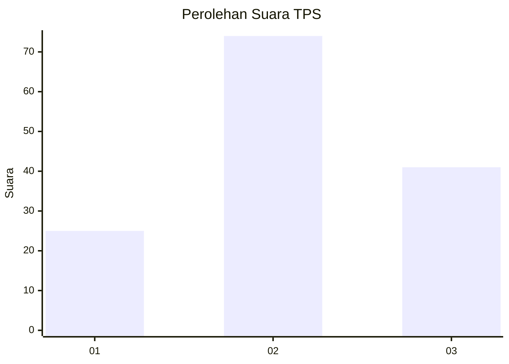
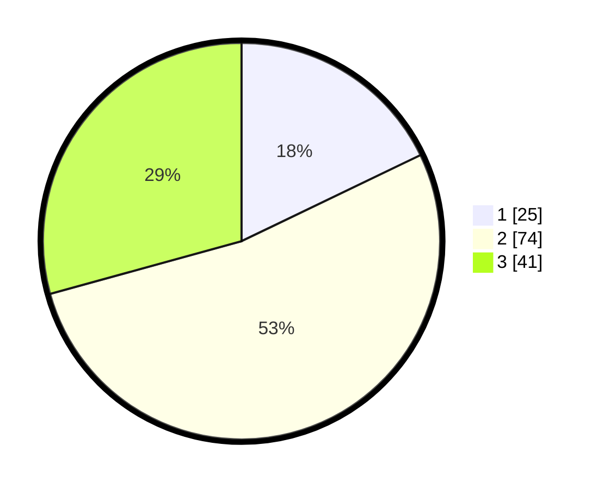

# Hasil

## Grafik

## Tabel

| No. | Nama Paslon    | Suara | Suara (raw) | Persentase |
|:--- |:-------------- | -----:| -----------:| ----------:|
| 1   | ANIES MUHAIMIN | 25    | [25][p-1]   | 17,86      |
| 2   | PRABOWO GIBRAN | 74    | [74][p-2]   | 52,86      |
| 3   | GANJAR MAHFUD  | 41    | [41][p-3]   | 29,29      |

[p-1]: https://github.com/gigit-pemilu/pemilu-2024-33-jawa-tengah/blob/main/pilpres/hitung-suara/sub/33-jawa-tengah/sub/05-kebumen/sub/08-mirit/sub/2006-wiromartan/sub/002-tps/sub/paslon-1.txt
[p-2]: https://github.com/gigit-pemilu/pemilu-2024-33-jawa-tengah/blob/main/pilpres/hitung-suara/sub/33-jawa-tengah/sub/05-kebumen/sub/08-mirit/sub/2006-wiromartan/sub/002-tps/sub/paslon-2.txt
[p-3]: https://github.com/gigit-pemilu/pemilu-2024-33-jawa-tengah/blob/main/pilpres/hitung-suara/sub/33-jawa-tengah/sub/05-kebumen/sub/08-mirit/sub/2006-wiromartan/sub/002-tps/sub/paslon-3.txt

## Foto C Plano

https://sirekap-obj-formc.kpu.go.id/4ea6/pemilu/ppwp/33/05/08/20/06/3305082006002-20240217-205447--a3dab06b-8dd5-4a07-9f8c-1f81b1e3e22a.jpg

https://sirekap-obj-formc.kpu.go.id/4ea6/pemilu/ppwp/33/05/08/20/06/3305082006002-20240217-211521--89859067-6c28-4f22-87fb-877d6168c904.jpg

https://sirekap-obj-formc.kpu.go.id/4ea6/pemilu/ppwp/33/05/08/20/06/3305082006002-20240217-224150--7e35f539-e72c-4abf-9df3-6f544d4b83fa.jpg

## Metadata

| Key        | Value               |
| ---------- | ------------------- |
| Time Stamp | 2024-02-19 06:16:00 |

