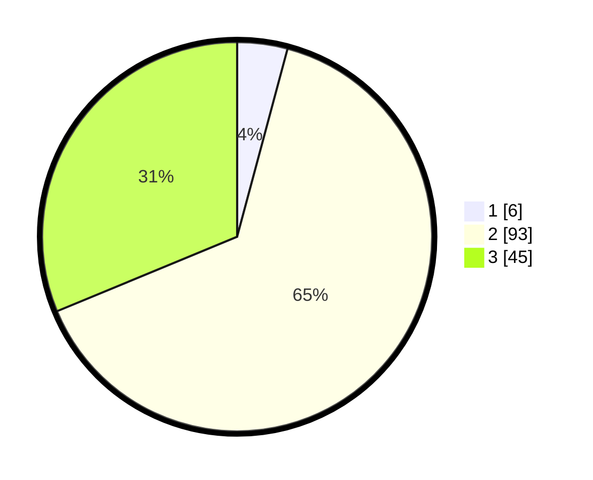

# Hasil

## Grafik

## Tabel

| No. | Nama Paslon    | Suara | Suara (raw) | Persentase |
|:--- |:-------------- | -----:| -----------:| ----------:|
| 1   | ANIES MUHAIMIN | 6     | [6][p-1]    | 4,17       |
| 2   | PRABOWO GIBRAN | 93    | [93][p-2]   | 64,58      |
| 3   | GANJAR MAHFUD  | 45    | [45][p-3]   | 31,25      |

[p-1]: https://github.com/gigit-pemilu/pemilu-2024/blob/main/pilpres/hitung-suara/sub/33-jawa-tengah/sub/05-kebumen/sub/08-mirit/sub/2009-wergonayan/sub/002-tps/sub/paslon-1.txt
[p-2]: https://github.com/gigit-pemilu/pemilu-2024/blob/main/pilpres/hitung-suara/sub/33-jawa-tengah/sub/05-kebumen/sub/08-mirit/sub/2009-wergonayan/sub/002-tps/sub/paslon-2.txt
[p-3]: https://github.com/gigit-pemilu/pemilu-2024/blob/main/pilpres/hitung-suara/sub/33-jawa-tengah/sub/05-kebumen/sub/08-mirit/sub/2009-wergonayan/sub/002-tps/sub/paslon-3.txt

## Foto C Plano

https://sirekap-obj-formc.kpu.go.id/f707/pemilu/ppwp/33/05/08/20/09/3305082009002-20240214-222357--68f739e3-1fee-4302-883b-78ed9daaab3a.jpg

https://sirekap-obj-formc.kpu.go.id/f707/pemilu/ppwp/33/05/08/20/09/3305082009002-20240214-222446--007b46f9-247b-4667-9763-89eaac8d0428.jpg

https://sirekap-obj-formc.kpu.go.id/f707/pemilu/ppwp/33/05/08/20/09/3305082009002-20240214-222513--6322dadf-9cab-488d-bc94-30c8d2bb8022.jpg

## Metadata

| Key        | Value               |
| ---------- | ------------------- |
| Time Stamp | 2024-02-16 21:01:00 |

