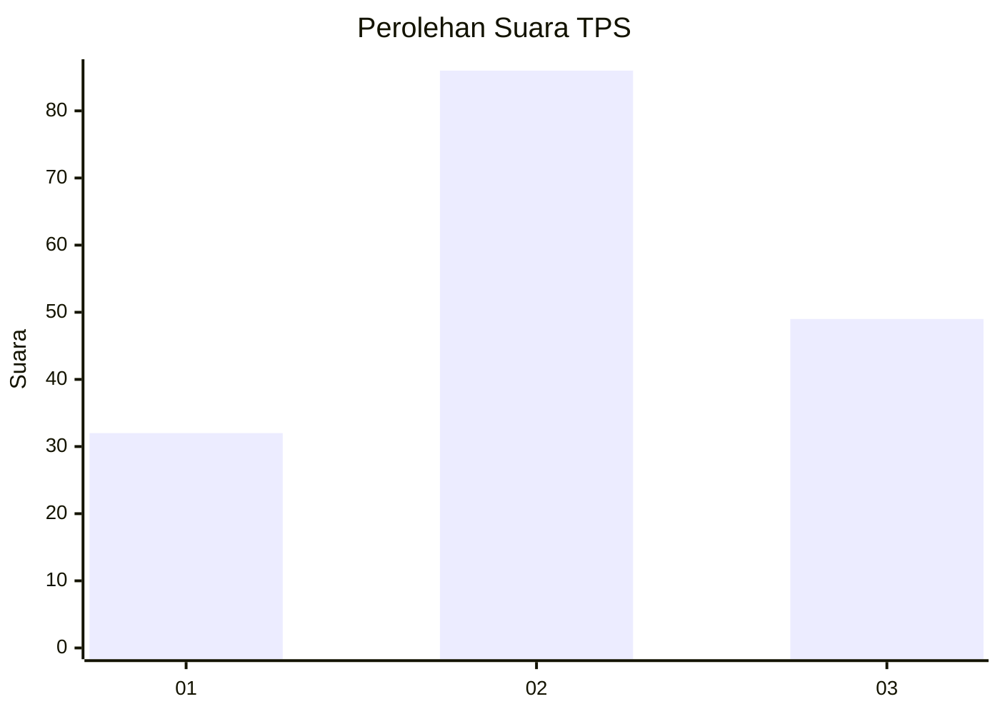
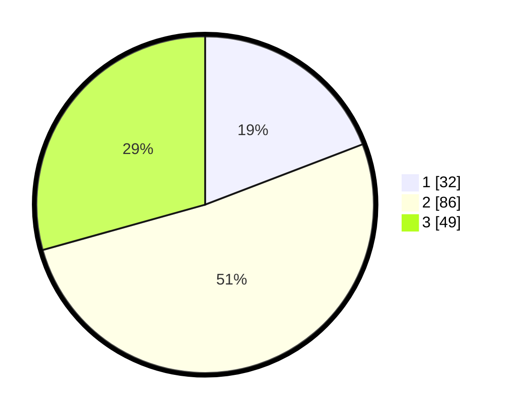

# Hasil

## Grafik

## Tabel

| No. | Nama Paslon    | Suara | Suara (raw) | Persentase |
|:--- |:-------------- | -----:| -----------:| ----------:|
| 1   | ANIES MUHAIMIN | 32    | [32][p-1]   | 19,16      |
| 2   | PRABOWO GIBRAN | 86    | [86][p-2]   | 51,50      |
| 3   | GANJAR MAHFUD  | 49    | [49][p-3]   | 29,34      |

[p-1]: https://github.com/gigit-pemilu/pemilu-2024-33-jawa-tengah/blob/main/pilpres/hitung-suara/sub/33-jawa-tengah/sub/05-kebumen/sub/08-mirit/sub/2010-selotumpeng/sub/003-tps/sub/paslon-1.txt
[p-2]: https://github.com/gigit-pemilu/pemilu-2024-33-jawa-tengah/blob/main/pilpres/hitung-suara/sub/33-jawa-tengah/sub/05-kebumen/sub/08-mirit/sub/2010-selotumpeng/sub/003-tps/sub/paslon-2.txt
[p-3]: https://github.com/gigit-pemilu/pemilu-2024-33-jawa-tengah/blob/main/pilpres/hitung-suara/sub/33-jawa-tengah/sub/05-kebumen/sub/08-mirit/sub/2010-selotumpeng/sub/003-tps/sub/paslon-3.txt

## Foto C Plano

https://sirekap-obj-formc.kpu.go.id/5385/pemilu/ppwp/33/05/08/20/10/3305082010003-20240214-223229--c12e9391-720a-41c1-866e-3c22d8df4f5f.jpg

https://sirekap-obj-formc.kpu.go.id/5385/pemilu/ppwp/33/05/08/20/10/3305082010003-20240214-223714--dec2e7fd-a10b-45df-9ed3-849c3815279e.jpg

https://sirekap-obj-formc.kpu.go.id/5385/pemilu/ppwp/33/05/08/20/10/3305082010003-20240214-223900--cedad883-cdc9-4505-989d-0b216f941667.jpg

## Metadata

| Key        | Value               |
| ---------- | ------------------- |
| Time Stamp | 2024-02-19 16:00:00 |

