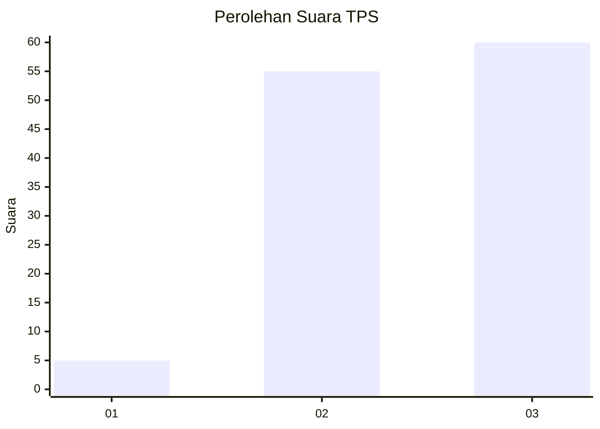
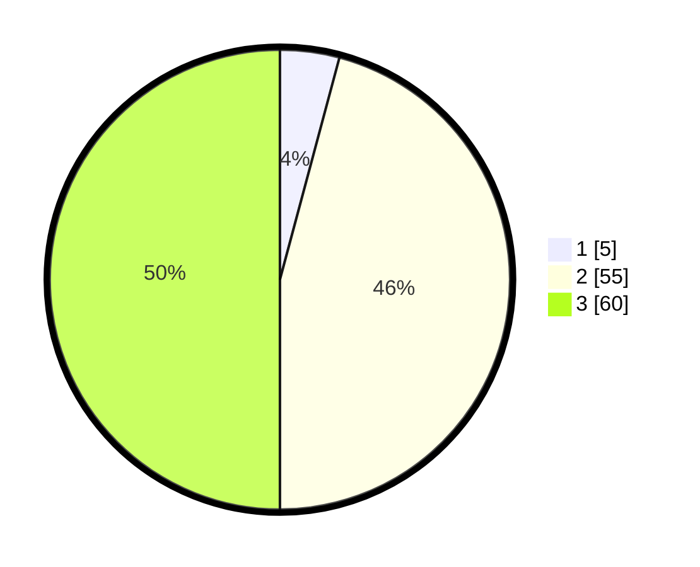

# Hasil

## Grafik

## Tabel

| No. | Nama Paslon    | Suara | Suara (raw) | Persentase |
|:--- |:-------------- | -----:| -----------:| ----------:|
| 1   | ANIES MUHAIMIN | 5     | [5][p-1]    | 4,17       |
| 2   | PRABOWO GIBRAN | 55    | [55][p-2]   | 45,83      |
| 3   | GANJAR MAHFUD  | 60    | [60][p-3]   | 50,00      |

[p-1]: https://github.com/gigit-pemilu/pemilu-2024-33-jawa-tengah/blob/main/pilpres/hitung-suara/sub/33-jawa-tengah/sub/05-kebumen/sub/08-mirit/sub/2010-selotumpeng/sub/005-tps/sub/paslon-1.txt
[p-2]: https://github.com/gigit-pemilu/pemilu-2024-33-jawa-tengah/blob/main/pilpres/hitung-suara/sub/33-jawa-tengah/sub/05-kebumen/sub/08-mirit/sub/2010-selotumpeng/sub/005-tps/sub/paslon-2.txt
[p-3]: https://github.com/gigit-pemilu/pemilu-2024-33-jawa-tengah/blob/main/pilpres/hitung-suara/sub/33-jawa-tengah/sub/05-kebumen/sub/08-mirit/sub/2010-selotumpeng/sub/005-tps/sub/paslon-3.txt

## Foto C Plano

https://sirekap-obj-formc.kpu.go.id/540d/pemilu/ppwp/33/05/08/20/10/3305082010005-20240214-221602--50ae6514-d5fe-42a1-a172-4fac2f3ede00.jpg

https://sirekap-obj-formc.kpu.go.id/540d/pemilu/ppwp/33/05/08/20/10/3305082010005-20240214-221758--e9c4bc2b-ae8b-46da-b520-510ea0d22021.jpg

https://sirekap-obj-formc.kpu.go.id/540d/pemilu/ppwp/33/05/08/20/10/3305082010005-20240214-221955--345f3b4b-8aab-4f33-90d3-09de131cc323.jpg

## Metadata

| Key        | Value               |
| ---------- | ------------------- |
| Time Stamp | 2024-02-19 15:00:00 |

