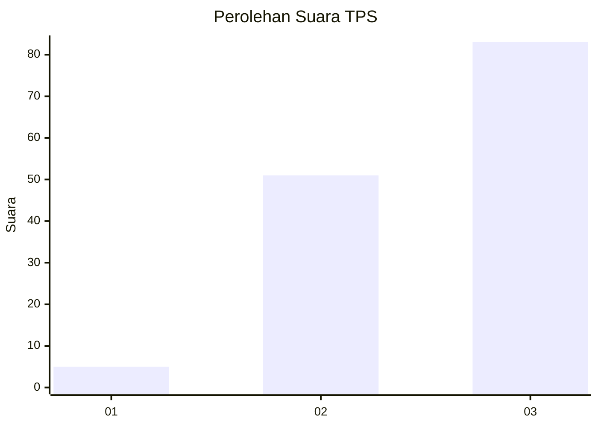
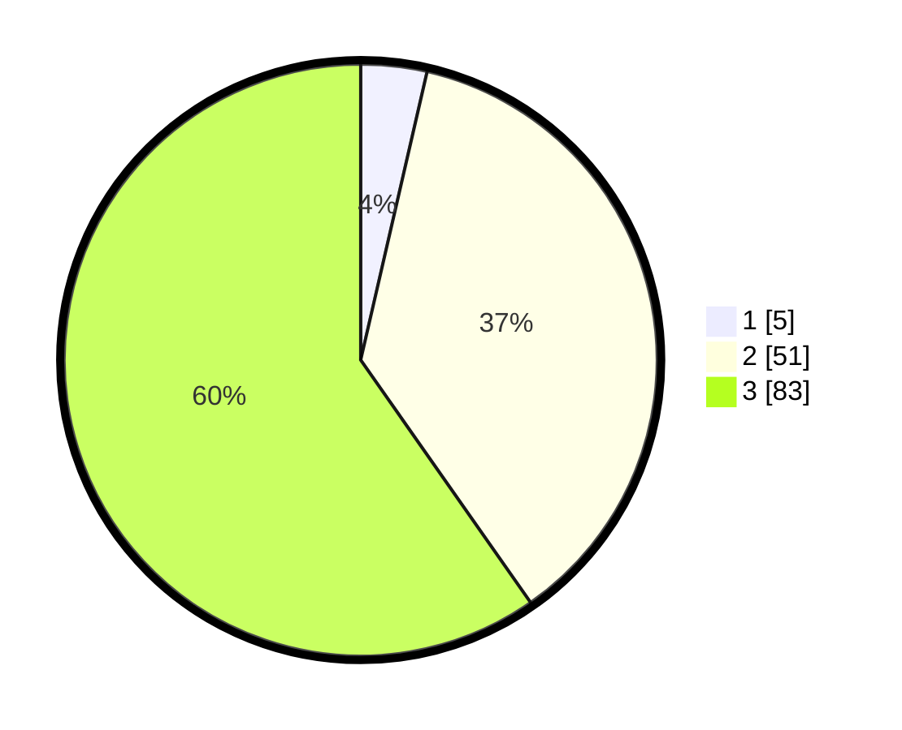

# Hasil

## Grafik

## Tabel

| No. | Nama Paslon    | Suara | Suara (raw) | Persentase |
|:--- |:-------------- | -----:| -----------:| ----------:|
| 1   | ANIES MUHAIMIN | 5     | [5][p-1]    | 3,60       |
| 2   | PRABOWO GIBRAN | 51    | [51][p-2]   | 36,69      |
| 3   | GANJAR MAHFUD  | 83    | [83][p-3]   | 59,71      |

[p-1]: https://github.com/gigit-pemilu/pemilu-2024-33-jawa-tengah/blob/main/pilpres/hitung-suara/sub/33-jawa-tengah/sub/05-kebumen/sub/08-mirit/sub/2010-selotumpeng/sub/006-tps/sub/paslon-1.txt
[p-2]: https://github.com/gigit-pemilu/pemilu-2024-33-jawa-tengah/blob/main/pilpres/hitung-suara/sub/33-jawa-tengah/sub/05-kebumen/sub/08-mirit/sub/2010-selotumpeng/sub/006-tps/sub/paslon-2.txt
[p-3]: https://github.com/gigit-pemilu/pemilu-2024-33-jawa-tengah/blob/main/pilpres/hitung-suara/sub/33-jawa-tengah/sub/05-kebumen/sub/08-mirit/sub/2010-selotumpeng/sub/006-tps/sub/paslon-3.txt

## Foto C Plano

https://sirekap-obj-formc.kpu.go.id/a744/pemilu/ppwp/33/05/08/20/10/3305082010006-20240214-215652--63d8cdf7-7ccd-4e69-a25c-a3e5d8d24366.jpg

https://sirekap-obj-formc.kpu.go.id/a744/pemilu/ppwp/33/05/08/20/10/3305082010006-20240214-220021--b3bb2422-5a5a-4155-b1ac-e8ee359b8120.jpg

https://sirekap-obj-formc.kpu.go.id/a744/pemilu/ppwp/33/05/08/20/10/3305082010006-20240214-215738--4b77e377-8d73-40eb-9c86-0b21e4781f2c.jpg

## Metadata

| Key        | Value               |
| ---------- | ------------------- |
| Time Stamp | 2024-02-19 16:00:00 |

## DATA PEMILIH TETAP

Jumlah pemilih dalam DPT: **194**.
 * L: **101**.
 * P: **93**.

## DATA PENGGUNA HAK PILIH

Jumlah pengguna hak pilih dalam DPT: **140**.
 * L: **75**.
 * P: **65**.

Jumlah pengguna hak pilih dalam DPTb: **0**.
 * L: **5**.
 * P: **52**.

Jumlah pengguna hak pilih dalam DPK: **3**.
 * L: **2**.
 * P: **1**.

Jumlah pengguna hak pilih: **143**.
 * L: **77**.
 * P: **66**.

## JUMLAH SUARA SAH DAN TIDAK SAH

JUMLAH SELURUH SUARA SAH: **139**.

JUMLAH SUARA TIDAK SAH: **4**.

JUMLAH SELURUH SUARA SAH DAN SUARA TIDAK SAH: **143**.

