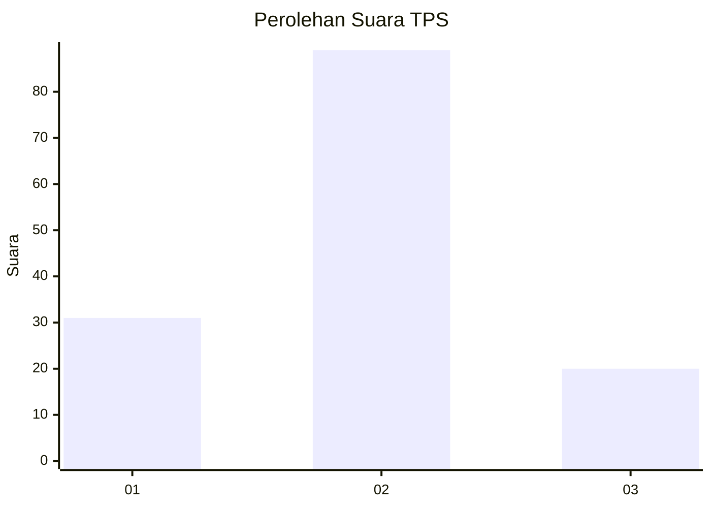
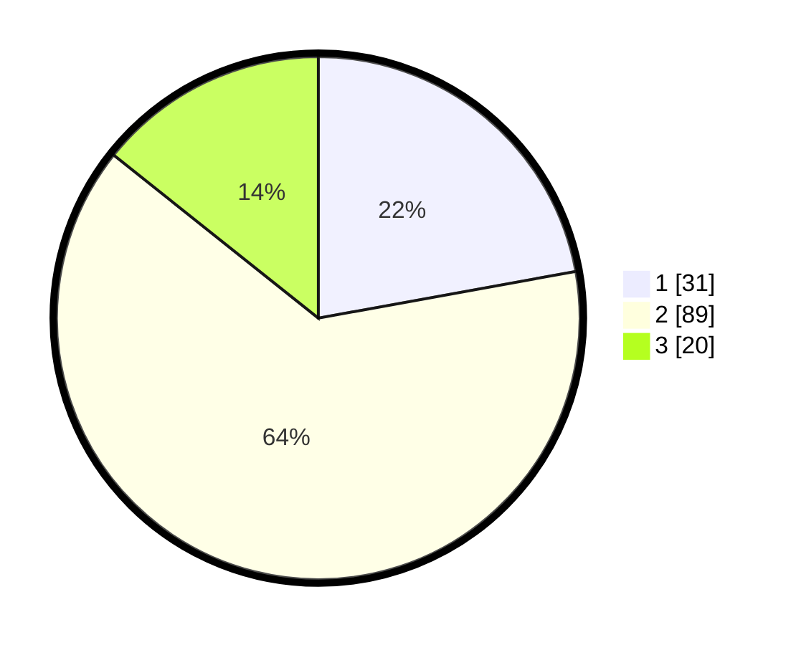

# Hasil

## Grafik

## Tabel

| No. | Nama Paslon    | Suara | Suara (raw) | Persentase |
|:--- |:-------------- | -----:| -----------:| ----------:|
| 1   | ANIES MUHAIMIN | 31    | [31][p-1]   | 22,14      |
| 2   | PRABOWO GIBRAN | 89    | [89][p-2]   | 63,57      |
| 3   | GANJAR MAHFUD  | 20    | [20][p-3]   | 14,29      |

[p-1]: https://github.com/gigit-pemilu/pemilu-2024/blob/main/pilpres/hitung-suara/sub/33-jawa-tengah/sub/05-kebumen/sub/08-mirit/sub/2012-karanggede/sub/004-tps/sub/paslon-1.txt
[p-2]: https://github.com/gigit-pemilu/pemilu-2024/blob/main/pilpres/hitung-suara/sub/33-jawa-tengah/sub/05-kebumen/sub/08-mirit/sub/2012-karanggede/sub/004-tps/sub/paslon-2.txt
[p-3]: https://github.com/gigit-pemilu/pemilu-2024/blob/main/pilpres/hitung-suara/sub/33-jawa-tengah/sub/05-kebumen/sub/08-mirit/sub/2012-karanggede/sub/004-tps/sub/paslon-3.txt

## Foto C Plano

https://sirekap-obj-formc.kpu.go.id/5ba1/pemilu/ppwp/33/05/08/20/12/3305082012004-20240215-011516--8666c5d2-bac3-4b92-9cd2-8fba0e83e6ba.jpg

https://sirekap-obj-formc.kpu.go.id/5ba1/pemilu/ppwp/33/05/08/20/12/3305082012004-20240215-005246--9983df7f-787c-4448-9eb4-f127ae7e8622.jpg

https://sirekap-obj-formc.kpu.go.id/5ba1/pemilu/ppwp/33/05/08/20/12/3305082012004-20240215-005403--e733fbb5-0ab1-443f-a421-6ba4dc8ce703.jpg

## Metadata

| Key        | Value               |
| ---------- | ------------------- |
| Time Stamp | 2024-02-19 15:00:00 |

