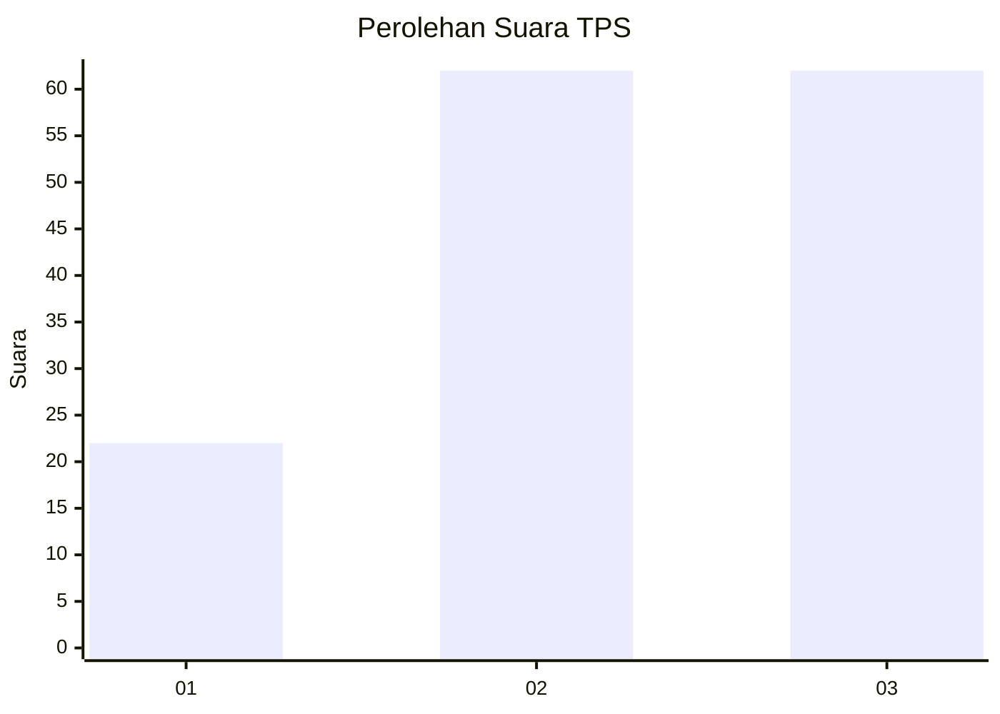
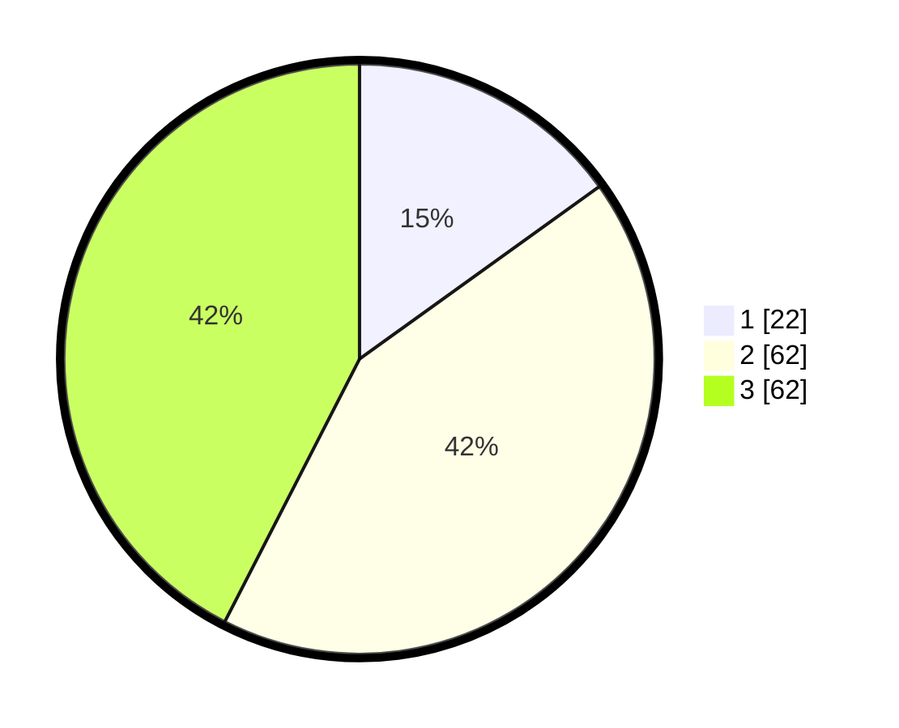

# Hasil

## Grafik

## Tabel

| No. | Nama Paslon    | Suara | Suara (raw) | Persentase |
|:--- |:-------------- | -----:| -----------:| ----------:|
| 1   | ANIES MUHAIMIN | 22    | [22][p-1]   | 15,07      |
| 2   | PRABOWO GIBRAN | 62    | [62][p-2]   | 42,47      |
| 3   | GANJAR MAHFUD  | 62    | [62][p-3]   | 42,47      |

[p-1]: https://github.com/gigit-pemilu/pemilu-2024-33-jawa-tengah/blob/main/pilpres/hitung-suara/sub/33-jawa-tengah/sub/05-kebumen/sub/08-mirit/sub/2013-kertodeso/sub/005-tps/sub/paslon-1.txt
[p-2]: https://github.com/gigit-pemilu/pemilu-2024-33-jawa-tengah/blob/main/pilpres/hitung-suara/sub/33-jawa-tengah/sub/05-kebumen/sub/08-mirit/sub/2013-kertodeso/sub/005-tps/sub/paslon-2.txt
[p-3]: https://github.com/gigit-pemilu/pemilu-2024-33-jawa-tengah/blob/main/pilpres/hitung-suara/sub/33-jawa-tengah/sub/05-kebumen/sub/08-mirit/sub/2013-kertodeso/sub/005-tps/sub/paslon-3.txt

## Foto C Plano

https://sirekap-obj-formc.kpu.go.id/fd7b/pemilu/ppwp/33/05/08/20/13/3305082013005-20240214-214147--47da35ac-2ecc-473e-b101-912f46af6b57.jpg

https://sirekap-obj-formc.kpu.go.id/fd7b/pemilu/ppwp/33/05/08/20/13/3305082013005-20240214-214345--9d5aee33-faab-420e-8369-0786828bfe74.jpg

https://sirekap-obj-formc.kpu.go.id/fd7b/pemilu/ppwp/33/05/08/20/13/3305082013005-20240214-214834--fbc3e5fd-e81c-464e-91bc-d9c8e7f9113a.jpg

## Metadata

| Key        | Value               |
| ---------- | ------------------- |
| Time Stamp | 2024-02-19 15:00:00 |

