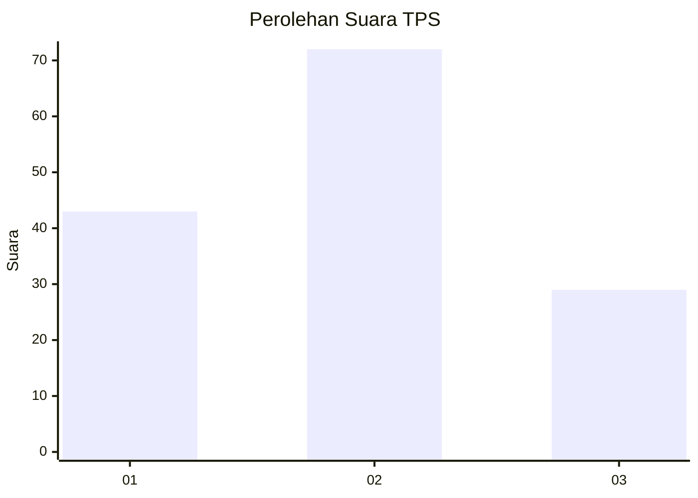
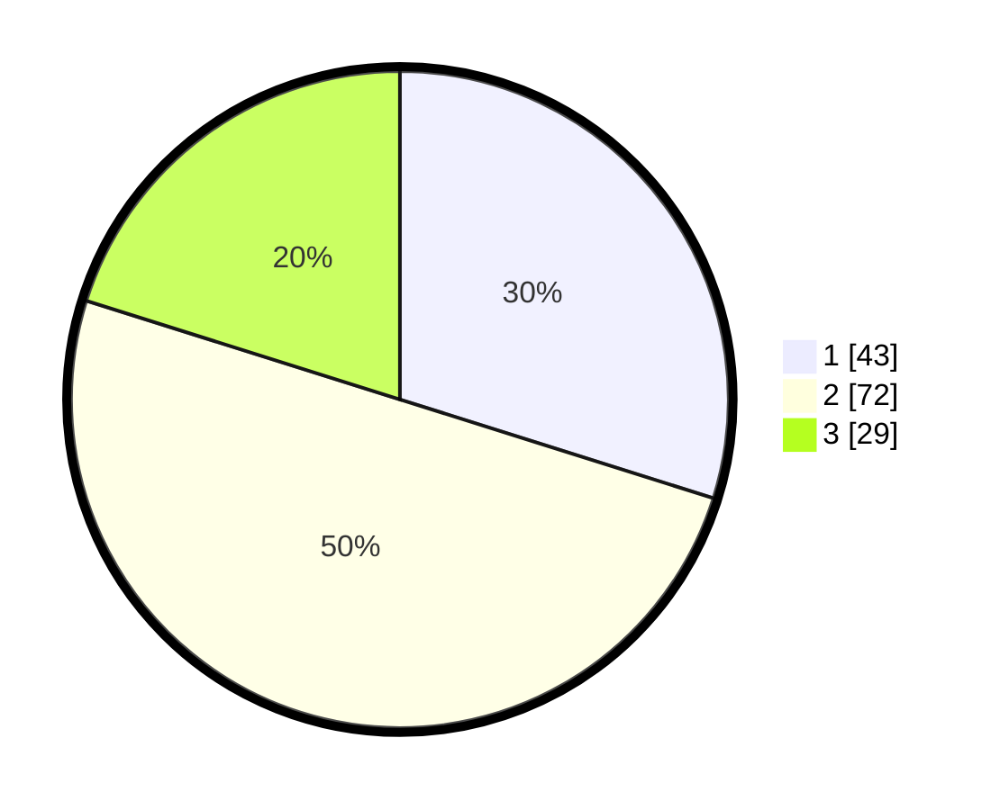

# Hasil

## Grafik

## Tabel

| No. | Nama Paslon    | Suara | Suara (raw) | Persentase |
|:--- |:-------------- | -----:| -----------:| ----------:|
| 1   | ANIES MUHAIMIN | 43    | [43][p-1]   | 29,86      |
| 2   | PRABOWO GIBRAN | 72    | [72][p-2]   | 50,00      |
| 3   | GANJAR MAHFUD  | 29    | [29][p-3]   | 20,14      |

[p-1]: https://github.com/gigit-pemilu/pemilu-2024-33-jawa-tengah/blob/main/pilpres/hitung-suara/sub/33-jawa-tengah/sub/05-kebumen/sub/08-mirit/sub/2013-kertodeso/sub/010-tps/sub/paslon-1.txt
[p-2]: https://github.com/gigit-pemilu/pemilu-2024-33-jawa-tengah/blob/main/pilpres/hitung-suara/sub/33-jawa-tengah/sub/05-kebumen/sub/08-mirit/sub/2013-kertodeso/sub/010-tps/sub/paslon-2.txt
[p-3]: https://github.com/gigit-pemilu/pemilu-2024-33-jawa-tengah/blob/main/pilpres/hitung-suara/sub/33-jawa-tengah/sub/05-kebumen/sub/08-mirit/sub/2013-kertodeso/sub/010-tps/sub/paslon-3.txt

## Foto C Plano

https://sirekap-obj-formc.kpu.go.id/2c3b/pemilu/ppwp/33/05/08/20/13/3305082013010-20240214-231621--2055792a-2b03-45fc-8941-ced0c377af5e.jpg

https://sirekap-obj-formc.kpu.go.id/2c3b/pemilu/ppwp/33/05/08/20/13/3305082013010-20240214-232048--563e1e85-2ba8-4e0e-9b65-e1f2e52504cc.jpg

https://sirekap-obj-formc.kpu.go.id/2c3b/pemilu/ppwp/33/05/08/20/13/3305082013010-20240214-232611--0c2ae8a9-3c72-4734-a60a-1bc2b4a32d87.jpg

## Metadata

| Key        | Value               |
| ---------- | ------------------- |
| Time Stamp | 2024-02-19 15:00:00 |

