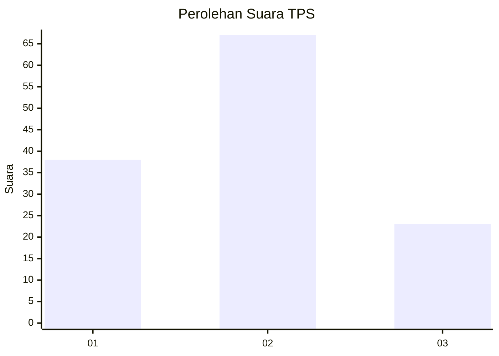
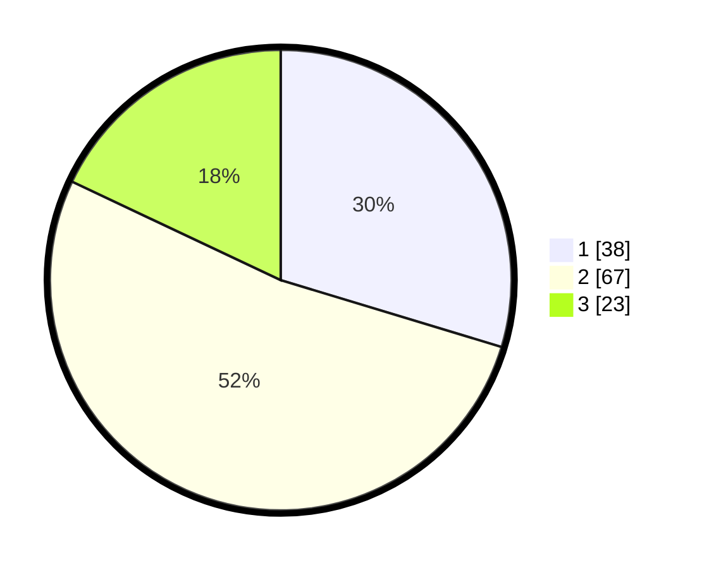

# Hasil

## Grafik

## Tabel

| No. | Nama Paslon    | Suara | Suara (raw) | Persentase |
|:--- |:-------------- | -----:| -----------:| ----------:|
| 1   | ANIES MUHAIMIN | 38    | [38][p-1]   | 29,69      |
| 2   | PRABOWO GIBRAN | 67    | [67][p-2]   | 52,34      |
| 3   | GANJAR MAHFUD  | 23    | [23][p-3]   | 17,97      |

[p-1]: https://github.com/gigit-pemilu/pemilu-2024/blob/main/pilpres/hitung-suara/sub/33-jawa-tengah/sub/05-kebumen/sub/08-mirit/sub/2016-mangunranan/sub/001-tps/sub/paslon-1.txt
[p-2]: https://github.com/gigit-pemilu/pemilu-2024/blob/main/pilpres/hitung-suara/sub/33-jawa-tengah/sub/05-kebumen/sub/08-mirit/sub/2016-mangunranan/sub/001-tps/sub/paslon-2.txt
[p-3]: https://github.com/gigit-pemilu/pemilu-2024/blob/main/pilpres/hitung-suara/sub/33-jawa-tengah/sub/05-kebumen/sub/08-mirit/sub/2016-mangunranan/sub/001-tps/sub/paslon-3.txt

## Foto C Plano

https://sirekap-obj-formc.kpu.go.id/4131/pemilu/ppwp/33/05/08/20/16/3305082016001-20240216-235304--78064087-0cdc-40a5-8d67-dd8f50cee40c.jpg

https://sirekap-obj-formc.kpu.go.id/4131/pemilu/ppwp/33/05/08/20/16/3305082016001-20240217-093536--466b9875-5bf4-411e-84df-837658226165.jpg

https://sirekap-obj-formc.kpu.go.id/4131/pemilu/ppwp/33/05/08/20/16/3305082016001-20240216-233041--e76a261e-3569-4465-bd14-c6d3f92889ef.jpg

## Metadata

| Key        | Value               |
| ---------- | ------------------- |
| Time Stamp | 2024-02-17 12:00:00 |

