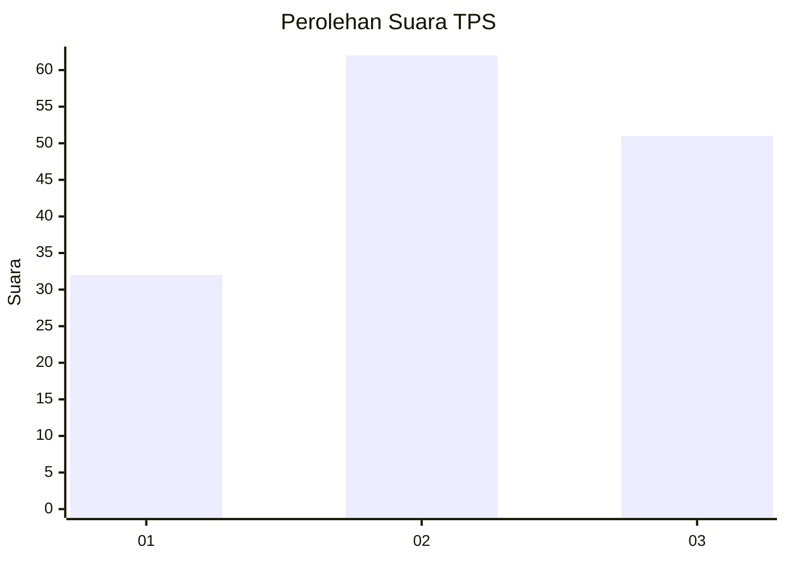
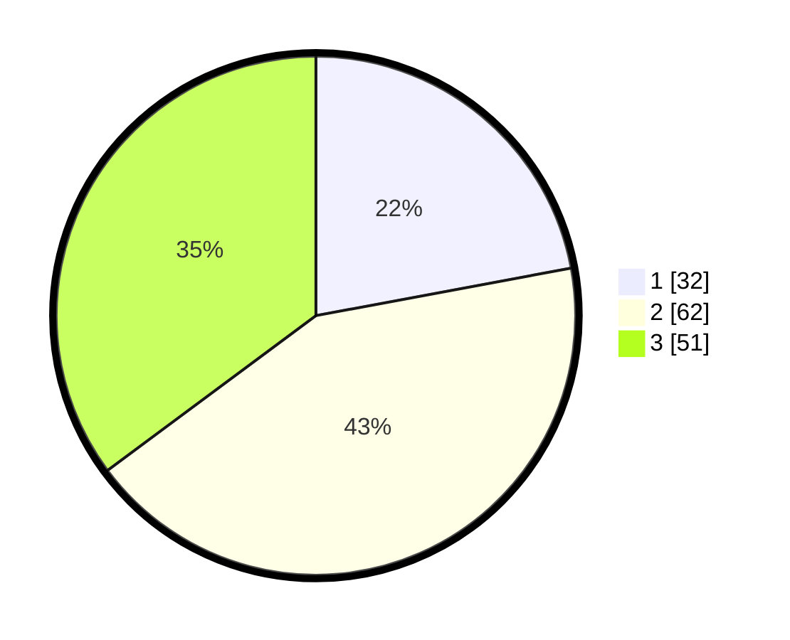

# Hasil

## Grafik

## Tabel

| No. | Nama Paslon    | Suara | Suara (raw) | Persentase |
|:--- |:-------------- | -----:| -----------:| ----------:|
| 1   | ANIES MUHAIMIN | 32    | [32][p-1]   | 22,07      |
| 2   | PRABOWO GIBRAN | 62    | [62][p-2]   | 42,76      |
| 3   | GANJAR MAHFUD  | 51    | [51][p-3]   | 35,17      |

[p-1]: https://github.com/gigit-pemilu/pemilu-2024-33-jawa-tengah/blob/main/pilpres/hitung-suara/sub/33-jawa-tengah/sub/05-kebumen/sub/08-mirit/sub/2016-mangunranan/sub/007-tps/sub/paslon-1.txt
[p-2]: https://github.com/gigit-pemilu/pemilu-2024-33-jawa-tengah/blob/main/pilpres/hitung-suara/sub/33-jawa-tengah/sub/05-kebumen/sub/08-mirit/sub/2016-mangunranan/sub/007-tps/sub/paslon-2.txt
[p-3]: https://github.com/gigit-pemilu/pemilu-2024-33-jawa-tengah/blob/main/pilpres/hitung-suara/sub/33-jawa-tengah/sub/05-kebumen/sub/08-mirit/sub/2016-mangunranan/sub/007-tps/sub/paslon-3.txt

## Foto C Plano

https://sirekap-obj-formc.kpu.go.id/6f84/pemilu/ppwp/33/05/08/20/16/3305082016007-20240217-065623--3ab12d16-b7d2-44bd-88bf-e7db0d6916c0.jpg

https://sirekap-obj-formc.kpu.go.id/6f84/pemilu/ppwp/33/05/08/20/16/3305082016007-20240219-202510--60ccf155-986a-4ccb-a372-097519f664e8.jpg

https://sirekap-obj-formc.kpu.go.id/6f84/pemilu/ppwp/33/05/08/20/16/3305082016007-20240219-202347--08d05ad7-a4a2-408d-a4a6-66c8440b847d.jpg

## Metadata

| Key        | Value               |
| ---------- | ------------------- |
| Time Stamp | 2024-02-20 20:00:00 |

