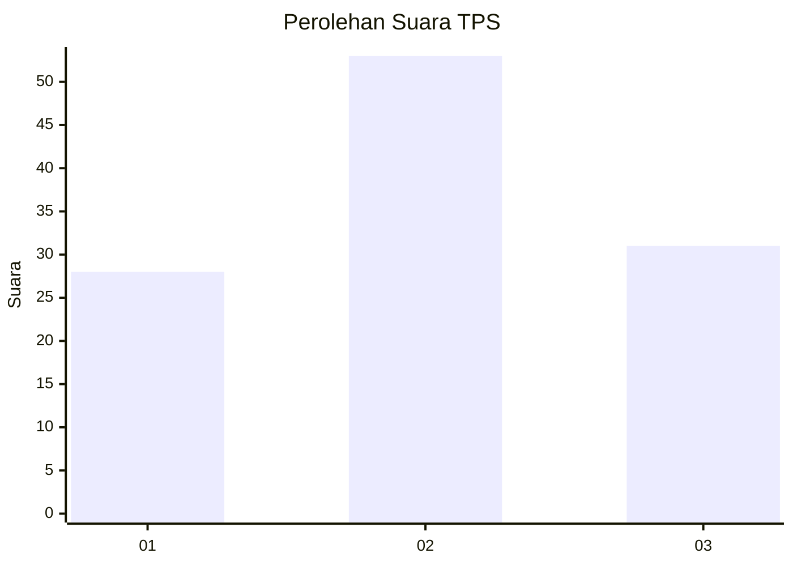
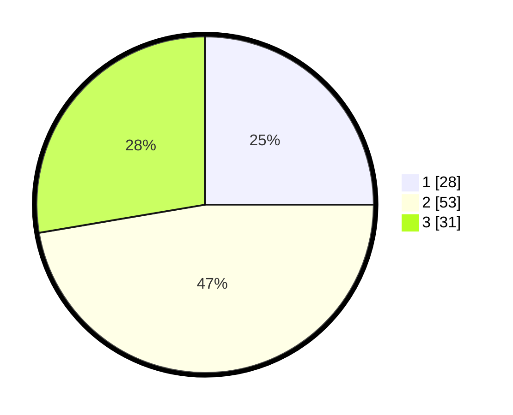

# Hasil

## Grafik

## Tabel

| No. | Nama Paslon    | Suara | Suara (raw) | Persentase |
|:--- |:-------------- | -----:| -----------:| ----------:|
| 1   | ANIES MUHAIMIN | 28    | [28][p-1]   | 25,00      |
| 2   | PRABOWO GIBRAN | 53    | [53][p-2]   | 47,32      |
| 3   | GANJAR MAHFUD  | 31    | [31][p-3]   | 27,68      |

[p-1]: https://github.com/gigit-pemilu/pemilu-2024-33-jawa-tengah/blob/main/pilpres/hitung-suara/sub/33-jawa-tengah/sub/05-kebumen/sub/08-mirit/sub/2019-winong/sub/002-tps/sub/paslon-1.txt
[p-2]: https://github.com/gigit-pemilu/pemilu-2024-33-jawa-tengah/blob/main/pilpres/hitung-suara/sub/33-jawa-tengah/sub/05-kebumen/sub/08-mirit/sub/2019-winong/sub/002-tps/sub/paslon-2.txt
[p-3]: https://github.com/gigit-pemilu/pemilu-2024-33-jawa-tengah/blob/main/pilpres/hitung-suara/sub/33-jawa-tengah/sub/05-kebumen/sub/08-mirit/sub/2019-winong/sub/002-tps/sub/paslon-3.txt

## Foto C Plano

https://sirekap-obj-formc.kpu.go.id/9423/pemilu/ppwp/33/05/08/20/19/3305082019002-20240214-190303--400ee2fb-cf4d-46da-8707-0630534cb061.jpg

https://sirekap-obj-formc.kpu.go.id/9423/pemilu/ppwp/33/05/08/20/19/3305082019002-20240214-190028--47638217-25d2-4efe-9964-c693595da0f6.jpg

https://sirekap-obj-formc.kpu.go.id/9423/pemilu/ppwp/33/05/08/20/19/3305082019002-20240215-015111--ef8337a6-3467-464c-9028-0c51d9bbb5e1.jpg

## Metadata

| Key        | Value               |
| ---------- | ------------------- |
| Time Stamp | 2024-02-15 15:00:29 |

