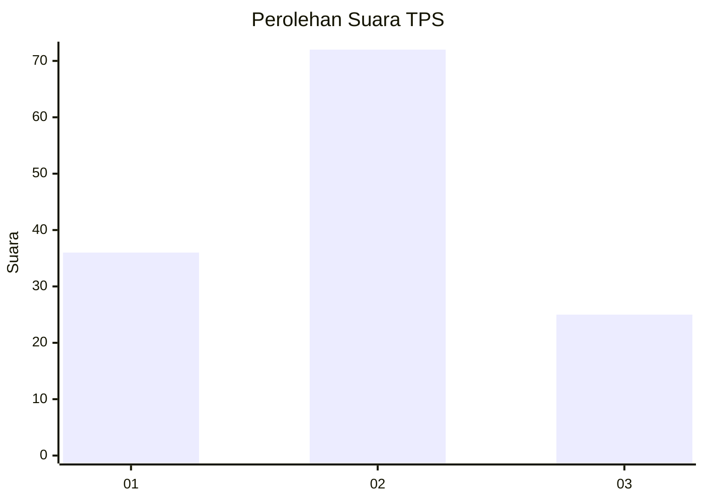
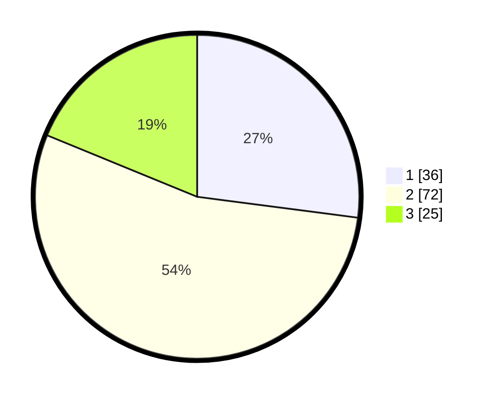

# Hasil

## Grafik

## Tabel

| No. | Nama Paslon    | Suara | Suara (raw) | Persentase |
|:--- |:-------------- | -----:| -----------:| ----------:|
| 1   | ANIES MUHAIMIN | 36    | [36][p-1]   | 27,07      |
| 2   | PRABOWO GIBRAN | 72    | [72][p-2]   | 54,14      |
| 3   | GANJAR MAHFUD  | 25    | [25][p-3]   | 18,80      |

[p-1]: https://github.com/gigit-pemilu/pemilu-2024-33-jawa-tengah/blob/main/pilpres/hitung-suara/sub/33-jawa-tengah/sub/05-kebumen/sub/08-mirit/sub/2020-ngabean/sub/002-tps/sub/paslon-1.txt
[p-2]: https://github.com/gigit-pemilu/pemilu-2024-33-jawa-tengah/blob/main/pilpres/hitung-suara/sub/33-jawa-tengah/sub/05-kebumen/sub/08-mirit/sub/2020-ngabean/sub/002-tps/sub/paslon-2.txt
[p-3]: https://github.com/gigit-pemilu/pemilu-2024-33-jawa-tengah/blob/main/pilpres/hitung-suara/sub/33-jawa-tengah/sub/05-kebumen/sub/08-mirit/sub/2020-ngabean/sub/002-tps/sub/paslon-3.txt

## Foto C Plano

https://sirekap-obj-formc.kpu.go.id/ba5c/pemilu/ppwp/33/05/08/20/20/3305082020002-20240216-164546--2adf2df9-9ae2-4573-a0c2-85873270386d.jpg

https://sirekap-obj-formc.kpu.go.id/ba5c/pemilu/ppwp/33/05/08/20/20/3305082020002-20240218-082427--360c7907-5a79-468e-ba1e-38ad48b8ce96.jpg

## Metadata

| Key        | Value               |
| ---------- | ------------------- |
| Time Stamp | 2024-02-21 12:00:00 |

