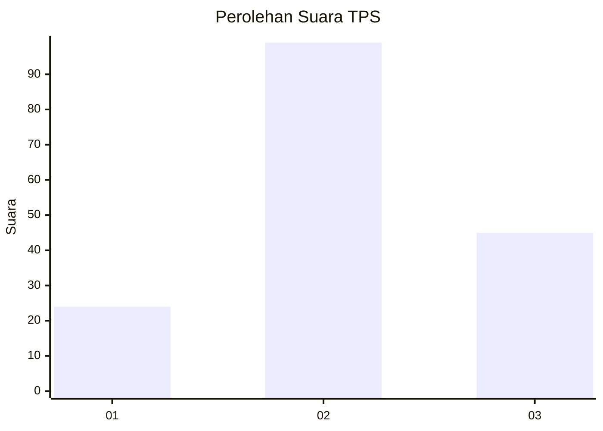
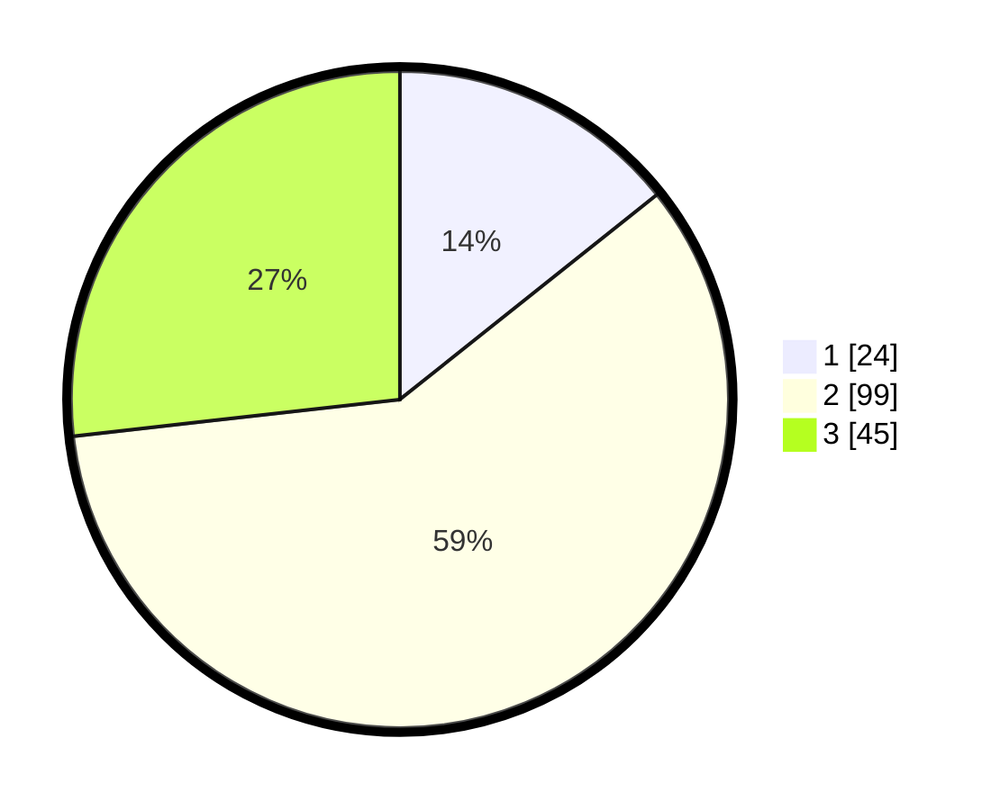

# Hasil

## Grafik

## Tabel

| No. | Nama Paslon    | Suara | Suara (raw) | Persentase |
|:--- |:-------------- | -----:| -----------:| ----------:|
| 1   | ANIES MUHAIMIN | 24    | [24][p-1]   | 14,29      |
| 2   | PRABOWO GIBRAN | 99    | [99][p-2]   | 58,93      |
| 3   | GANJAR MAHFUD  | 45    | [45][p-3]   | 26,79      |

[p-1]: https://github.com/gigit-pemilu/pemilu-2024/blob/main/pilpres/hitung-suara/sub/33-jawa-tengah/sub/05-kebumen/sub/09-prembun/sub/2004-tunggalroso/sub/003-tps/sub/paslon-1.txt
[p-2]: https://github.com/gigit-pemilu/pemilu-2024/blob/main/pilpres/hitung-suara/sub/33-jawa-tengah/sub/05-kebumen/sub/09-prembun/sub/2004-tunggalroso/sub/003-tps/sub/paslon-2.txt
[p-3]: https://github.com/gigit-pemilu/pemilu-2024/blob/main/pilpres/hitung-suara/sub/33-jawa-tengah/sub/05-kebumen/sub/09-prembun/sub/2004-tunggalroso/sub/003-tps/sub/paslon-3.txt

## Foto C Plano

https://sirekap-obj-formc.kpu.go.id/3bbc/pemilu/ppwp/33/05/09/20/04/3305092004003-20240214-141504--3c8e3c0b-c877-4266-a5a9-273e5adbe097.jpg

https://sirekap-obj-formc.kpu.go.id/3bbc/pemilu/ppwp/33/05/09/20/04/3305092004003-20240214-230601--47774768-6c61-4e69-a82d-d4dcdfe200cb.jpg

https://sirekap-obj-formc.kpu.go.id/3bbc/pemilu/ppwp/33/05/09/20/04/3305092004003-20240214-230213--d3e483c4-e479-4541-a06c-834d51424c39.jpg

## Metadata

| Key        | Value               |
| ---------- | ------------------- |
| Time Stamp | 2024-02-16 12:51:22 |

