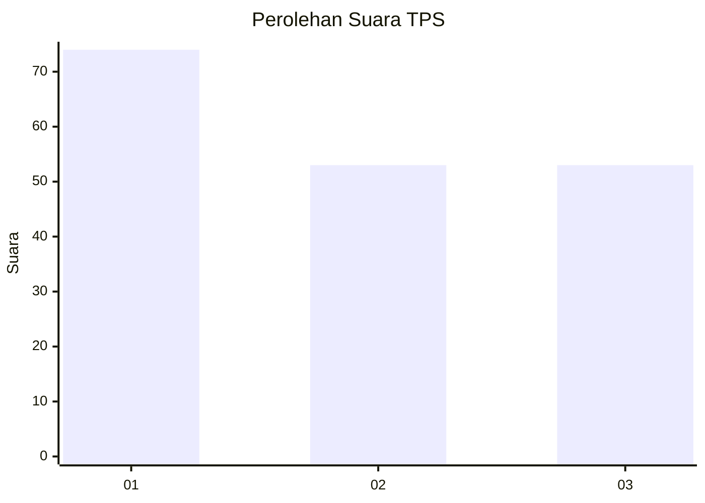
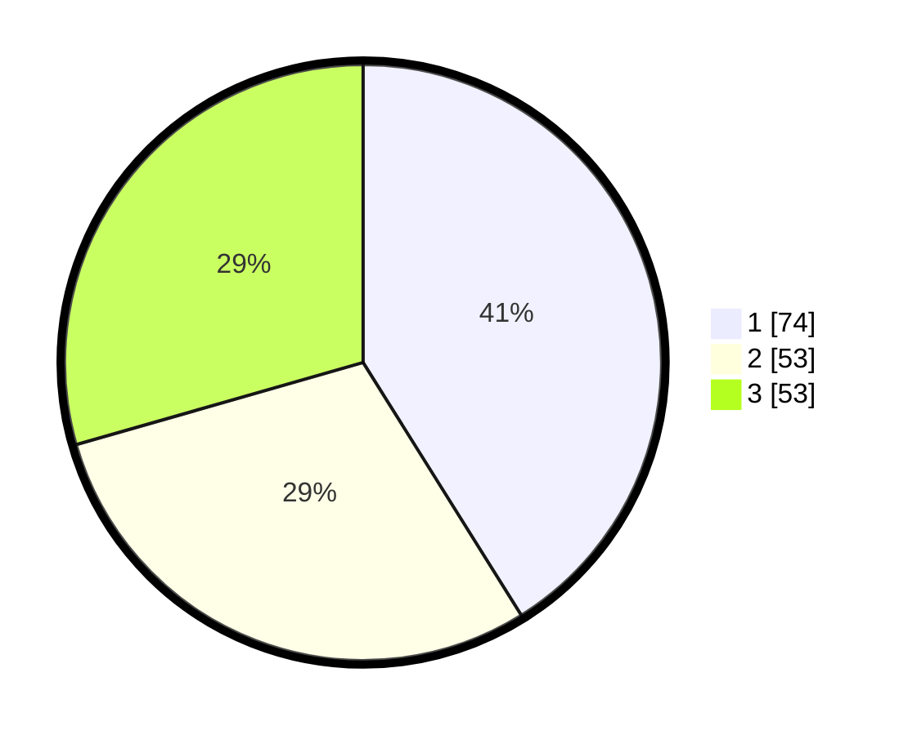

# Hasil

## Grafik

## Tabel

| No. | Nama Paslon    | Suara | Suara (raw) | Persentase |
|:--- |:-------------- | -----:| -----------:| ----------:|
| 1   | ANIES MUHAIMIN | 74    | [74][p-1]   | 41,11      |
| 2   | PRABOWO GIBRAN | 53    | [53][p-2]   | 29,44      |
| 3   | GANJAR MAHFUD  | 53    | [53][p-3]   | 29,44      |

[p-1]: https://github.com/gigit-pemilu/pemilu-2024/blob/main/pilpres/hitung-suara/sub/33-jawa-tengah/sub/05-kebumen/sub/09-prembun/sub/2008-sembirkadipaten/sub/002-tps/sub/paslon-1.txt
[p-2]: https://github.com/gigit-pemilu/pemilu-2024/blob/main/pilpres/hitung-suara/sub/33-jawa-tengah/sub/05-kebumen/sub/09-prembun/sub/2008-sembirkadipaten/sub/002-tps/sub/paslon-2.txt
[p-3]: https://github.com/gigit-pemilu/pemilu-2024/blob/main/pilpres/hitung-suara/sub/33-jawa-tengah/sub/05-kebumen/sub/09-prembun/sub/2008-sembirkadipaten/sub/002-tps/sub/paslon-3.txt

## Foto C Plano

https://sirekap-obj-formc.kpu.go.id/2ca8/pemilu/ppwp/33/05/09/20/08/3305092008002-20240216-181959--7d152b5b-d6ae-4300-94f7-a3f911626b6f.jpg

https://sirekap-obj-formc.kpu.go.id/2ca8/pemilu/ppwp/33/05/09/20/08/3305092008002-20240216-184802--be8fee2b-f87e-47f6-b68c-588ac8816a58.jpg

https://sirekap-obj-formc.kpu.go.id/2ca8/pemilu/ppwp/33/05/09/20/08/3305092008002-20240216-182409--427d9a6a-d20e-4e61-95bf-7bd6ac72fd3b.jpg

## Metadata

| Key        | Value               |
| ---------- | ------------------- |
| Time Stamp | 2024-02-19 15:00:00 |

