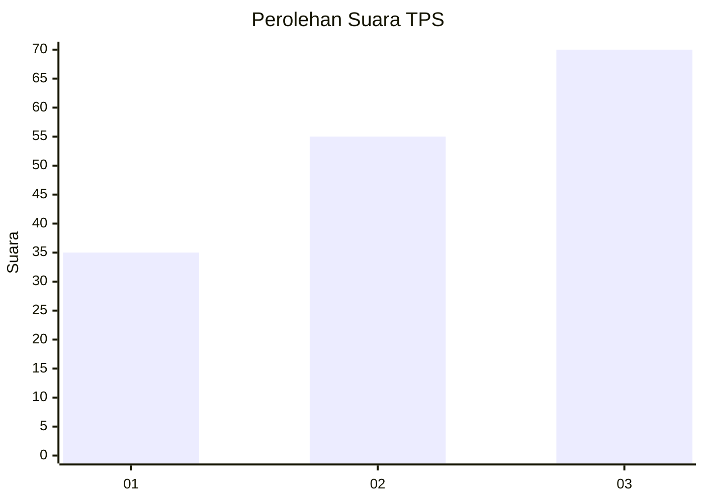
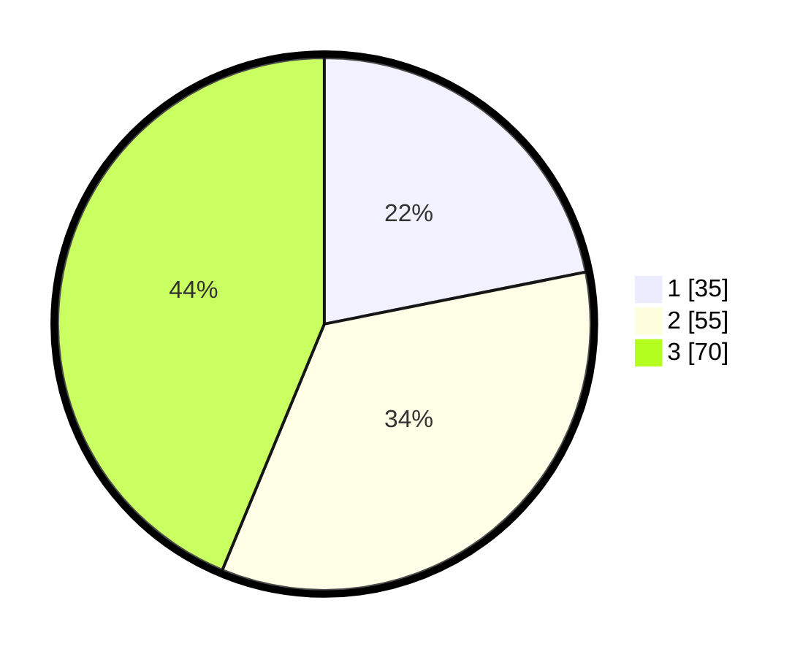

# Hasil

## Grafik

## Tabel

| No. | Nama Paslon    | Suara | Suara (raw) | Persentase |
|:--- |:-------------- | -----:| -----------:| ----------:|
| 1   | ANIES MUHAIMIN | 35    | [35][p-1]   | 21,88      |
| 2   | PRABOWO GIBRAN | 55    | [55][p-2]   | 34,38      |
| 3   | GANJAR MAHFUD  | 70    | [70][p-3]   | 43,75      |

[p-1]: https://github.com/gigit-pemilu/pemilu-2024-33-jawa-tengah/blob/main/pilpres/hitung-suara/sub/33-jawa-tengah/sub/05-kebumen/sub/09-prembun/sub/2008-sembirkadipaten/sub/005-tps/sub/paslon-1.txt
[p-2]: https://github.com/gigit-pemilu/pemilu-2024-33-jawa-tengah/blob/main/pilpres/hitung-suara/sub/33-jawa-tengah/sub/05-kebumen/sub/09-prembun/sub/2008-sembirkadipaten/sub/005-tps/sub/paslon-2.txt
[p-3]: https://github.com/gigit-pemilu/pemilu-2024-33-jawa-tengah/blob/main/pilpres/hitung-suara/sub/33-jawa-tengah/sub/05-kebumen/sub/09-prembun/sub/2008-sembirkadipaten/sub/005-tps/sub/paslon-3.txt

## Foto C Plano

https://sirekap-obj-formc.kpu.go.id/a882/pemilu/ppwp/33/05/09/20/08/3305092008005-20240218-125654--fb7b7332-06a2-4862-9cf0-844504c4282b.jpg

https://sirekap-obj-formc.kpu.go.id/a882/pemilu/ppwp/33/05/09/20/08/3305092008005-20240218-135733--5c92f131-654c-44f8-866c-21f5d64cad23.jpg

https://sirekap-obj-formc.kpu.go.id/a882/pemilu/ppwp/33/05/09/20/08/3305092008005-20240218-140221--3e66f6a1-d688-414e-8ff2-b4cf3251da3b.jpg

## Metadata

| Key        | Value               |
| ---------- | ------------------- |
| Time Stamp | 2024-02-19 15:00:00 |

