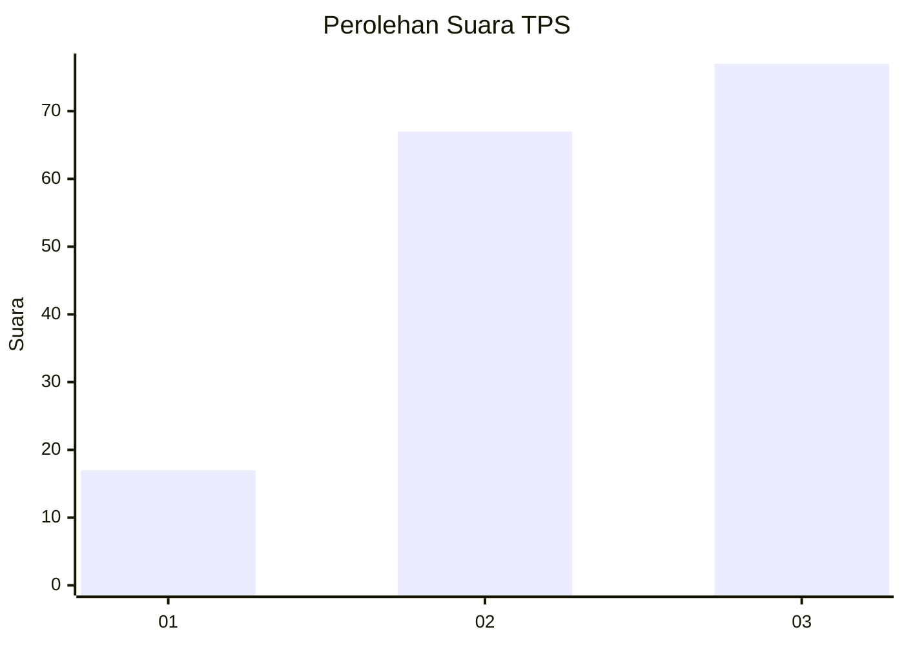
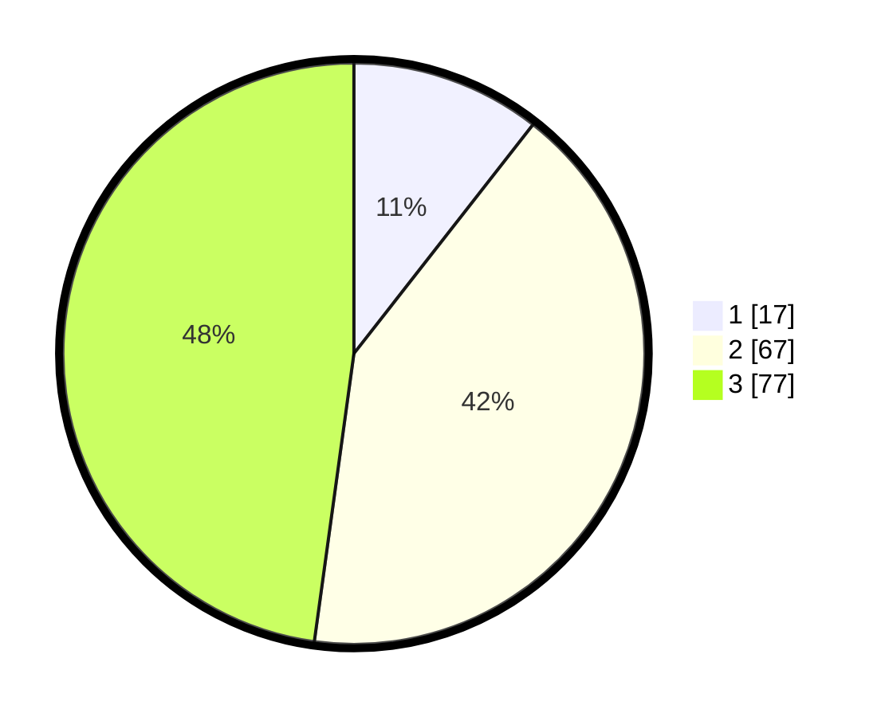

# Hasil

## Grafik

## Tabel

| No. | Nama Paslon    | Suara | Suara (raw) | Persentase |
|:--- |:-------------- | -----:| -----------:| ----------:|
| 1   | ANIES MUHAIMIN | 17    | [17][p-1]   | 10,56      |
| 2   | PRABOWO GIBRAN | 67    | [67][p-2]   | 41,61      |
| 3   | GANJAR MAHFUD  | 77    | [77][p-3]   | 47,83      |

[p-1]: https://github.com/gigit-pemilu/pemilu-2024/blob/main/pilpres/hitung-suara/sub/33-jawa-tengah/sub/05-kebumen/sub/09-prembun/sub/2013-kabuaran/sub/005-tps/sub/paslon-1.txt
[p-2]: https://github.com/gigit-pemilu/pemilu-2024/blob/main/pilpres/hitung-suara/sub/33-jawa-tengah/sub/05-kebumen/sub/09-prembun/sub/2013-kabuaran/sub/005-tps/sub/paslon-2.txt
[p-3]: https://github.com/gigit-pemilu/pemilu-2024/blob/main/pilpres/hitung-suara/sub/33-jawa-tengah/sub/05-kebumen/sub/09-prembun/sub/2013-kabuaran/sub/005-tps/sub/paslon-3.txt

## Foto C Plano

https://sirekap-obj-formc.kpu.go.id/52a4/pemilu/ppwp/33/05/09/20/13/3305092013005-20240218-070443--ebf682fb-ba35-4478-ba0d-899bfba2f1a5.jpg

https://sirekap-obj-formc.kpu.go.id/52a4/pemilu/ppwp/33/05/09/20/13/3305092013005-20240217-130858--f67eb424-49e9-411f-9ff0-a2cf36f5873a.jpg

https://sirekap-obj-formc.kpu.go.id/52a4/pemilu/ppwp/33/05/09/20/13/3305092013005-20240218-065144--618fd099-100d-4799-9381-a3153b0122cd.jpg

## Metadata

| Key        | Value               |
| ---------- | ------------------- |
| Time Stamp | 2024-02-19 06:16:00 |

