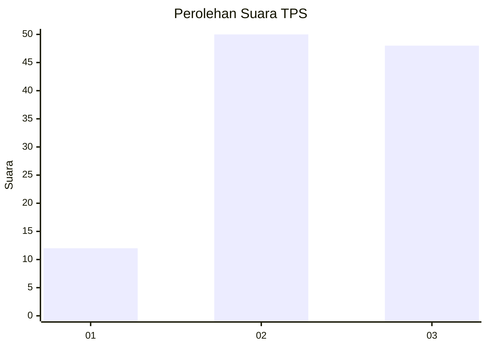
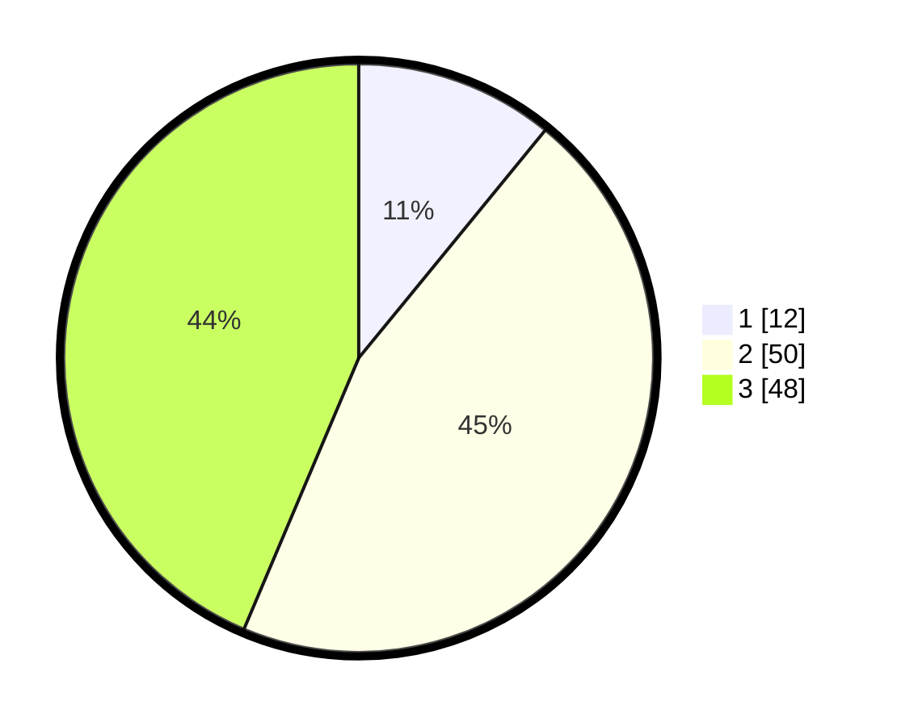

# Hasil

## Grafik

## Tabel

| No. | Nama Paslon    | Suara | Suara (raw) | Persentase |
|:--- |:-------------- | -----:| -----------:| ----------:|
| 1   | ANIES MUHAIMIN | 12    | [12][p-1]   | 10,91      |
| 2   | PRABOWO GIBRAN | 50    | [50][p-2]   | 45,45      |
| 3   | GANJAR MAHFUD  | 48    | [48][p-3]   | 43,64      |

[p-1]: https://github.com/gigit-pemilu/pemilu-2024-33-jawa-tengah/blob/main/pilpres/hitung-suara/sub/33-jawa-tengah/sub/05-kebumen/sub/10-kutowinangun/sub/2004-kutowinangun/sub/017-tps/sub/paslon-1.txt
[p-2]: https://github.com/gigit-pemilu/pemilu-2024-33-jawa-tengah/blob/main/pilpres/hitung-suara/sub/33-jawa-tengah/sub/05-kebumen/sub/10-kutowinangun/sub/2004-kutowinangun/sub/017-tps/sub/paslon-2.txt
[p-3]: https://github.com/gigit-pemilu/pemilu-2024-33-jawa-tengah/blob/main/pilpres/hitung-suara/sub/33-jawa-tengah/sub/05-kebumen/sub/10-kutowinangun/sub/2004-kutowinangun/sub/017-tps/sub/paslon-3.txt

## Foto C Plano

https://sirekap-obj-formc.kpu.go.id/b948/pemilu/ppwp/33/05/10/20/04/3305102004017-20240217-110212--15ccc7e6-0bee-4b0d-8276-385beba5c990.jpg

https://sirekap-obj-formc.kpu.go.id/b948/pemilu/ppwp/33/05/10/20/04/3305102004017-20240217-110326--a9719a78-b465-4c9e-8cca-166f98193dea.jpg

https://sirekap-obj-formc.kpu.go.id/b948/pemilu/ppwp/33/05/10/20/04/3305102004017-20240217-110423--cbdb4ee1-1019-4697-9f36-dd75cb4805cc.jpg

## Metadata

| Key        | Value               |
| ---------- | ------------------- |
| Time Stamp | 2024-02-19 16:00:00 |

