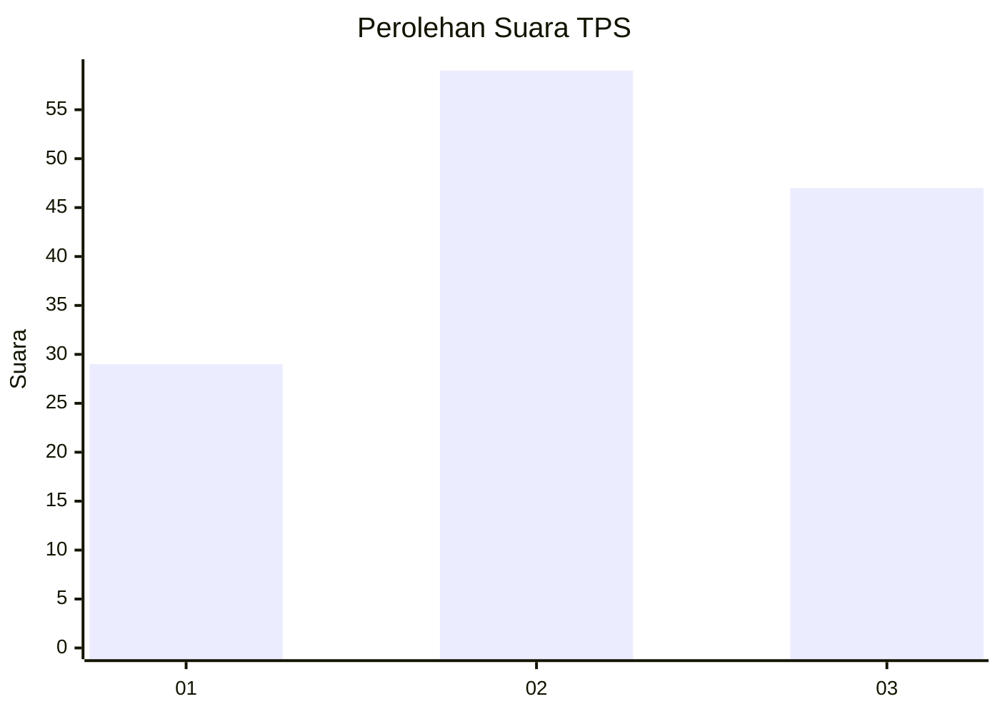
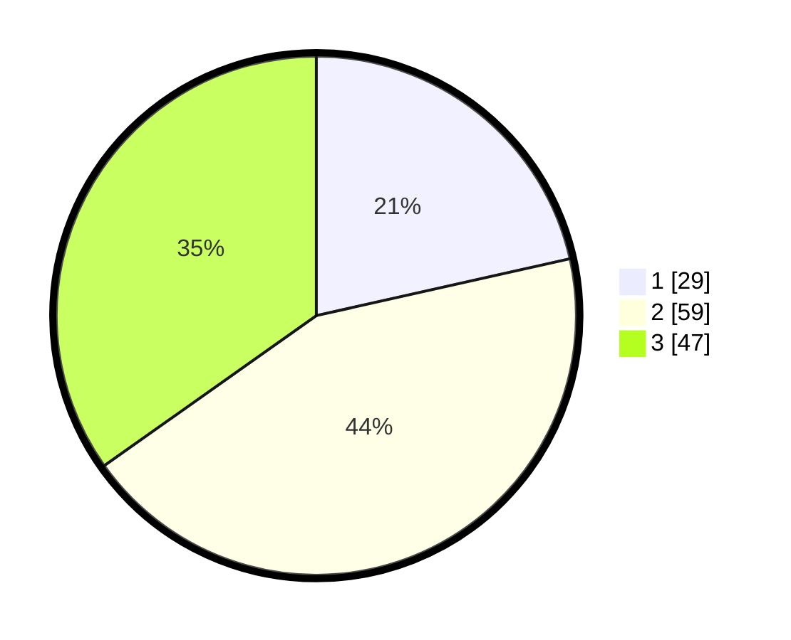

# Hasil

## Grafik

## Tabel

| No. | Nama Paslon    | Suara | Suara (raw) | Persentase |
|:--- |:-------------- | -----:| -----------:| ----------:|
| 1   | ANIES MUHAIMIN | 29    | [29][p-1]   | 21,48      |
| 2   | PRABOWO GIBRAN | 59    | [59][p-2]   | 43,70      |
| 3   | GANJAR MAHFUD  | 47    | [47][p-3]   | 34,81      |

[p-1]: https://github.com/gigit-pemilu/pemilu-2024-33-jawa-tengah/blob/main/pilpres/hitung-suara/sub/33-jawa-tengah/sub/05-kebumen/sub/10-kutowinangun/sub/2015-tanjungsari/sub/004-tps/sub/paslon-1.txt
[p-2]: https://github.com/gigit-pemilu/pemilu-2024-33-jawa-tengah/blob/main/pilpres/hitung-suara/sub/33-jawa-tengah/sub/05-kebumen/sub/10-kutowinangun/sub/2015-tanjungsari/sub/004-tps/sub/paslon-2.txt
[p-3]: https://github.com/gigit-pemilu/pemilu-2024-33-jawa-tengah/blob/main/pilpres/hitung-suara/sub/33-jawa-tengah/sub/05-kebumen/sub/10-kutowinangun/sub/2015-tanjungsari/sub/004-tps/sub/paslon-3.txt

## Foto C Plano

https://sirekap-obj-formc.kpu.go.id/38ac/pemilu/ppwp/33/05/10/20/15/3305102015004-20240215-031042--86619162-b220-4a58-a4f7-d5c8d931fb4a.jpg

https://sirekap-obj-formc.kpu.go.id/38ac/pemilu/ppwp/33/05/10/20/15/3305102015004-20240215-031232--03173d94-1cb1-4c74-9040-de3be6c61fe4.jpg

https://sirekap-obj-formc.kpu.go.id/38ac/pemilu/ppwp/33/05/10/20/15/3305102015004-20240214-214301--e4f2fc8a-3970-434e-8e30-f8b5d2c177cb.jpg

## Metadata

| Key        | Value               |
| ---------- | ------------------- |
| Time Stamp | 2024-02-17 10:30:03 |

