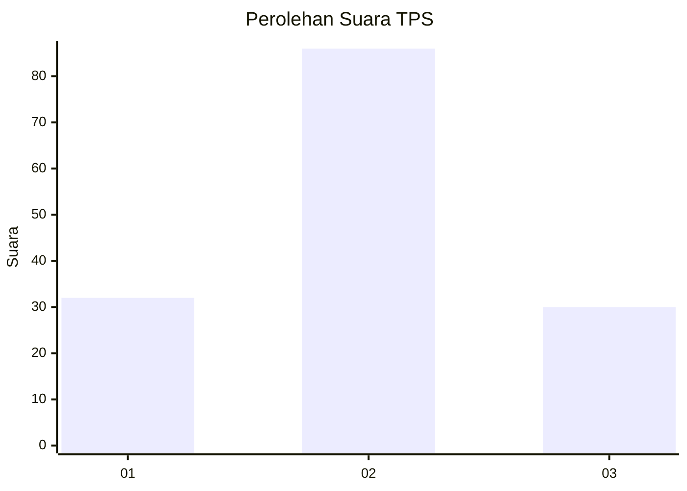
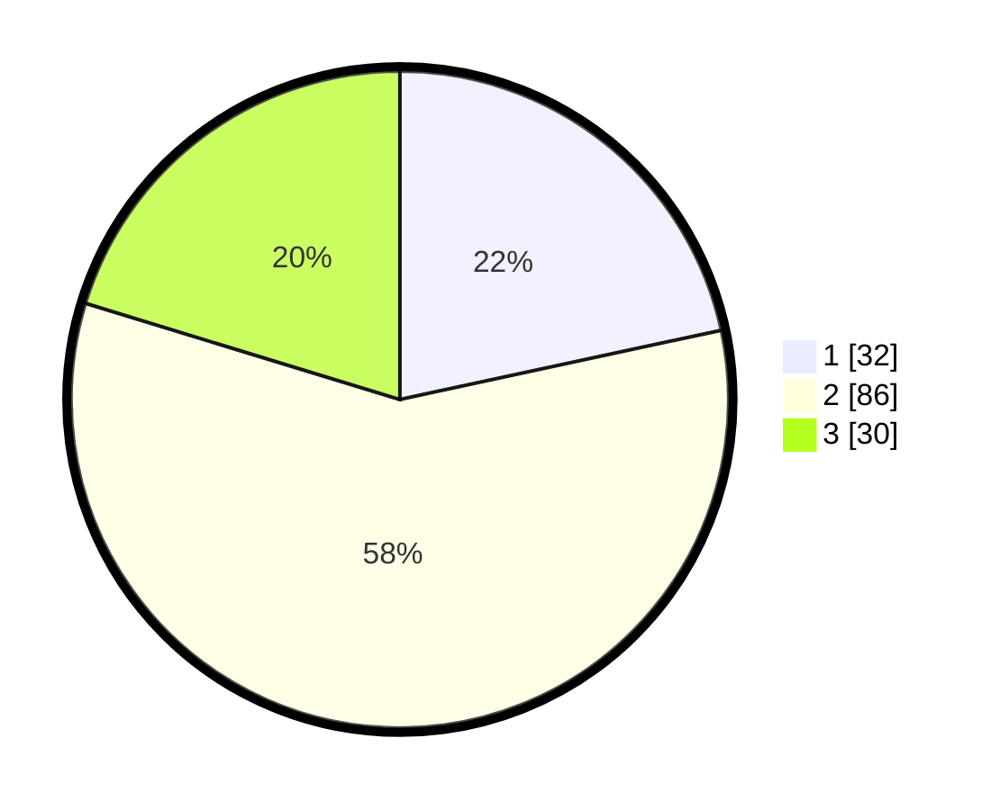

# Hasil

## Grafik

## Tabel

| No. | Nama Paslon    | Suara | Suara (raw) | Persentase |
|:--- |:-------------- | -----:| -----------:| ----------:|
| 1   | ANIES MUHAIMIN | 32    | [32][p-1]   | 21,62      |
| 2   | PRABOWO GIBRAN | 86    | [86][p-2]   | 58,11      |
| 3   | GANJAR MAHFUD  | 30    | [30][p-3]   | 20,27      |

[p-1]: https://github.com/gigit-pemilu/pemilu-2024/blob/main/pilpres/hitung-suara/sub/33-jawa-tengah/sub/05-kebumen/sub/11-alian/sub/2002-surotrunan/sub/012-tps/sub/paslon-1.txt
[p-2]: https://github.com/gigit-pemilu/pemilu-2024/blob/main/pilpres/hitung-suara/sub/33-jawa-tengah/sub/05-kebumen/sub/11-alian/sub/2002-surotrunan/sub/012-tps/sub/paslon-2.txt
[p-3]: https://github.com/gigit-pemilu/pemilu-2024/blob/main/pilpres/hitung-suara/sub/33-jawa-tengah/sub/05-kebumen/sub/11-alian/sub/2002-surotrunan/sub/012-tps/sub/paslon-3.txt

## Foto C Plano

https://sirekap-obj-formc.kpu.go.id/d465/pemilu/ppwp/33/05/11/20/02/3305112002012-20240217-084352--06203942-2962-4886-b0c3-8d14e3dff687.jpg

https://sirekap-obj-formc.kpu.go.id/d465/pemilu/ppwp/33/05/11/20/02/3305112002012-20240214-213414--1853b3d0-5522-4b53-92d5-e764b6b9f862.jpg

https://sirekap-obj-formc.kpu.go.id/d465/pemilu/ppwp/33/05/11/20/02/3305112002012-20240214-213607--7e2a0e9b-8d96-4892-962f-9c8c608d50ea.jpg

## Metadata

| Key        | Value               |
| ---------- | ------------------- |
| Time Stamp | 2024-02-19 16:00:00 |

