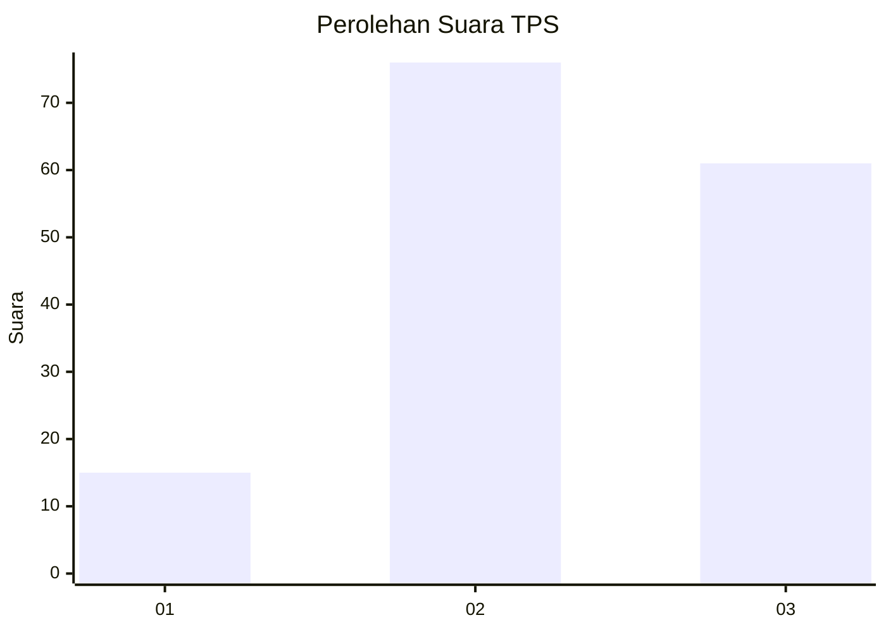
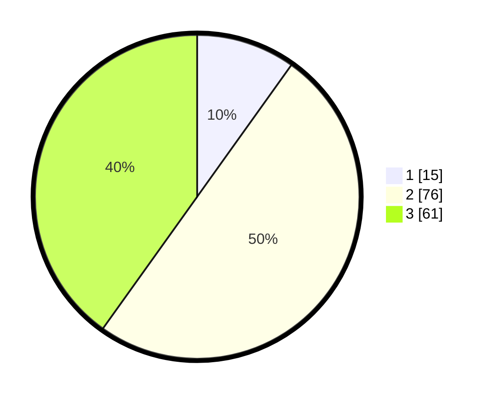

# Hasil

## Grafik

## Tabel

| No. | Nama Paslon    | Suara | Suara (raw) | Persentase |
|:--- |:-------------- | -----:| -----------:| ----------:|
| 1   | ANIES MUHAIMIN | 15    | [15][p-1]   | 9,87       |
| 2   | PRABOWO GIBRAN | 76    | [76][p-2]   | 50,00      |
| 3   | GANJAR MAHFUD  | 61    | [61][p-3]   | 40,13      |

[p-1]: https://github.com/gigit-pemilu/pemilu-2024/blob/main/pilpres/hitung-suara/sub/33-jawa-tengah/sub/05-kebumen/sub/11-alian/sub/2008-kalijaya/sub/006-tps/sub/paslon-1.txt
[p-2]: https://github.com/gigit-pemilu/pemilu-2024/blob/main/pilpres/hitung-suara/sub/33-jawa-tengah/sub/05-kebumen/sub/11-alian/sub/2008-kalijaya/sub/006-tps/sub/paslon-2.txt
[p-3]: https://github.com/gigit-pemilu/pemilu-2024/blob/main/pilpres/hitung-suara/sub/33-jawa-tengah/sub/05-kebumen/sub/11-alian/sub/2008-kalijaya/sub/006-tps/sub/paslon-3.txt

## Foto C Plano

https://sirekap-obj-formc.kpu.go.id/2054/pemilu/ppwp/33/05/11/20/08/3305112008006-20240215-003228--0d05a54f-2497-4668-8e83-7d767172c0ca.jpg

https://sirekap-obj-formc.kpu.go.id/2054/pemilu/ppwp/33/05/11/20/08/3305112008006-20240214-224105--a9fbb661-25d3-4274-8647-bf2f8f935112.jpg

https://sirekap-obj-formc.kpu.go.id/2054/pemilu/ppwp/33/05/11/20/08/3305112008006-20240214-223913--e998cfd9-1186-4652-9376-958096d902ef.jpg

## Metadata

| Key        | Value               |
| ---------- | ------------------- |
| Time Stamp | 2024-02-19 16:00:00 |

