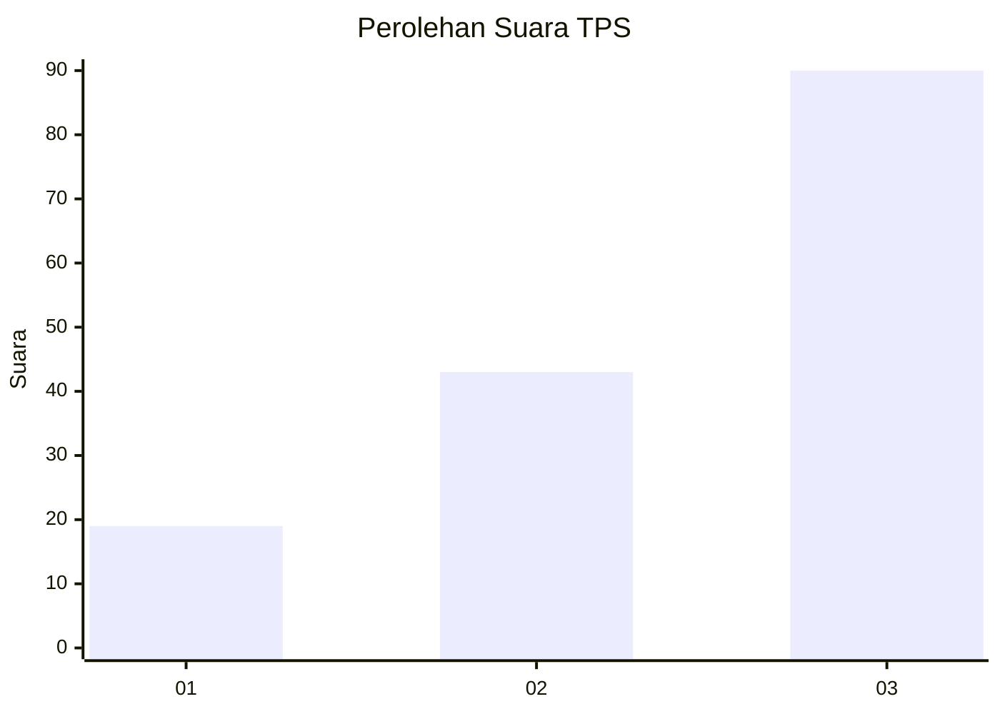
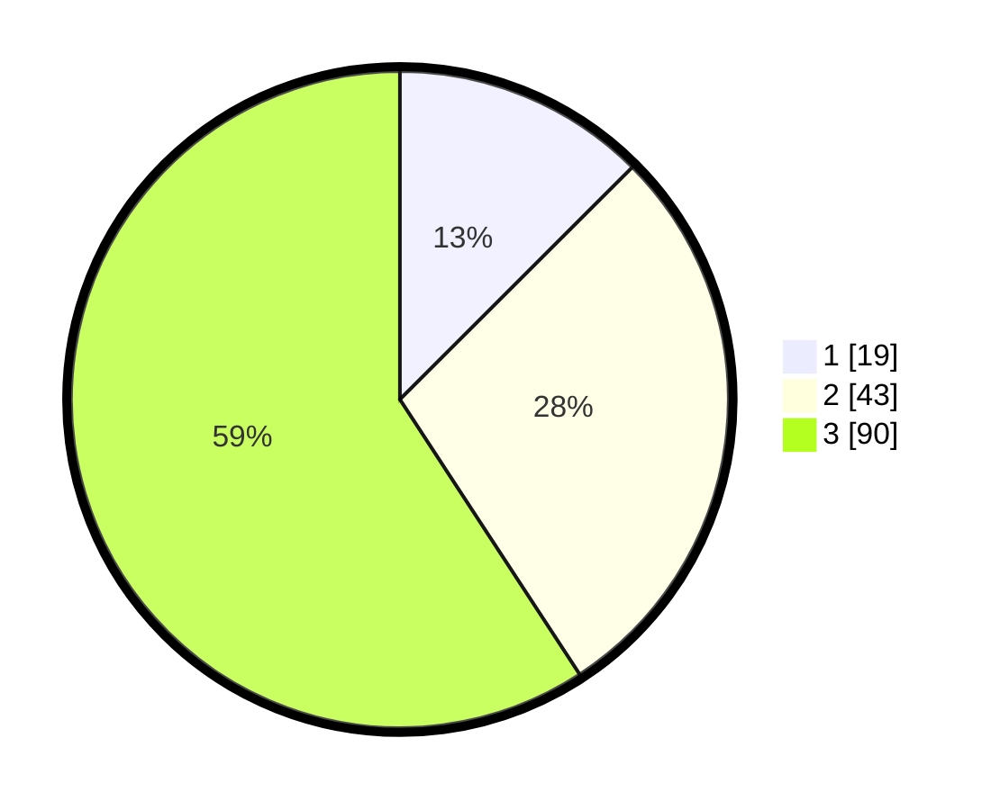

# Hasil

## Grafik

## Tabel

| No. | Nama Paslon    | Suara | Suara (raw) | Persentase |
|:--- |:-------------- | -----:| -----------:| ----------:|
| 1   | ANIES MUHAIMIN | 19    | [19][p-1]   | 12,50      |
| 2   | PRABOWO GIBRAN | 43    | [43][p-2]   | 28,29      |
| 3   | GANJAR MAHFUD  | 90    | [90][p-3]   | 59,21      |

[p-1]: https://github.com/gigit-pemilu/pemilu-2024/blob/main/pilpres/hitung-suara/sub/33-jawa-tengah/sub/05-kebumen/sub/11-alian/sub/2013-wonokromo/sub/007-tps/sub/paslon-1.txt
[p-2]: https://github.com/gigit-pemilu/pemilu-2024/blob/main/pilpres/hitung-suara/sub/33-jawa-tengah/sub/05-kebumen/sub/11-alian/sub/2013-wonokromo/sub/007-tps/sub/paslon-2.txt
[p-3]: https://github.com/gigit-pemilu/pemilu-2024/blob/main/pilpres/hitung-suara/sub/33-jawa-tengah/sub/05-kebumen/sub/11-alian/sub/2013-wonokromo/sub/007-tps/sub/paslon-3.txt

## Foto C Plano

https://sirekap-obj-formc.kpu.go.id/4f64/pemilu/ppwp/33/05/11/20/13/3305112013007-20240214-235425--4364e27d-078e-4434-8400-de4842b5b874.jpg

https://sirekap-obj-formc.kpu.go.id/4f64/pemilu/ppwp/33/05/11/20/13/3305112013007-20240214-235501--02b55c08-5b18-4585-81e6-a39b52a9a92b.jpg

https://sirekap-obj-formc.kpu.go.id/4f64/pemilu/ppwp/33/05/11/20/13/3305112013007-20240214-235605--73fb7d9d-96c8-4c9b-8140-2ea834be2faf.jpg

## Metadata

| Key        | Value               |
| ---------- | ------------------- |
| Time Stamp | 2024-02-19 16:00:00 |

