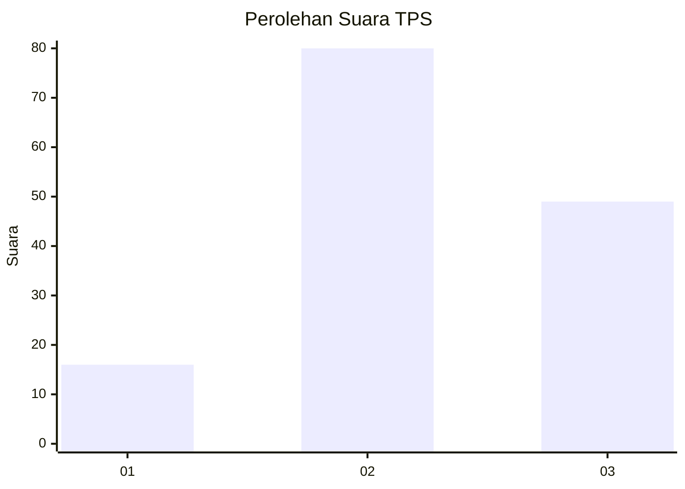
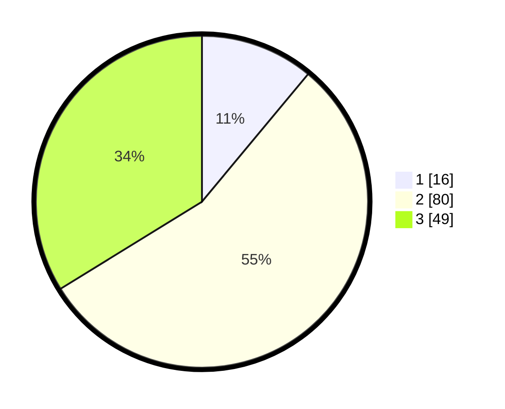

# Hasil

## Grafik

## Tabel

| No. | Nama Paslon    | Suara | Suara (raw) | Persentase |
|:--- |:-------------- | -----:| -----------:| ----------:|
| 1   | ANIES MUHAIMIN | 16    | [16][p-1]   | 11,03      |
| 2   | PRABOWO GIBRAN | 80    | [80][p-2]   | 55,17      |
| 3   | GANJAR MAHFUD  | 49    | [49][p-3]   | 33,79      |

[p-1]: https://github.com/gigit-pemilu/pemilu-2024/blob/main/pilpres/hitung-suara/sub/33-jawa-tengah/sub/05-kebumen/sub/11-alian/sub/2013-wonokromo/sub/014-tps/sub/paslon-1.txt
[p-2]: https://github.com/gigit-pemilu/pemilu-2024/blob/main/pilpres/hitung-suara/sub/33-jawa-tengah/sub/05-kebumen/sub/11-alian/sub/2013-wonokromo/sub/014-tps/sub/paslon-2.txt
[p-3]: https://github.com/gigit-pemilu/pemilu-2024/blob/main/pilpres/hitung-suara/sub/33-jawa-tengah/sub/05-kebumen/sub/11-alian/sub/2013-wonokromo/sub/014-tps/sub/paslon-3.txt

## Foto C Plano

https://sirekap-obj-formc.kpu.go.id/6ff1/pemilu/ppwp/33/05/11/20/13/3305112013014-20240215-060957--172b577f-cca6-48a5-be10-c71a3c25dd31.jpg

https://sirekap-obj-formc.kpu.go.id/6ff1/pemilu/ppwp/33/05/11/20/13/3305112013014-20240215-061101--140c20e8-9811-453c-96f8-cabced017d0b.jpg

https://sirekap-obj-formc.kpu.go.id/6ff1/pemilu/ppwp/33/05/11/20/13/3305112013014-20240215-062016--ee393cf8-5c13-4692-81d6-4d550a728876.jpg

## Metadata

| Key        | Value               |
| ---------- | ------------------- |
| Time Stamp | 2024-02-19 16:00:00 |

