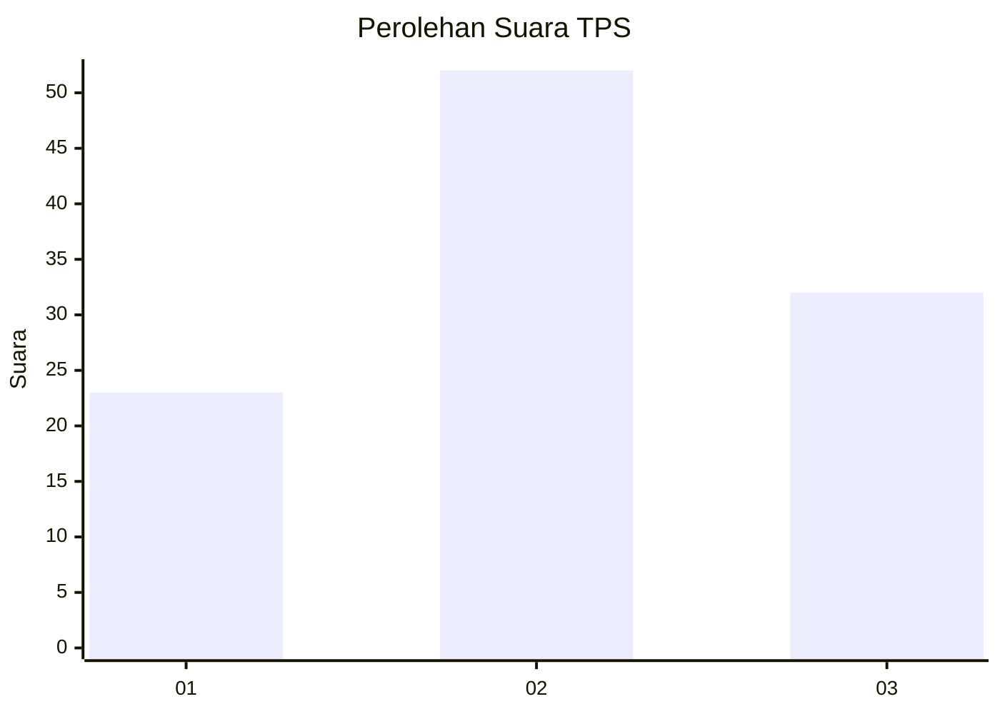
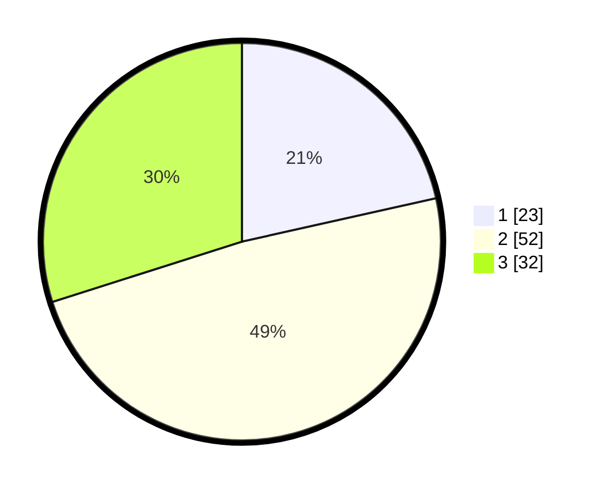

# Hasil

## Grafik

## Tabel

| No. | Nama Paslon    | Suara | Suara (raw) | Persentase |
|:--- |:-------------- | -----:| -----------:| ----------:|
| 1   | ANIES MUHAIMIN | 23    | [23][p-1]   | 21,50      |
| 2   | PRABOWO GIBRAN | 52    | [52][p-2]   | 48,60      |
| 3   | GANJAR MAHFUD  | 32    | [32][p-3]   | 29,91      |

[p-1]: https://github.com/gigit-pemilu/pemilu-2024-33-jawa-tengah/blob/main/pilpres/hitung-suara/sub/33-jawa-tengah/sub/05-kebumen/sub/11-alian/sub/2014-sawangan/sub/006-tps/sub/paslon-1.txt
[p-2]: https://github.com/gigit-pemilu/pemilu-2024-33-jawa-tengah/blob/main/pilpres/hitung-suara/sub/33-jawa-tengah/sub/05-kebumen/sub/11-alian/sub/2014-sawangan/sub/006-tps/sub/paslon-2.txt
[p-3]: https://github.com/gigit-pemilu/pemilu-2024-33-jawa-tengah/blob/main/pilpres/hitung-suara/sub/33-jawa-tengah/sub/05-kebumen/sub/11-alian/sub/2014-sawangan/sub/006-tps/sub/paslon-3.txt

## Foto C Plano

https://sirekap-obj-formc.kpu.go.id/2183/pemilu/ppwp/33/05/11/20/14/3305112014006-20240215-031859--ef8b0761-d1f7-4ead-b482-09eb585329e4.jpg

https://sirekap-obj-formc.kpu.go.id/2183/pemilu/ppwp/33/05/11/20/14/3305112014006-20240214-221124--39c5c9a8-ae1f-427b-b9da-6f0283e54263.jpg

https://sirekap-obj-formc.kpu.go.id/2183/pemilu/ppwp/33/05/11/20/14/3305112014006-20240214-221254--5f03d0fb-8d5d-4d6d-871d-32e01459b038.jpg

## Metadata

| Key        | Value               |
| ---------- | ------------------- |
| Time Stamp | 2024-02-19 16:00:00 |

