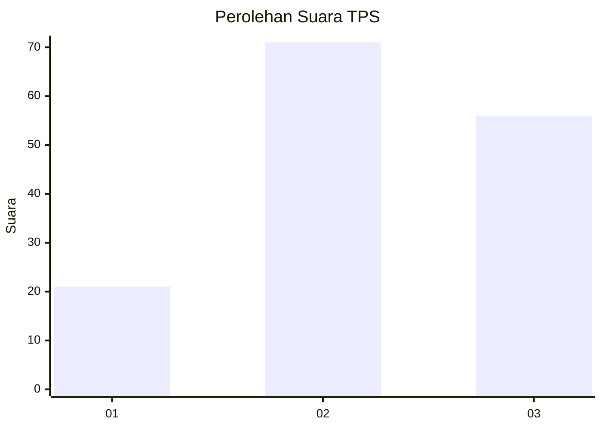
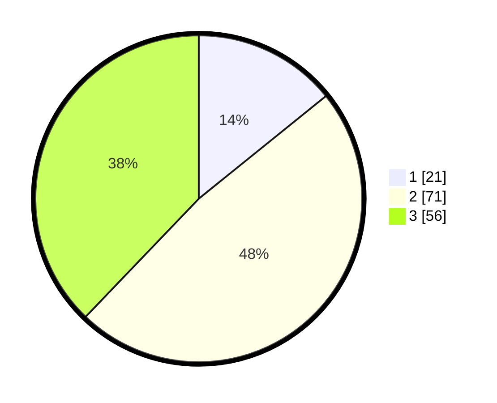

# Hasil

## Grafik

## Tabel

| No. | Nama Paslon    | Suara | Suara (raw) | Persentase |
|:--- |:-------------- | -----:| -----------:| ----------:|
| 1   | ANIES MUHAIMIN | 21    | [21][p-1]   | 14,19      |
| 2   | PRABOWO GIBRAN | 71    | [71][p-2]   | 47,97      |
| 3   | GANJAR MAHFUD  | 56    | [56][p-3]   | 37,84      |

[p-1]: https://github.com/gigit-pemilu/pemilu-2024/blob/main/pilpres/hitung-suara/sub/33-jawa-tengah/sub/05-kebumen/sub/11-alian/sub/2016-krakal/sub/022-tps/sub/paslon-1.txt
[p-2]: https://github.com/gigit-pemilu/pemilu-2024/blob/main/pilpres/hitung-suara/sub/33-jawa-tengah/sub/05-kebumen/sub/11-alian/sub/2016-krakal/sub/022-tps/sub/paslon-2.txt
[p-3]: https://github.com/gigit-pemilu/pemilu-2024/blob/main/pilpres/hitung-suara/sub/33-jawa-tengah/sub/05-kebumen/sub/11-alian/sub/2016-krakal/sub/022-tps/sub/paslon-3.txt

## Foto C Plano

https://sirekap-obj-formc.kpu.go.id/926f/pemilu/ppwp/33/05/11/20/16/3305112016022-20240214-224145--340b3fd0-396b-4e54-a61d-6dae8dfc70c9.jpg

https://sirekap-obj-formc.kpu.go.id/926f/pemilu/ppwp/33/05/11/20/16/3305112016022-20240214-235527--e49391e5-a6b9-4176-908e-9bb5591c101e.jpg

https://sirekap-obj-formc.kpu.go.id/926f/pemilu/ppwp/33/05/11/20/16/3305112016022-20240214-224651--3ca0b8bc-5d9e-4fa0-95ed-62457ee47103.jpg

## Metadata

| Key        | Value               |
| ---------- | ------------------- |
| Time Stamp | 2024-02-19 15:00:00 |

