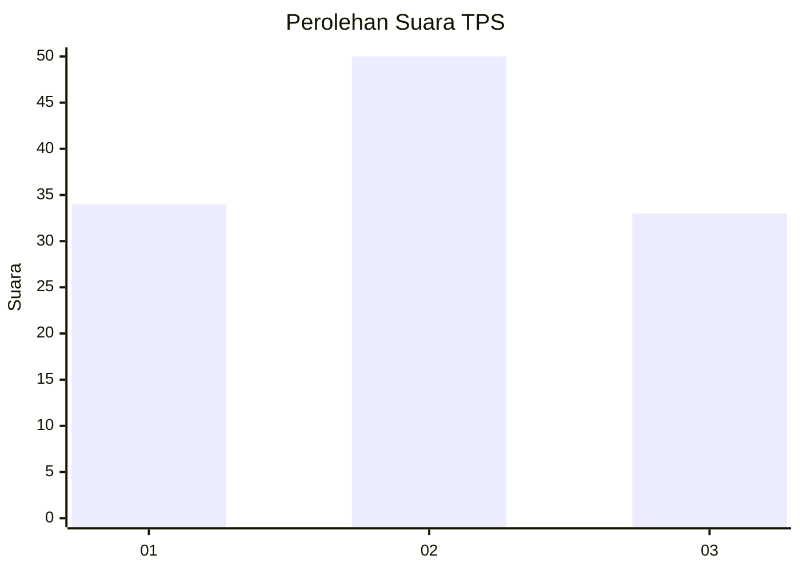
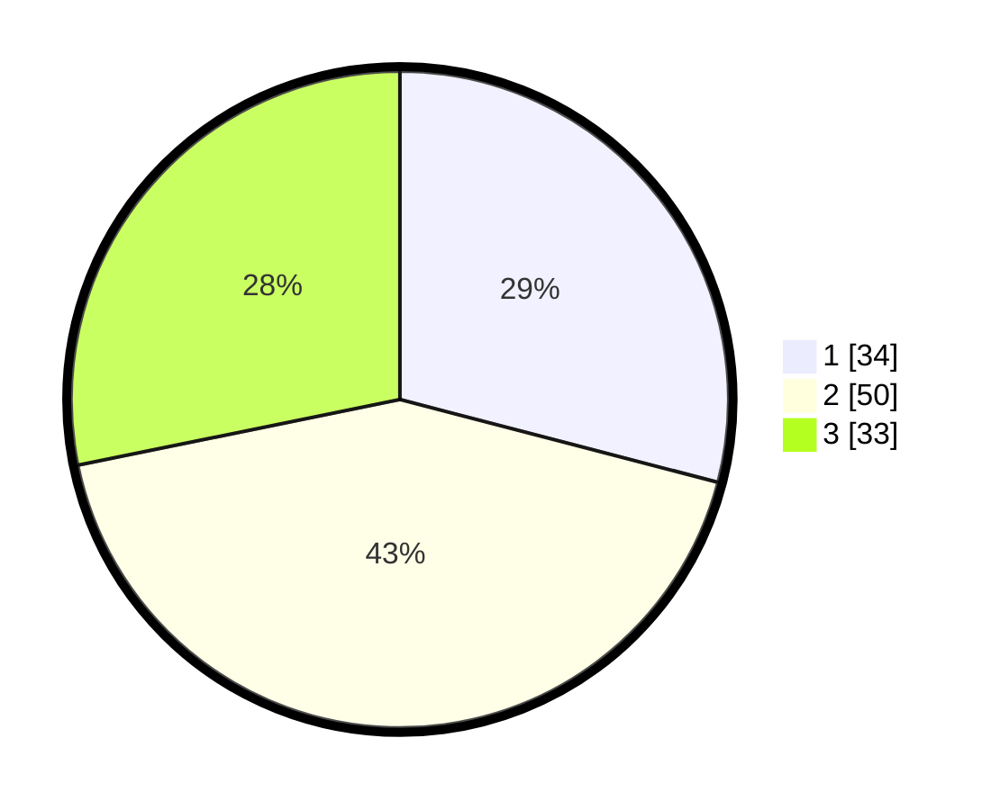

# Hasil

## Grafik

## Tabel

| No. | Nama Paslon    | Suara | Suara (raw) | Persentase |
|:--- |:-------------- | -----:| -----------:| ----------:|
| 1   | ANIES MUHAIMIN | 34    | [34][p-1]   | 29,06      |
| 2   | PRABOWO GIBRAN | 50    | [50][p-2]   | 42,74      |
| 3   | GANJAR MAHFUD  | 33    | [33][p-3]   | 28,21      |

[p-1]: https://github.com/gigit-pemilu/pemilu-2024-33-jawa-tengah/blob/main/pilpres/hitung-suara/sub/33-jawa-tengah/sub/05-kebumen/sub/12-kebumen/sub/1013-panjer/sub/001-tps/sub/paslon-1.txt
[p-2]: https://github.com/gigit-pemilu/pemilu-2024-33-jawa-tengah/blob/main/pilpres/hitung-suara/sub/33-jawa-tengah/sub/05-kebumen/sub/12-kebumen/sub/1013-panjer/sub/001-tps/sub/paslon-2.txt
[p-3]: https://github.com/gigit-pemilu/pemilu-2024-33-jawa-tengah/blob/main/pilpres/hitung-suara/sub/33-jawa-tengah/sub/05-kebumen/sub/12-kebumen/sub/1013-panjer/sub/001-tps/sub/paslon-3.txt

## Foto C Plano

https://sirekap-obj-formc.kpu.go.id/80f4/pemilu/ppwp/33/05/12/10/13/3305121013001-20240220-144655--36537e63-e104-4e48-a39e-64c89c015e48.jpg

https://sirekap-obj-formc.kpu.go.id/80f4/pemilu/ppwp/33/05/12/10/13/3305121013001-20240214-195655--7e8a52ab-c0fb-44ae-bc70-58243f864c1e.jpg

https://sirekap-obj-formc.kpu.go.id/80f4/pemilu/ppwp/33/05/12/10/13/3305121013001-20240214-201524--c2b87c46-ee11-411b-af71-ffd147c9cbd1.jpg

## Metadata

| Key        | Value               |
| ---------- | ------------------- |
| Time Stamp | 2024-02-20 15:00:00 |

