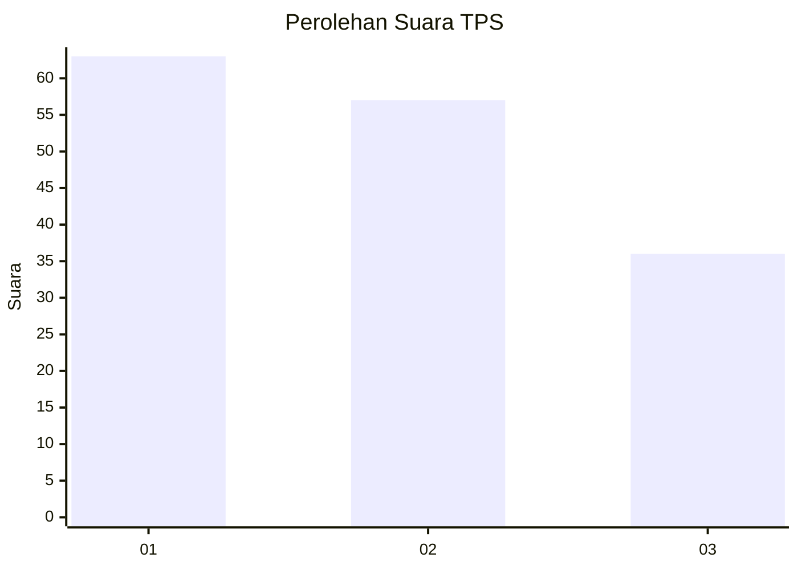
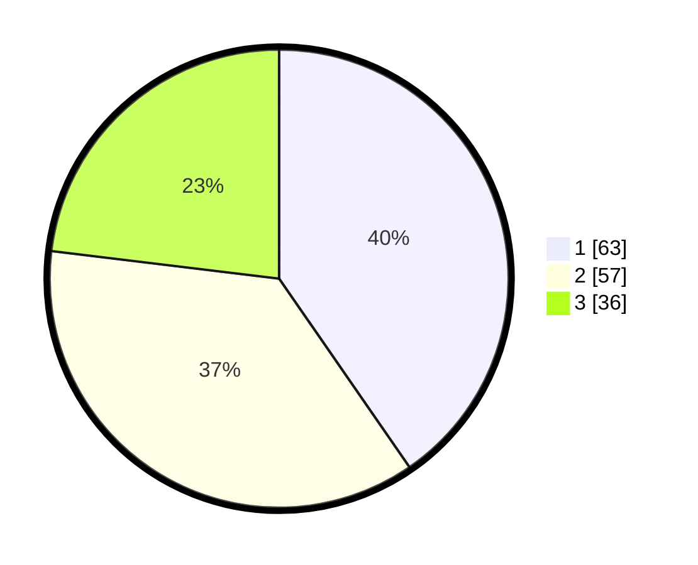

# Hasil

## Grafik

## Tabel

| No. | Nama Paslon    | Suara | Suara (raw) | Persentase |
|:--- |:-------------- | -----:| -----------:| ----------:|
| 1   | ANIES MUHAIMIN | 63    | [63][p-1]   | 40,38      |
| 2   | PRABOWO GIBRAN | 57    | [57][p-2]   | 36,54      |
| 3   | GANJAR MAHFUD  | 36    | [36][p-3]   | 23,08      |

[p-1]: https://github.com/gigit-pemilu/pemilu-2024-33-jawa-tengah/blob/main/pilpres/hitung-suara/sub/33-jawa-tengah/sub/05-kebumen/sub/12-kebumen/sub/1026-bumirejo/sub/022-tps/sub/paslon-1.txt
[p-2]: https://github.com/gigit-pemilu/pemilu-2024-33-jawa-tengah/blob/main/pilpres/hitung-suara/sub/33-jawa-tengah/sub/05-kebumen/sub/12-kebumen/sub/1026-bumirejo/sub/022-tps/sub/paslon-2.txt
[p-3]: https://github.com/gigit-pemilu/pemilu-2024-33-jawa-tengah/blob/main/pilpres/hitung-suara/sub/33-jawa-tengah/sub/05-kebumen/sub/12-kebumen/sub/1026-bumirejo/sub/022-tps/sub/paslon-3.txt

## Foto C Plano

https://sirekap-obj-formc.kpu.go.id/19bc/pemilu/ppwp/33/05/12/10/26/3305121026022-20240214-220710--9cb7bed9-5bf9-4217-95c1-e4765fcad64b.jpg

https://sirekap-obj-formc.kpu.go.id/19bc/pemilu/ppwp/33/05/12/10/26/3305121026022-20240220-204932--c58f88b5-72af-40f0-9961-93bf13704157.jpg

https://sirekap-obj-formc.kpu.go.id/19bc/pemilu/ppwp/33/05/12/10/26/3305121026022-20240220-205033--89d2cc2c-df17-4216-85e3-09e7a86c0bcf.jpg

## Metadata

| Key        | Value               |
| ---------- | ------------------- |
| Time Stamp | 2024-02-21 10:00:00 |

