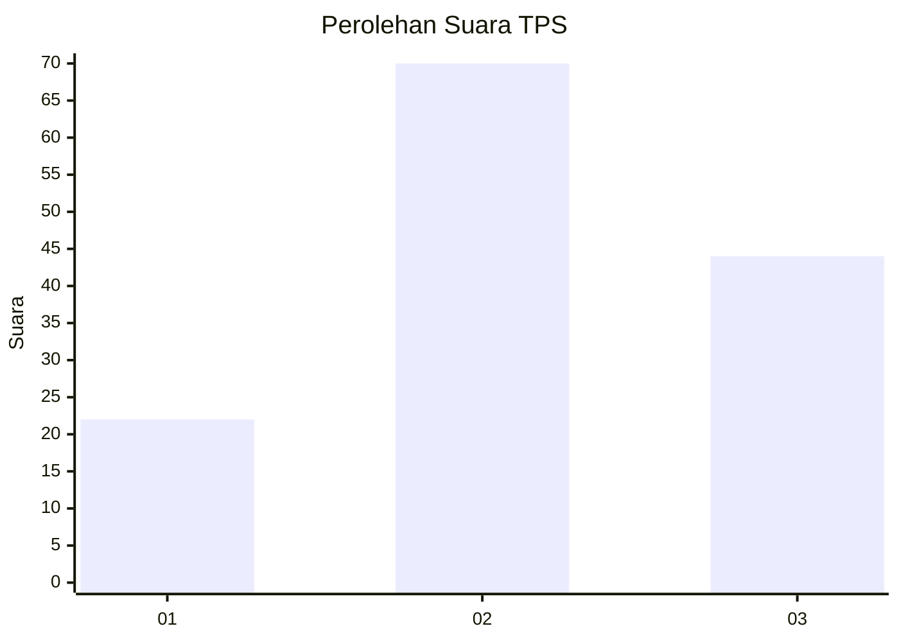
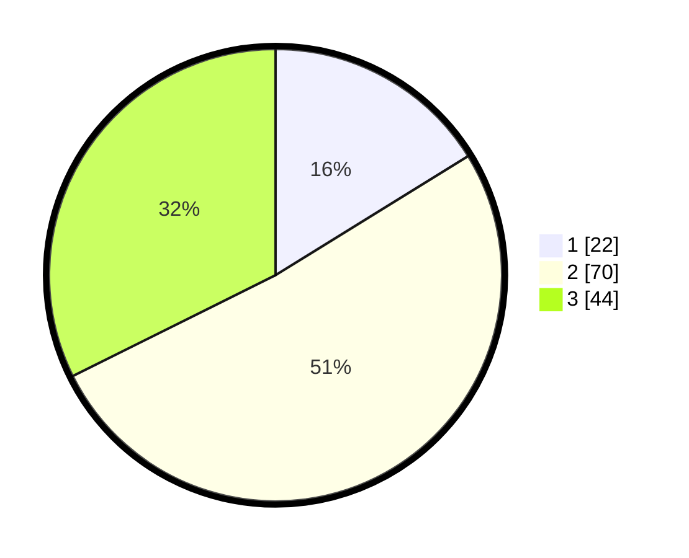

# Hasil

## Grafik

## Tabel

| No. | Nama Paslon    | Suara | Suara (raw) | Persentase |
|:--- |:-------------- | -----:| -----------:| ----------:|
| 1   | ANIES MUHAIMIN | 22    | [22][p-1]   | 16,18      |
| 2   | PRABOWO GIBRAN | 70    | [70][p-2]   | 51,47      |
| 3   | GANJAR MAHFUD  | 44    | [44][p-3]   | 32,35      |

[p-1]: https://github.com/gigit-pemilu/pemilu-2024/blob/main/pilpres/hitung-suara/sub/33-jawa-tengah/sub/05-kebumen/sub/12-kebumen/sub/1026-bumirejo/sub/024-tps/sub/paslon-1.txt
[p-2]: https://github.com/gigit-pemilu/pemilu-2024/blob/main/pilpres/hitung-suara/sub/33-jawa-tengah/sub/05-kebumen/sub/12-kebumen/sub/1026-bumirejo/sub/024-tps/sub/paslon-2.txt
[p-3]: https://github.com/gigit-pemilu/pemilu-2024/blob/main/pilpres/hitung-suara/sub/33-jawa-tengah/sub/05-kebumen/sub/12-kebumen/sub/1026-bumirejo/sub/024-tps/sub/paslon-3.txt

## Foto C Plano

https://sirekap-obj-formc.kpu.go.id/9bde/pemilu/ppwp/33/05/12/10/26/3305121026024-20240215-005812--c0c6847b-f28e-4525-afdd-b810cb86eb5e.jpg

https://sirekap-obj-formc.kpu.go.id/9bde/pemilu/ppwp/33/05/12/10/26/3305121026024-20240215-010119--ef2cbea9-e217-48ed-95c6-e6b06532885f.jpg

https://sirekap-obj-formc.kpu.go.id/9bde/pemilu/ppwp/33/05/12/10/26/3305121026024-20240215-014555--8308c35f-f933-4ba0-9399-a9fa9c289ce9.jpg

## Metadata

| Key        | Value               |
| ---------- | ------------------- |
| Time Stamp | 2024-02-15 12:00:28 |

