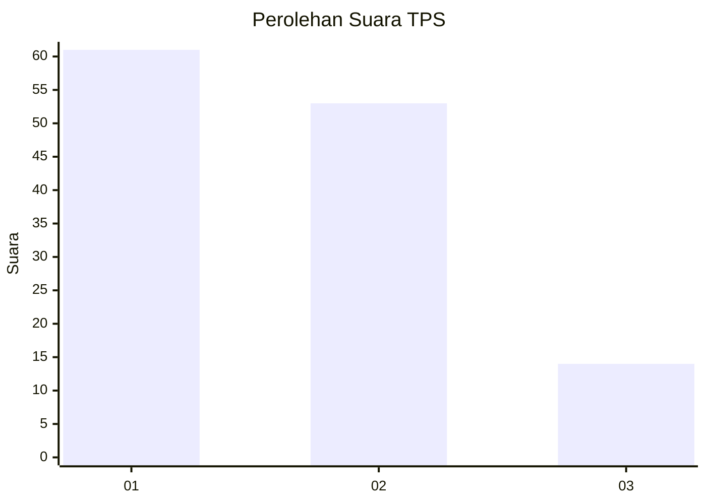
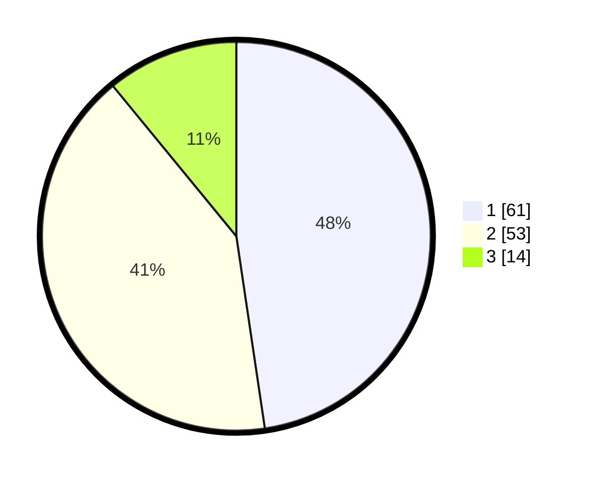

# Hasil

## Grafik

## Tabel

| No. | Nama Paslon    | Suara | Suara (raw) | Persentase |
|:--- |:-------------- | -----:| -----------:| ----------:|
| 1   | ANIES MUHAIMIN | 61    | [61][p-1]   | 47,66      |
| 2   | PRABOWO GIBRAN | 53    | [53][p-2]   | 41,41      |
| 3   | GANJAR MAHFUD  | 14    | [14][p-3]   | 10,94      |

[p-1]: https://github.com/gigit-pemilu/pemilu-2024/blob/main/pilpres/hitung-suara/sub/33-jawa-tengah/sub/05-kebumen/sub/12-kebumen/sub/2003-depokrejo/sub/009-tps/sub/paslon-1.txt
[p-2]: https://github.com/gigit-pemilu/pemilu-2024/blob/main/pilpres/hitung-suara/sub/33-jawa-tengah/sub/05-kebumen/sub/12-kebumen/sub/2003-depokrejo/sub/009-tps/sub/paslon-2.txt
[p-3]: https://github.com/gigit-pemilu/pemilu-2024/blob/main/pilpres/hitung-suara/sub/33-jawa-tengah/sub/05-kebumen/sub/12-kebumen/sub/2003-depokrejo/sub/009-tps/sub/paslon-3.txt

## Foto C Plano

https://sirekap-obj-formc.kpu.go.id/687b/pemilu/ppwp/33/05/12/20/03/3305122003009-20240214-221432--c28661d5-184e-46d5-baed-e0c35398e3f9.jpg

https://sirekap-obj-formc.kpu.go.id/687b/pemilu/ppwp/33/05/12/20/03/3305122003009-20240214-221700--39bb7d83-9412-4399-a3cb-5adb6d9673c7.jpg

https://sirekap-obj-formc.kpu.go.id/687b/pemilu/ppwp/33/05/12/20/03/3305122003009-20240214-221928--bc4f0235-16f9-494a-8c3e-070af7206277.jpg

## Metadata

| Key        | Value               |
| ---------- | ------------------- |
| Time Stamp | 2024-02-19 16:00:00 |

