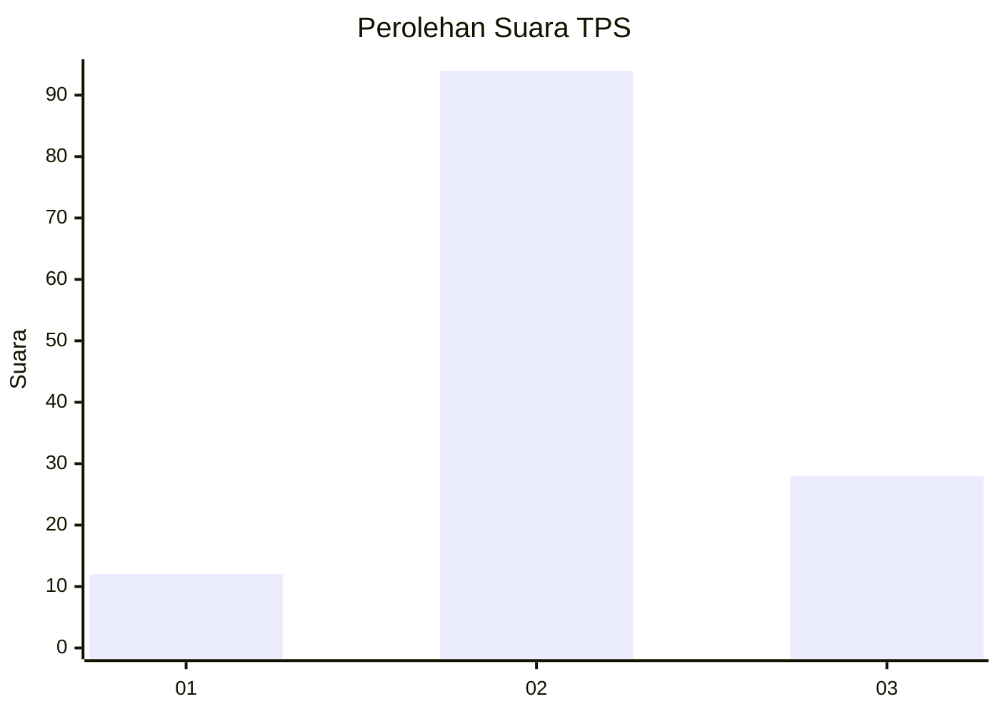
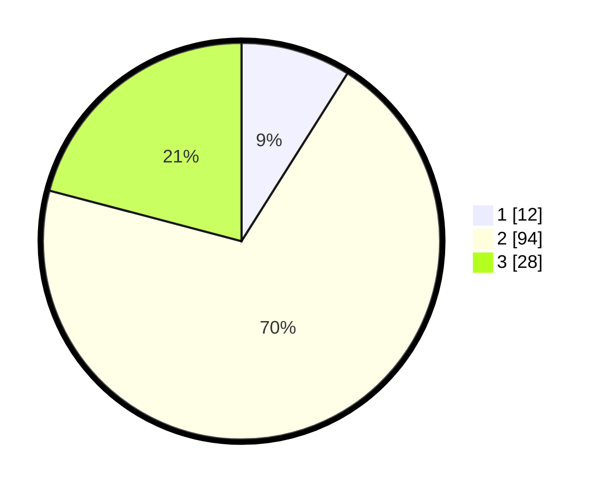

# Hasil

## Grafik

## Tabel

| No. | Nama Paslon    | Suara | Suara (raw) | Persentase |
|:--- |:-------------- | -----:| -----------:| ----------:|
| 1   | ANIES MUHAIMIN | 12    | [12][p-1]   | 8,96       |
| 2   | PRABOWO GIBRAN | 94    | [94][p-2]   | 70,15      |
| 3   | GANJAR MAHFUD  | 28    | [28][p-3]   | 20,90      |

[p-1]: https://github.com/gigit-pemilu/pemilu-2024/blob/main/pilpres/hitung-suara/sub/33-jawa-tengah/sub/05-kebumen/sub/12-kebumen/sub/2007-argopeni/sub/009-tps/sub/paslon-1.txt
[p-2]: https://github.com/gigit-pemilu/pemilu-2024/blob/main/pilpres/hitung-suara/sub/33-jawa-tengah/sub/05-kebumen/sub/12-kebumen/sub/2007-argopeni/sub/009-tps/sub/paslon-2.txt
[p-3]: https://github.com/gigit-pemilu/pemilu-2024/blob/main/pilpres/hitung-suara/sub/33-jawa-tengah/sub/05-kebumen/sub/12-kebumen/sub/2007-argopeni/sub/009-tps/sub/paslon-3.txt

## Foto C Plano

https://sirekap-obj-formc.kpu.go.id/bb3e/pemilu/ppwp/33/05/12/20/07/3305122007009-20240214-141611--47de9db1-8fe4-4dfd-8956-fe597f9240a3.jpg

https://sirekap-obj-formc.kpu.go.id/bb3e/pemilu/ppwp/33/05/12/20/07/3305122007009-20240214-141534--8f883fb6-298e-42d7-8931-3dc8bc64de96.jpg

https://sirekap-obj-formc.kpu.go.id/bb3e/pemilu/ppwp/33/05/12/20/07/3305122007009-20240214-141648--1e33e327-c646-482e-a384-3b7bcd5c78ea.jpg

## Metadata

| Key        | Value               |
| ---------- | ------------------- |
| Time Stamp | 2024-02-14 21:46:01 |

