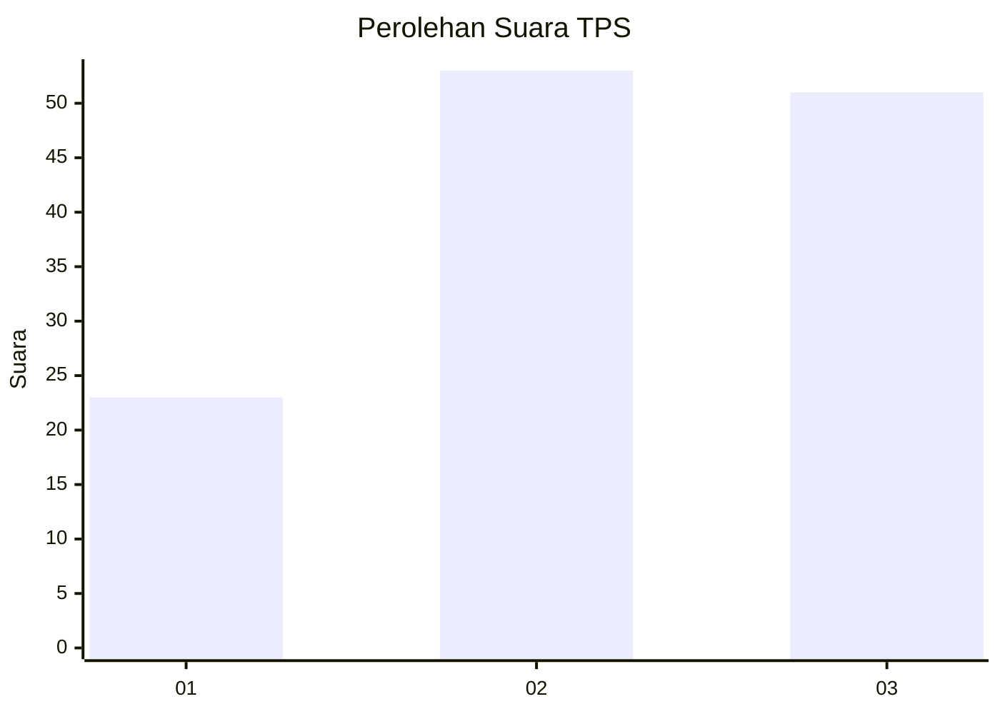
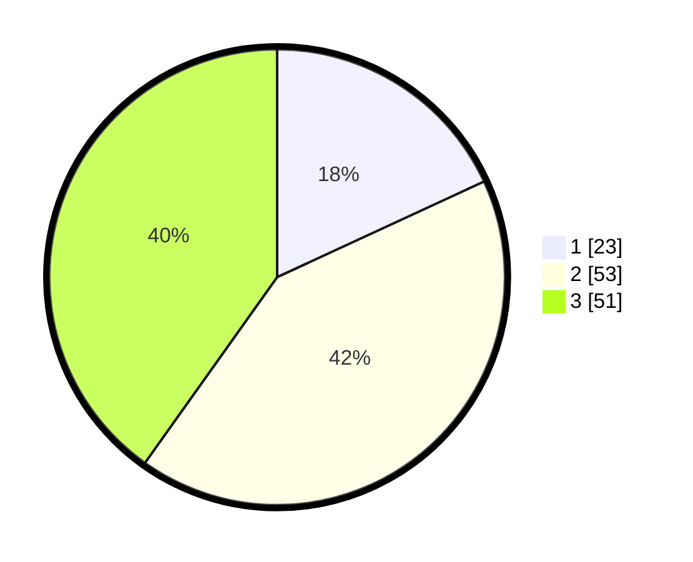

# Hasil

## Grafik

## Tabel

| No. | Nama Paslon    | Suara | Suara (raw) | Persentase |
|:--- |:-------------- | -----:| -----------:| ----------:|
| 1   | ANIES MUHAIMIN | 23    | [23][p-1]   | 18,11      |
| 2   | PRABOWO GIBRAN | 53    | [53][p-2]   | 41,73      |
| 3   | GANJAR MAHFUD  | 51    | [51][p-3]   | 40,16      |

[p-1]: https://github.com/gigit-pemilu/pemilu-2024-33-jawa-tengah/blob/main/pilpres/hitung-suara/sub/33-jawa-tengah/sub/05-kebumen/sub/12-kebumen/sub/2008-jatisari/sub/022-tps/sub/paslon-1.txt
[p-2]: https://github.com/gigit-pemilu/pemilu-2024-33-jawa-tengah/blob/main/pilpres/hitung-suara/sub/33-jawa-tengah/sub/05-kebumen/sub/12-kebumen/sub/2008-jatisari/sub/022-tps/sub/paslon-2.txt
[p-3]: https://github.com/gigit-pemilu/pemilu-2024-33-jawa-tengah/blob/main/pilpres/hitung-suara/sub/33-jawa-tengah/sub/05-kebumen/sub/12-kebumen/sub/2008-jatisari/sub/022-tps/sub/paslon-3.txt

## Foto C Plano

https://sirekap-obj-formc.kpu.go.id/5b47/pemilu/ppwp/33/05/12/20/08/3305122008022-20240218-174116--adae4e4d-8075-4fe5-9ecd-926d21d75e1e.jpg

https://sirekap-obj-formc.kpu.go.id/5b47/pemilu/ppwp/33/05/12/20/08/3305122008022-20240218-172934--9c788259-bd41-4e67-a703-450323eda855.jpg

https://sirekap-obj-formc.kpu.go.id/5b47/pemilu/ppwp/33/05/12/20/08/3305122008022-20240218-174917--f06bcc58-1563-4994-9f96-221088d78300.jpg

## Metadata

| Key        | Value               |
| ---------- | ------------------- |
| Time Stamp | 2024-02-19 16:00:00 |

