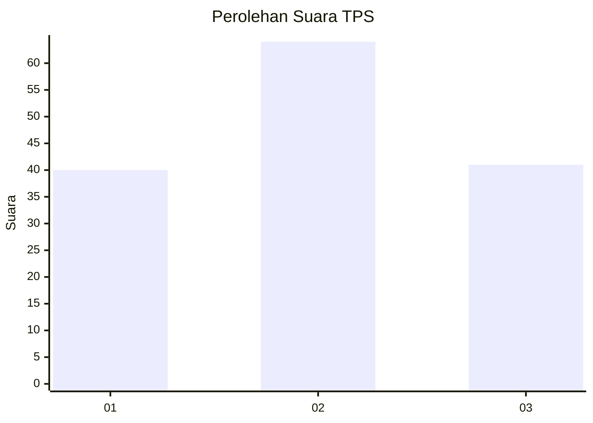
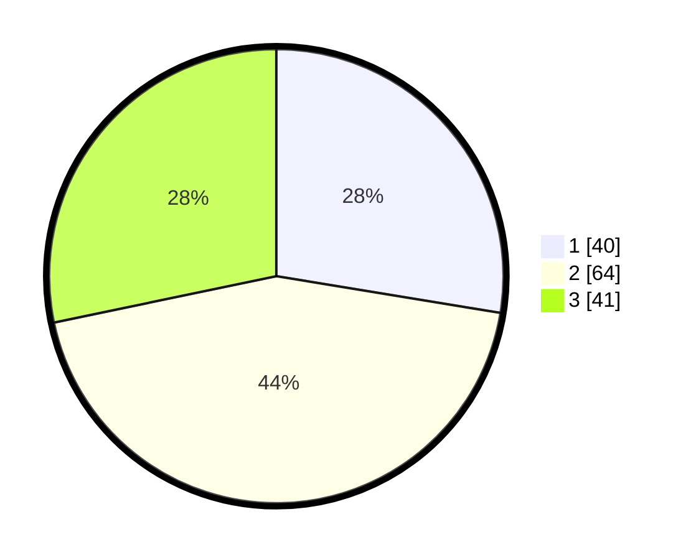

# Hasil

## Grafik

## Tabel

| No. | Nama Paslon    | Suara | Suara (raw) | Persentase |
|:--- |:-------------- | -----:| -----------:| ----------:|
| 1   | ANIES MUHAIMIN | 40    | [40][p-1]   | 27,59      |
| 2   | PRABOWO GIBRAN | 64    | [64][p-2]   | 44,14      |
| 3   | GANJAR MAHFUD  | 41    | [41][p-3]   | 28,28      |

[p-1]: https://github.com/gigit-pemilu/pemilu-2024/blob/main/pilpres/hitung-suara/sub/33-jawa-tengah/sub/05-kebumen/sub/12-kebumen/sub/2022-candiwulan/sub/009-tps/sub/paslon-1.txt
[p-2]: https://github.com/gigit-pemilu/pemilu-2024/blob/main/pilpres/hitung-suara/sub/33-jawa-tengah/sub/05-kebumen/sub/12-kebumen/sub/2022-candiwulan/sub/009-tps/sub/paslon-2.txt
[p-3]: https://github.com/gigit-pemilu/pemilu-2024/blob/main/pilpres/hitung-suara/sub/33-jawa-tengah/sub/05-kebumen/sub/12-kebumen/sub/2022-candiwulan/sub/009-tps/sub/paslon-3.txt

## Foto C Plano

https://sirekap-obj-formc.kpu.go.id/d21e/pemilu/ppwp/33/05/12/20/22/3305122022009-20240215-145122--3cb6b12f-25e2-4fc3-a63b-d05d6f209d7a.jpg

https://sirekap-obj-formc.kpu.go.id/d21e/pemilu/ppwp/33/05/12/20/22/3305122022009-20240215-181125--7f462e34-4bbd-4493-b5e2-aa8b445e3d4c.jpg

https://sirekap-obj-formc.kpu.go.id/d21e/pemilu/ppwp/33/05/12/20/22/3305122022009-20240215-145158--6d36d552-5008-4d02-b27c-558d35c4a51e.jpg

## Metadata

| Key        | Value               |
| ---------- | ------------------- |
| Time Stamp | 2024-02-19 16:00:00 |

