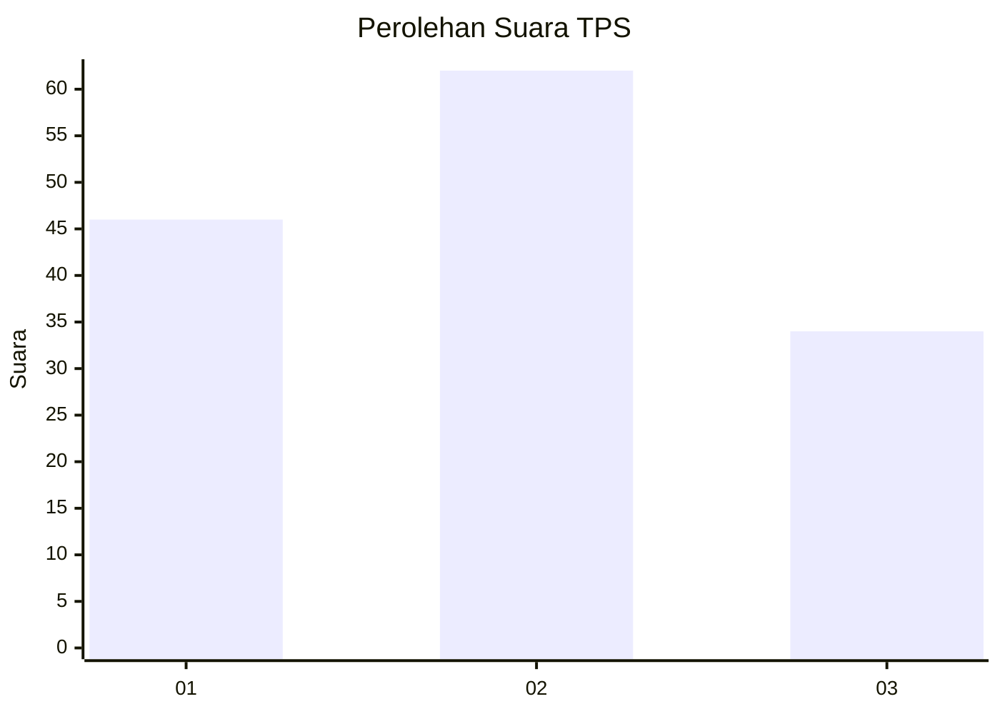
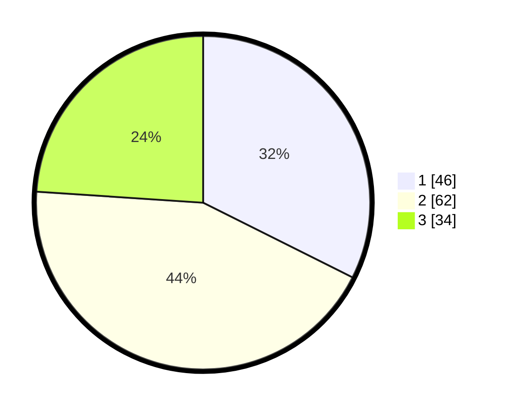

# Hasil

## Grafik

## Tabel

| No. | Nama Paslon    | Suara | Suara (raw) | Persentase |
|:--- |:-------------- | -----:| -----------:| ----------:|
| 1   | ANIES MUHAIMIN | 46    | [46][p-1]   | 32,39      |
| 2   | PRABOWO GIBRAN | 62    | [62][p-2]   | 43,66      |
| 3   | GANJAR MAHFUD  | 34    | [34][p-3]   | 23,94      |

[p-1]: https://github.com/gigit-pemilu/pemilu-2024-33-jawa-tengah/blob/main/pilpres/hitung-suara/sub/33-jawa-tengah/sub/05-kebumen/sub/12-kebumen/sub/2022-candiwulan/sub/010-tps/sub/paslon-1.txt
[p-2]: https://github.com/gigit-pemilu/pemilu-2024-33-jawa-tengah/blob/main/pilpres/hitung-suara/sub/33-jawa-tengah/sub/05-kebumen/sub/12-kebumen/sub/2022-candiwulan/sub/010-tps/sub/paslon-2.txt
[p-3]: https://github.com/gigit-pemilu/pemilu-2024-33-jawa-tengah/blob/main/pilpres/hitung-suara/sub/33-jawa-tengah/sub/05-kebumen/sub/12-kebumen/sub/2022-candiwulan/sub/010-tps/sub/paslon-3.txt

## Foto C Plano

https://sirekap-obj-formc.kpu.go.id/d6c7/pemilu/ppwp/33/05/12/20/22/3305122022010-20240216-195401--f279d100-6ed6-419e-a792-c8bd367e10db.jpg

https://sirekap-obj-formc.kpu.go.id/d6c7/pemilu/ppwp/33/05/12/20/22/3305122022010-20240216-195404--28cb5ace-c034-4dcb-98f4-719220ba0478.jpg

https://sirekap-obj-formc.kpu.go.id/d6c7/pemilu/ppwp/33/05/12/20/22/3305122022010-20240216-195407--b72f0aab-38ba-4a2a-938a-2e69dc73a99f.jpg

## Metadata

| Key        | Value               |
| ---------- | ------------------- |
| Time Stamp | 2024-02-19 17:00:00 |

