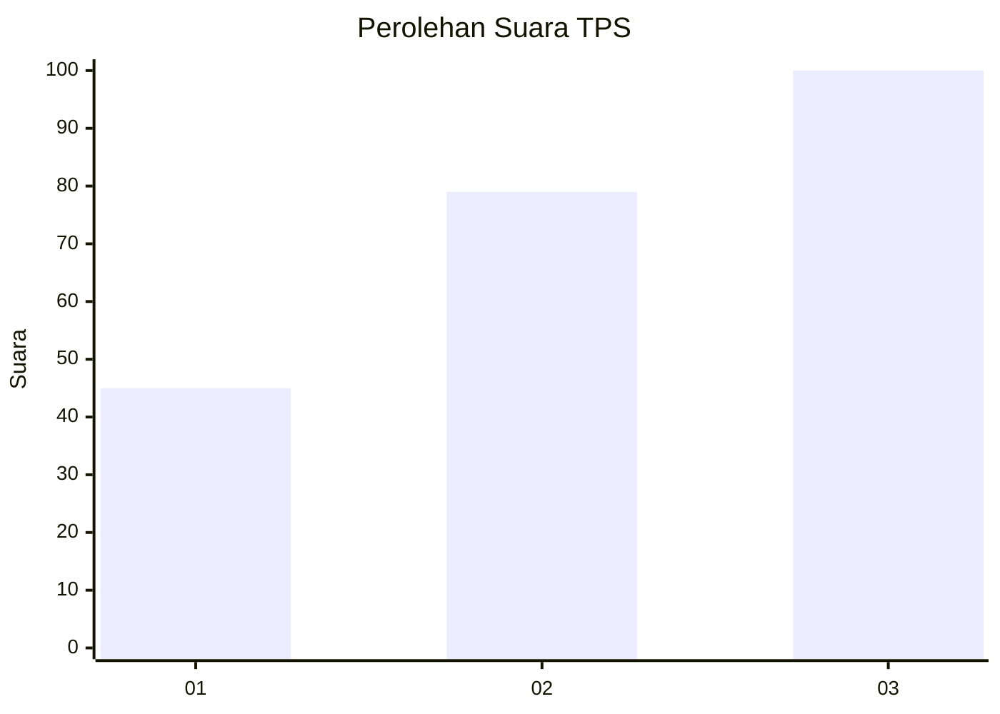
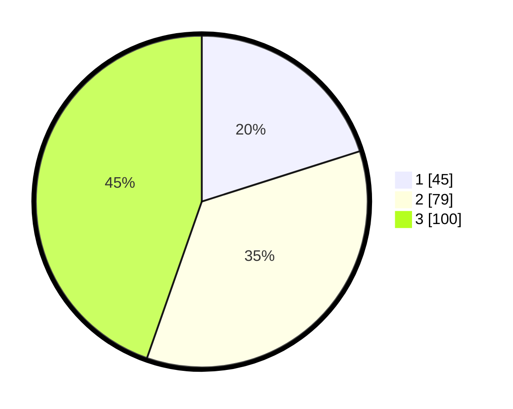

# Hasil

## Grafik

## Tabel

| No. | Nama Paslon    | Suara | Suara (raw) | Persentase |
|:--- |:-------------- | -----:| -----------:| ----------:|
| 1   | ANIES MUHAIMIN | 45    | [45][p-1]   | 20,09      |
| 2   | PRABOWO GIBRAN | 79    | [79][p-2]   | 35,27      |
| 3   | GANJAR MAHFUD  | 100   | [100][p-3]  | 44,64      |

[p-1]: https://github.com/gigit-pemilu/pemilu-2024-33-jawa-tengah/blob/main/pilpres/hitung-suara/sub/33-jawa-tengah/sub/05-kebumen/sub/12-kebumen/sub/2027-gemeksekti/sub/009-tps/sub/paslon-1.txt
[p-2]: https://github.com/gigit-pemilu/pemilu-2024-33-jawa-tengah/blob/main/pilpres/hitung-suara/sub/33-jawa-tengah/sub/05-kebumen/sub/12-kebumen/sub/2027-gemeksekti/sub/009-tps/sub/paslon-2.txt
[p-3]: https://github.com/gigit-pemilu/pemilu-2024-33-jawa-tengah/blob/main/pilpres/hitung-suara/sub/33-jawa-tengah/sub/05-kebumen/sub/12-kebumen/sub/2027-gemeksekti/sub/009-tps/sub/paslon-3.txt

## Foto C Plano

https://sirekap-obj-formc.kpu.go.id/ad20/pemilu/ppwp/33/05/12/20/27/3305122027009-20240217-152821--13551620-d74b-4db6-aeab-01153c73cbb5.jpg

https://sirekap-obj-formc.kpu.go.id/ad20/pemilu/ppwp/33/05/12/20/27/3305122027009-20240214-215002--eced22e4-23fd-42e3-9677-f9f6a727a2a0.jpg

https://sirekap-obj-formc.kpu.go.id/ad20/pemilu/ppwp/33/05/12/20/27/3305122027009-20240217-152921--ca6ffdf9-ce8d-4fbf-a965-e9430bce2135.jpg

## Metadata

| Key        | Value               |
| ---------- | ------------------- |
| Time Stamp | 2024-02-17 19:30:00 |

