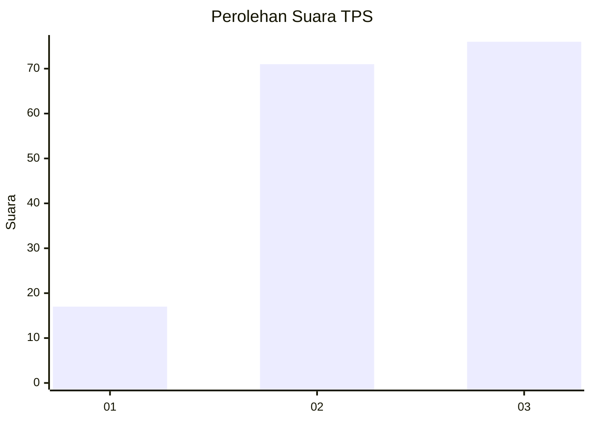
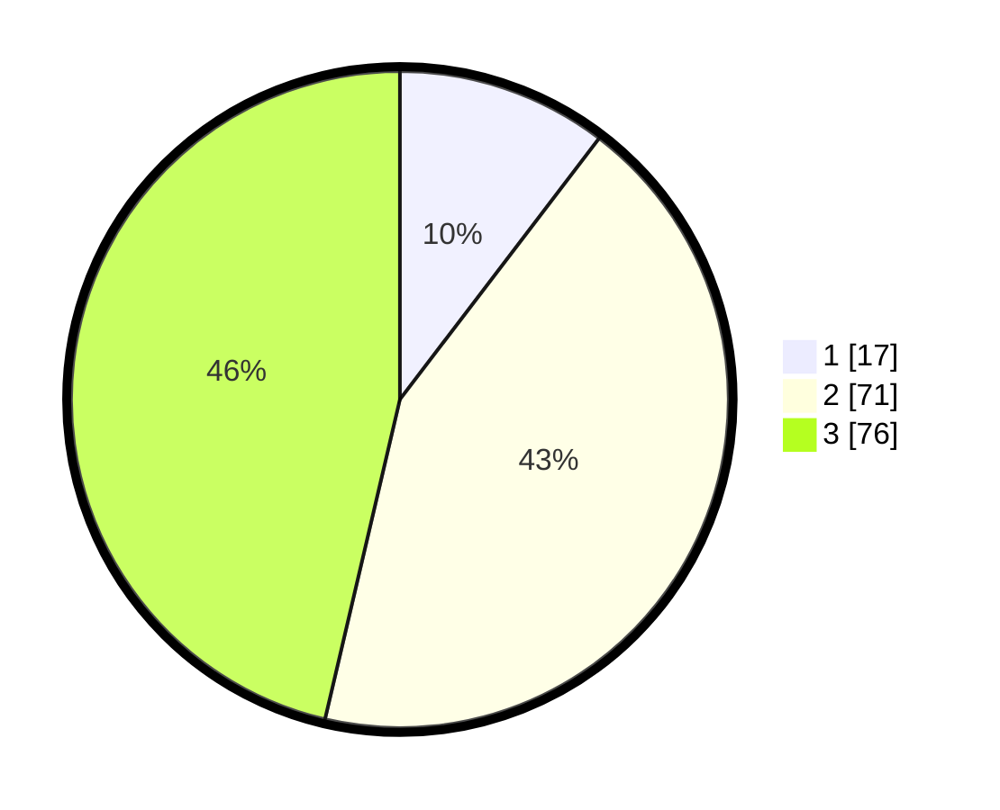

# Hasil

## Grafik

## Tabel

| No. | Nama Paslon    | Suara | Suara (raw) | Persentase |
|:--- |:-------------- | -----:| -----------:| ----------:|
| 1   | ANIES MUHAIMIN | 17    | [17][p-1]   | 10,37      |
| 2   | PRABOWO GIBRAN | 71    | [71][p-2]   | 43,29      |
| 3   | GANJAR MAHFUD  | 76    | [76][p-3]   | 46,34      |

[p-1]: https://github.com/gigit-pemilu/pemilu-2024-33-jawa-tengah/blob/main/pilpres/hitung-suara/sub/33-jawa-tengah/sub/05-kebumen/sub/13-pejagoan/sub/2006-aditirto/sub/009-tps/sub/paslon-1.txt
[p-2]: https://github.com/gigit-pemilu/pemilu-2024-33-jawa-tengah/blob/main/pilpres/hitung-suara/sub/33-jawa-tengah/sub/05-kebumen/sub/13-pejagoan/sub/2006-aditirto/sub/009-tps/sub/paslon-2.txt
[p-3]: https://github.com/gigit-pemilu/pemilu-2024-33-jawa-tengah/blob/main/pilpres/hitung-suara/sub/33-jawa-tengah/sub/05-kebumen/sub/13-pejagoan/sub/2006-aditirto/sub/009-tps/sub/paslon-3.txt

## Foto C Plano

https://sirekap-obj-formc.kpu.go.id/b86a/pemilu/ppwp/33/05/13/20/06/3305132006009-20240214-235733--ef792cc7-9e4b-4029-9b4f-163bee0d0d52.jpg

https://sirekap-obj-formc.kpu.go.id/b86a/pemilu/ppwp/33/05/13/20/06/3305132006009-20240214-235842--2cac94a1-aafe-4d84-a287-a2e705a9ae26.jpg

https://sirekap-obj-formc.kpu.go.id/b86a/pemilu/ppwp/33/05/13/20/06/3305132006009-20240215-000024--005e4ce0-5f3a-494b-b19b-33b8e423bb38.jpg

## Metadata

| Key        | Value               |
| ---------- | ------------------- |
| Time Stamp | 2024-02-15 20:00:44 |

