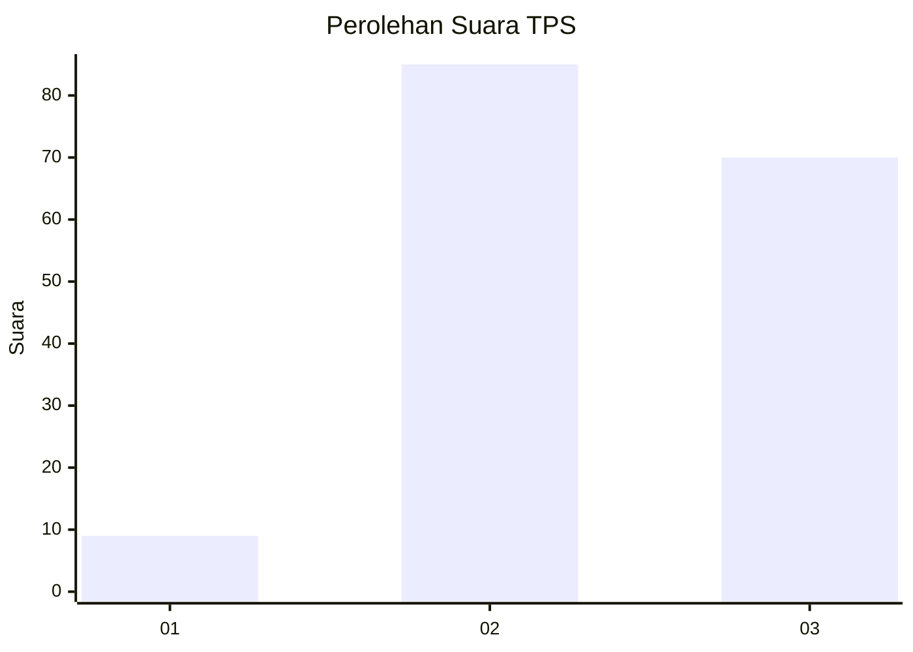
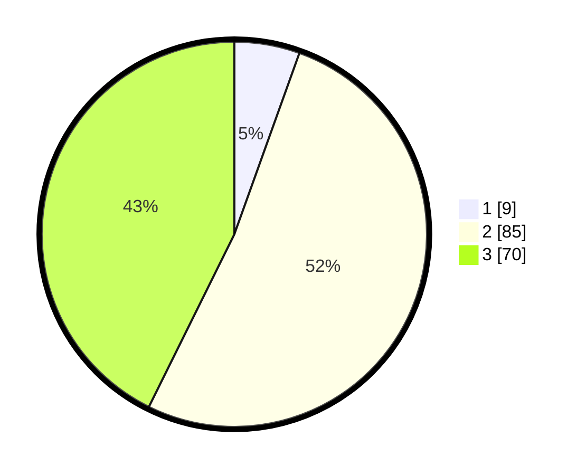

# Hasil

## Grafik

## Tabel

| No. | Nama Paslon    | Suara | Suara (raw) | Persentase |
|:--- |:-------------- | -----:| -----------:| ----------:|
| 1   | ANIES MUHAIMIN | 9     | [9][p-1]    | 5,49       |
| 2   | PRABOWO GIBRAN | 85    | [85][p-2]   | 51,83      |
| 3   | GANJAR MAHFUD  | 70    | [70][p-3]   | 42,68      |

[p-1]: https://github.com/gigit-pemilu/pemilu-2024-33-jawa-tengah/blob/main/pilpres/hitung-suara/sub/33-jawa-tengah/sub/05-kebumen/sub/13-pejagoan/sub/2007-karangpoh/sub/009-tps/sub/paslon-1.txt
[p-2]: https://github.com/gigit-pemilu/pemilu-2024-33-jawa-tengah/blob/main/pilpres/hitung-suara/sub/33-jawa-tengah/sub/05-kebumen/sub/13-pejagoan/sub/2007-karangpoh/sub/009-tps/sub/paslon-2.txt
[p-3]: https://github.com/gigit-pemilu/pemilu-2024-33-jawa-tengah/blob/main/pilpres/hitung-suara/sub/33-jawa-tengah/sub/05-kebumen/sub/13-pejagoan/sub/2007-karangpoh/sub/009-tps/sub/paslon-3.txt

## Foto C Plano

https://sirekap-obj-formc.kpu.go.id/3881/pemilu/ppwp/33/05/13/20/07/3305132007009-20240215-052023--042d7bda-52b0-44ba-8039-47415bf68ccb.jpg

https://sirekap-obj-formc.kpu.go.id/3881/pemilu/ppwp/33/05/13/20/07/3305132007009-20240215-020753--525a75bb-0bb0-4723-bfc8-1993f4f254f6.jpg

https://sirekap-obj-formc.kpu.go.id/3881/pemilu/ppwp/33/05/13/20/07/3305132007009-20240215-021052--13c27114-d6c5-4421-a435-2ae6841fa27c.jpg

## Metadata

| Key        | Value               |
| ---------- | ------------------- |
| Time Stamp | 2024-02-19 15:00:00 |

