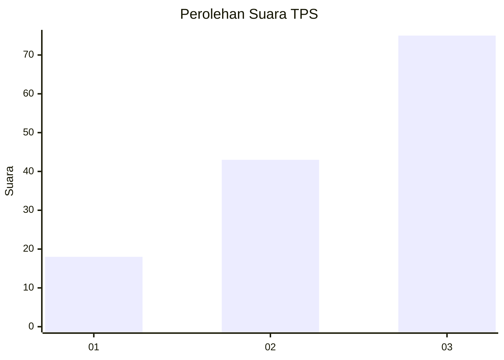
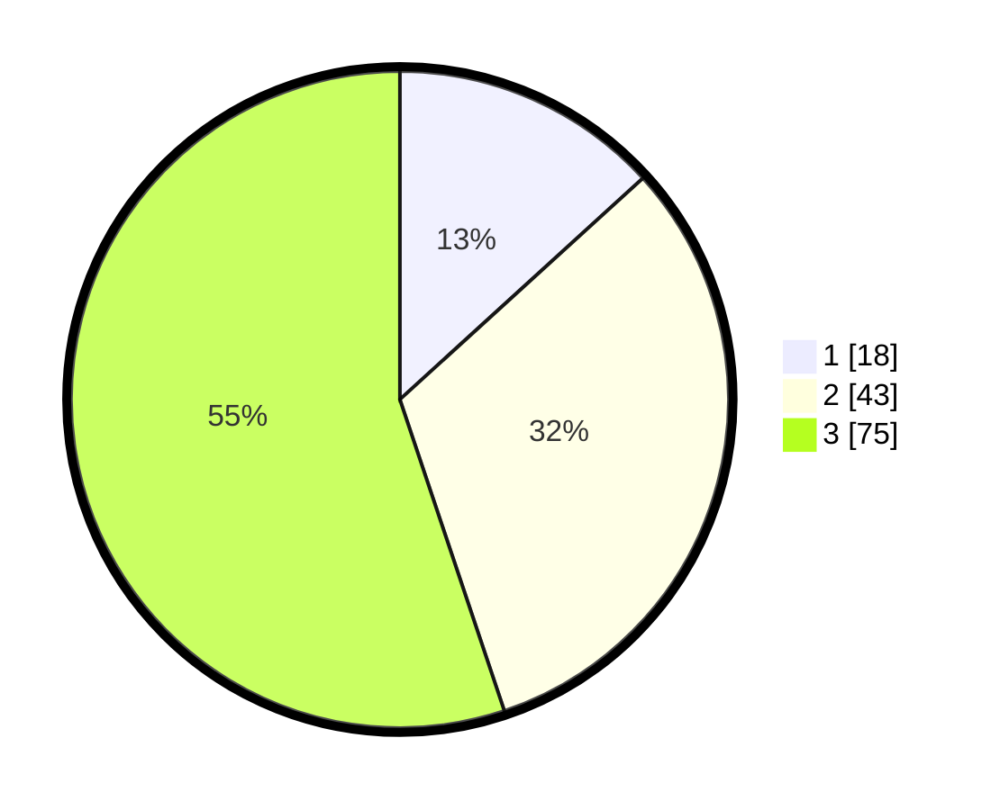

# Hasil

## Grafik

## Tabel

| No. | Nama Paslon    | Suara | Suara (raw) | Persentase |
|:--- |:-------------- | -----:| -----------:| ----------:|
| 1   | ANIES MUHAIMIN | 18    | [18][p-1]   | 13,24      |
| 2   | PRABOWO GIBRAN | 43    | [43][p-2]   | 31,62      |
| 3   | GANJAR MAHFUD  | 75    | [75][p-3]   | 55,15      |

[p-1]: https://github.com/gigit-pemilu/pemilu-2024/blob/main/pilpres/hitung-suara/sub/33-jawa-tengah/sub/05-kebumen/sub/13-pejagoan/sub/2007-karangpoh/sub/011-tps/sub/paslon-1.txt
[p-2]: https://github.com/gigit-pemilu/pemilu-2024/blob/main/pilpres/hitung-suara/sub/33-jawa-tengah/sub/05-kebumen/sub/13-pejagoan/sub/2007-karangpoh/sub/011-tps/sub/paslon-2.txt
[p-3]: https://github.com/gigit-pemilu/pemilu-2024/blob/main/pilpres/hitung-suara/sub/33-jawa-tengah/sub/05-kebumen/sub/13-pejagoan/sub/2007-karangpoh/sub/011-tps/sub/paslon-3.txt

## Foto C Plano

https://sirekap-obj-formc.kpu.go.id/7809/pemilu/ppwp/33/05/13/20/07/3305132007011-20240215-005410--513f44c0-2613-4ad5-a326-0d5f2e782c3d.jpg

https://sirekap-obj-formc.kpu.go.id/7809/pemilu/ppwp/33/05/13/20/07/3305132007011-20240216-023915--b2dd7c52-94eb-4456-bef0-802448c714d4.jpg

https://sirekap-obj-formc.kpu.go.id/7809/pemilu/ppwp/33/05/13/20/07/3305132007011-20240216-022326--88a5435c-cd31-48d2-ae54-3a1be7a233cd.jpg

## Metadata

| Key        | Value               |
| ---------- | ------------------- |
| Time Stamp | 2024-02-17 10:30:03 |

