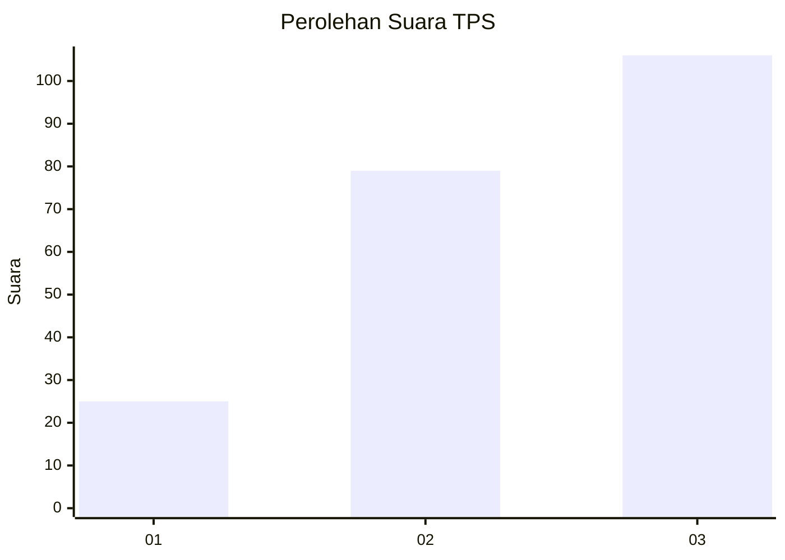
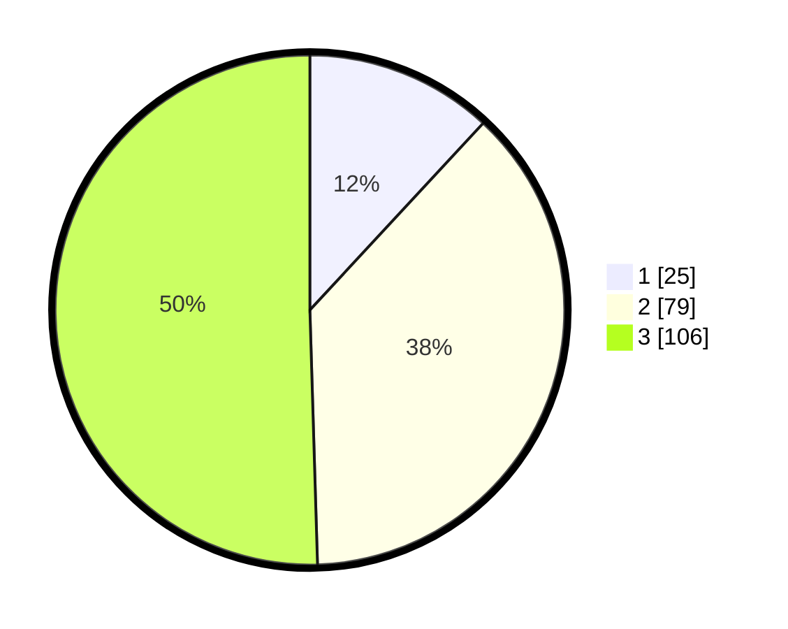

# Hasil

## Grafik

## Tabel

| No. | Nama Paslon    | Suara | Suara (raw) | Persentase |
|:--- |:-------------- | -----:| -----------:| ----------:|
| 1   | ANIES MUHAIMIN | 25    | [25][p-1]   | 11,90      |
| 2   | PRABOWO GIBRAN | 79    | [79][p-2]   | 37,62      |
| 3   | GANJAR MAHFUD  | 106   | [106][p-3]  | 50,48      |

[p-1]: https://github.com/gigit-pemilu/pemilu-2024-33-jawa-tengah/blob/main/pilpres/hitung-suara/sub/33-jawa-tengah/sub/05-kebumen/sub/13-pejagoan/sub/2008-jemur/sub/004-tps/sub/paslon-1.txt
[p-2]: https://github.com/gigit-pemilu/pemilu-2024-33-jawa-tengah/blob/main/pilpres/hitung-suara/sub/33-jawa-tengah/sub/05-kebumen/sub/13-pejagoan/sub/2008-jemur/sub/004-tps/sub/paslon-2.txt
[p-3]: https://github.com/gigit-pemilu/pemilu-2024-33-jawa-tengah/blob/main/pilpres/hitung-suara/sub/33-jawa-tengah/sub/05-kebumen/sub/13-pejagoan/sub/2008-jemur/sub/004-tps/sub/paslon-3.txt

## Foto C Plano

https://sirekap-obj-formc.kpu.go.id/2b43/pemilu/ppwp/33/05/13/20/08/3305132008004-20240215-211153--83562d22-052b-45ec-af7f-16adf92e4e38.jpg

https://sirekap-obj-formc.kpu.go.id/2b43/pemilu/ppwp/33/05/13/20/08/3305132008004-20240215-211254--75ff4095-fac0-42ac-9440-d2aab2e5aaae.jpg

https://sirekap-obj-formc.kpu.go.id/2b43/pemilu/ppwp/33/05/13/20/08/3305132008004-20240215-211620--fab5e568-d6eb-4e60-aa8b-5e1572d28ef9.jpg

## Metadata

| Key        | Value               |
| ---------- | ------------------- |
| Time Stamp | 2024-02-19 15:00:00 |

