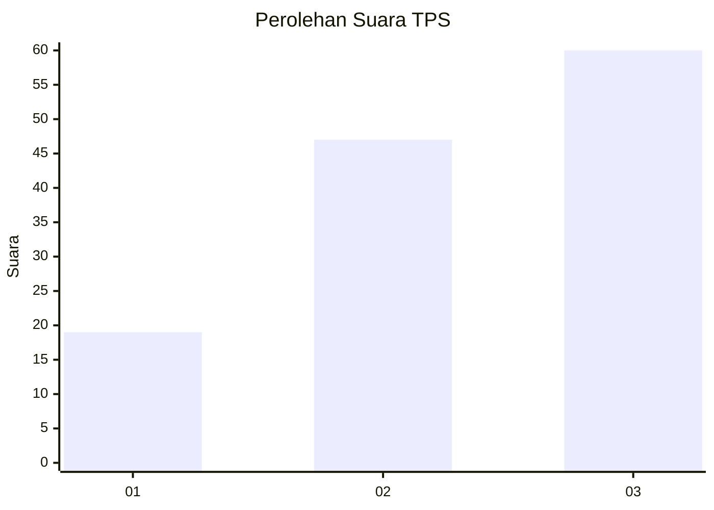
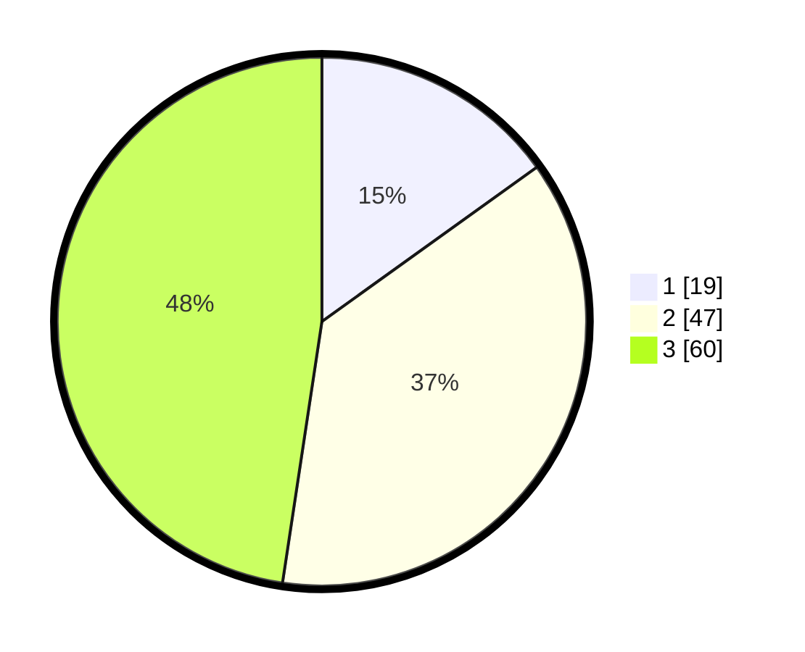

# Hasil

## Grafik

## Tabel

| No. | Nama Paslon    | Suara | Suara (raw) | Persentase |
|:--- |:-------------- | -----:| -----------:| ----------:|
| 1   | ANIES MUHAIMIN | 19    | [19][p-1]   | 15,08      |
| 2   | PRABOWO GIBRAN | 47    | [47][p-2]   | 37,30      |
| 3   | GANJAR MAHFUD  | 60    | [60][p-3]   | 47,62      |

[p-1]: https://github.com/gigit-pemilu/pemilu-2024-33-jawa-tengah/blob/main/pilpres/hitung-suara/sub/33-jawa-tengah/sub/05-kebumen/sub/13-pejagoan/sub/2009-prigi/sub/002-tps/sub/paslon-1.txt
[p-2]: https://github.com/gigit-pemilu/pemilu-2024-33-jawa-tengah/blob/main/pilpres/hitung-suara/sub/33-jawa-tengah/sub/05-kebumen/sub/13-pejagoan/sub/2009-prigi/sub/002-tps/sub/paslon-2.txt
[p-3]: https://github.com/gigit-pemilu/pemilu-2024-33-jawa-tengah/blob/main/pilpres/hitung-suara/sub/33-jawa-tengah/sub/05-kebumen/sub/13-pejagoan/sub/2009-prigi/sub/002-tps/sub/paslon-3.txt

## Foto C Plano

https://sirekap-obj-formc.kpu.go.id/30cd/pemilu/ppwp/33/05/13/20/09/3305132009002-20240217-140500--79ad1d1e-ac4c-48f7-84f0-cd01308c3e7c.jpg

https://sirekap-obj-formc.kpu.go.id/30cd/pemilu/ppwp/33/05/13/20/09/3305132009002-20240214-141307--d408e410-15da-4011-bf8d-d6bb1a8431a7.jpg

https://sirekap-obj-formc.kpu.go.id/30cd/pemilu/ppwp/33/05/13/20/09/3305132009002-20240214-141534--eeae8c52-7069-45df-ba31-7509f8139e45.jpg

## Metadata

| Key        | Value               |
| ---------- | ------------------- |
| Time Stamp | 2024-02-17 14:45:18 |

