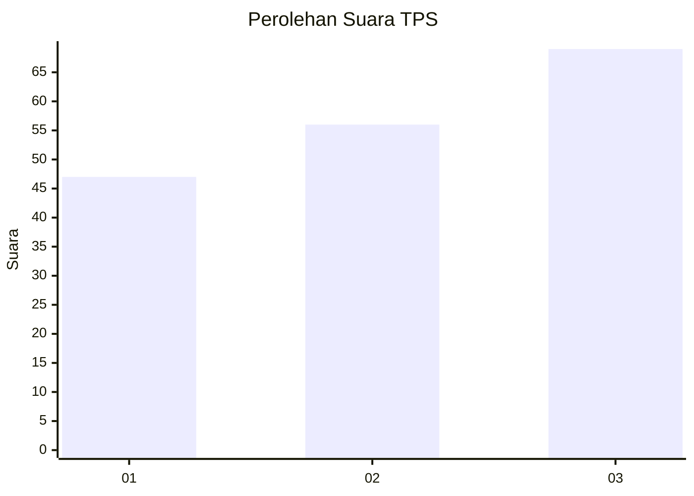
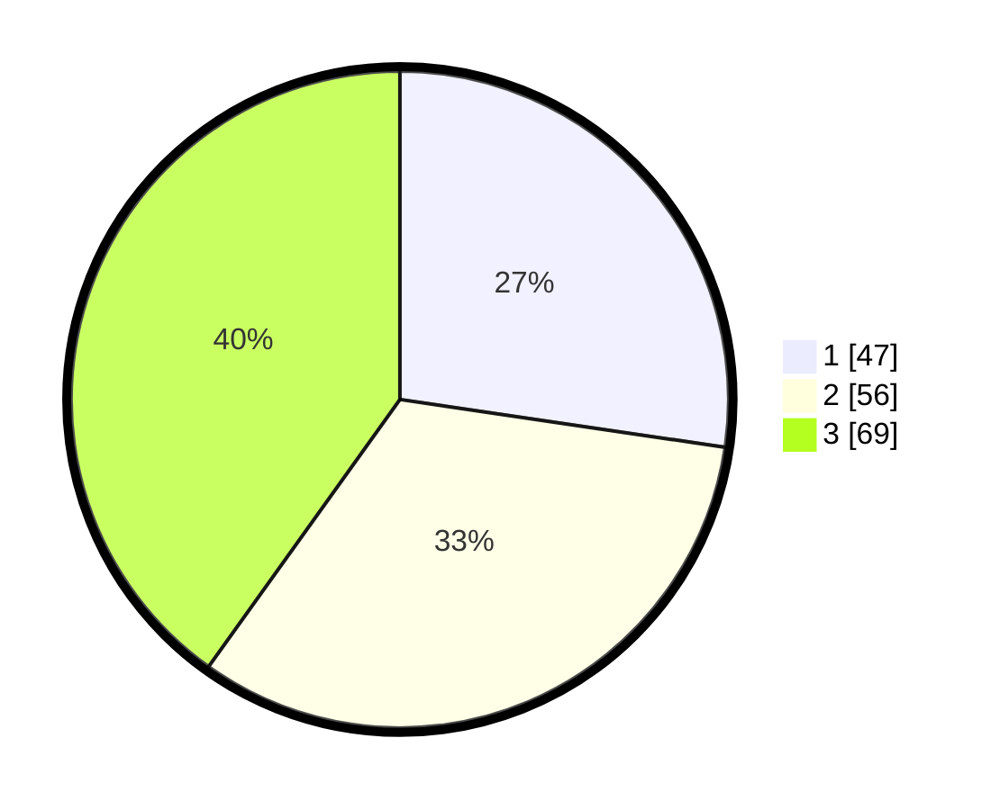

# Hasil

## Grafik

## Tabel

| No. | Nama Paslon    | Suara | Suara (raw) | Persentase |
|:--- |:-------------- | -----:| -----------:| ----------:|
| 1   | ANIES MUHAIMIN | 47    | [47][p-1]   | 27,33      |
| 2   | PRABOWO GIBRAN | 56    | [56][p-2]   | 32,56      |
| 3   | GANJAR MAHFUD  | 69    | [69][p-3]   | 40,12      |

[p-1]: https://github.com/gigit-pemilu/pemilu-2024-33-jawa-tengah/blob/main/pilpres/hitung-suara/sub/33-jawa-tengah/sub/05-kebumen/sub/13-pejagoan/sub/2012-peniron/sub/004-tps/sub/paslon-1.txt
[p-2]: https://github.com/gigit-pemilu/pemilu-2024-33-jawa-tengah/blob/main/pilpres/hitung-suara/sub/33-jawa-tengah/sub/05-kebumen/sub/13-pejagoan/sub/2012-peniron/sub/004-tps/sub/paslon-2.txt
[p-3]: https://github.com/gigit-pemilu/pemilu-2024-33-jawa-tengah/blob/main/pilpres/hitung-suara/sub/33-jawa-tengah/sub/05-kebumen/sub/13-pejagoan/sub/2012-peniron/sub/004-tps/sub/paslon-3.txt

## Foto C Plano

https://sirekap-obj-formc.kpu.go.id/a049/pemilu/ppwp/33/05/13/20/12/3305132012004-20240215-035528--9b3b42c6-28df-4d27-92c9-b5edfc4143a9.jpg

https://sirekap-obj-formc.kpu.go.id/a049/pemilu/ppwp/33/05/13/20/12/3305132012004-20240215-035710--99e16e42-4f39-4572-acbb-0101b6c8336a.jpg

https://sirekap-obj-formc.kpu.go.id/a049/pemilu/ppwp/33/05/13/20/12/3305132012004-20240215-041009--ed5e88d5-65a5-483c-b2bd-869a51c1b33a.jpg

## Metadata

| Key        | Value               |
| ---------- | ------------------- |
| Time Stamp | 2024-02-19 18:00:00 |

