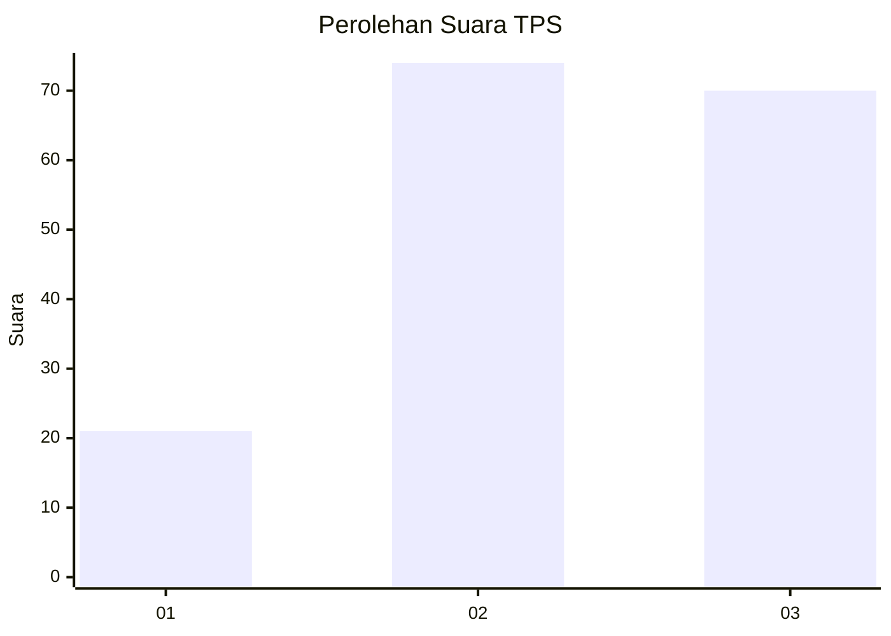
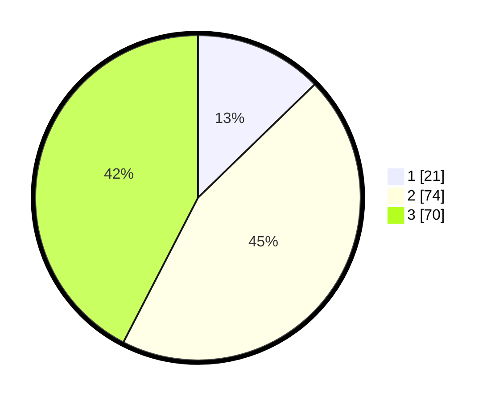

# Hasil

## Grafik

## Tabel

| No. | Nama Paslon    | Suara | Suara (raw) | Persentase |
|:--- |:-------------- | -----:| -----------:| ----------:|
| 1   | ANIES MUHAIMIN | 21    | [21][p-1]   | 12,73      |
| 2   | PRABOWO GIBRAN | 74    | [74][p-2]   | 44,85      |
| 3   | GANJAR MAHFUD  | 70    | [70][p-3]   | 42,42      |

[p-1]: https://github.com/gigit-pemilu/pemilu-2024/blob/main/pilpres/hitung-suara/sub/33-jawa-tengah/sub/05-kebumen/sub/14-sruweng/sub/2003-sidoarjo/sub/002-tps/sub/paslon-1.txt
[p-2]: https://github.com/gigit-pemilu/pemilu-2024/blob/main/pilpres/hitung-suara/sub/33-jawa-tengah/sub/05-kebumen/sub/14-sruweng/sub/2003-sidoarjo/sub/002-tps/sub/paslon-2.txt
[p-3]: https://github.com/gigit-pemilu/pemilu-2024/blob/main/pilpres/hitung-suara/sub/33-jawa-tengah/sub/05-kebumen/sub/14-sruweng/sub/2003-sidoarjo/sub/002-tps/sub/paslon-3.txt

## Foto C Plano

https://sirekap-obj-formc.kpu.go.id/9364/pemilu/ppwp/33/05/14/20/03/3305142003002-20240214-234436--5653b338-1590-462d-a42b-1e1ff8b23171.jpg

https://sirekap-obj-formc.kpu.go.id/9364/pemilu/ppwp/33/05/14/20/03/3305142003002-20240214-234710--13d9b2c3-8fd5-4e7b-a71f-241ba96f5754.jpg

https://sirekap-obj-formc.kpu.go.id/9364/pemilu/ppwp/33/05/14/20/03/3305142003002-20240214-235109--7554d1ce-c337-422c-8a88-84cc106cada9.jpg

## Metadata

| Key        | Value               |
| ---------- | ------------------- |
| Time Stamp | 2024-02-19 14:00:00 |

