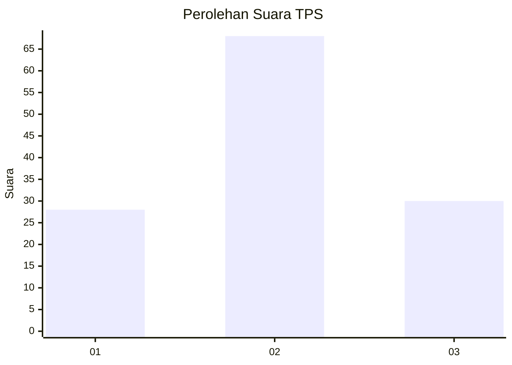
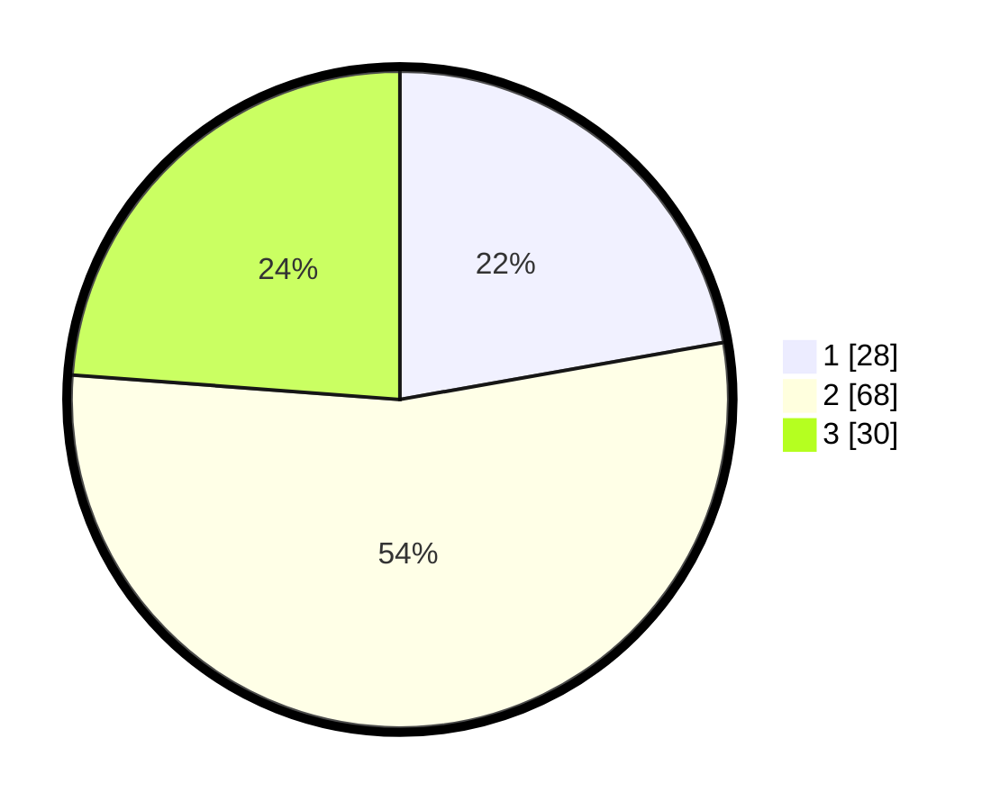

# Hasil

## Grafik

## Tabel

| No. | Nama Paslon    | Suara | Suara (raw) | Persentase |
|:--- |:-------------- | -----:| -----------:| ----------:|
| 1   | ANIES MUHAIMIN | 28    | [28][p-1]   | 22,22      |
| 2   | PRABOWO GIBRAN | 68    | [68][p-2]   | 53,97      |
| 3   | GANJAR MAHFUD  | 30    | [30][p-3]   | 23,81      |

[p-1]: https://github.com/gigit-pemilu/pemilu-2024/blob/main/pilpres/hitung-suara/sub/33-jawa-tengah/sub/05-kebumen/sub/14-sruweng/sub/2003-sidoarjo/sub/009-tps/sub/paslon-1.txt
[p-2]: https://github.com/gigit-pemilu/pemilu-2024/blob/main/pilpres/hitung-suara/sub/33-jawa-tengah/sub/05-kebumen/sub/14-sruweng/sub/2003-sidoarjo/sub/009-tps/sub/paslon-2.txt
[p-3]: https://github.com/gigit-pemilu/pemilu-2024/blob/main/pilpres/hitung-suara/sub/33-jawa-tengah/sub/05-kebumen/sub/14-sruweng/sub/2003-sidoarjo/sub/009-tps/sub/paslon-3.txt

## Foto C Plano

https://sirekap-obj-formc.kpu.go.id/3ad5/pemilu/ppwp/33/05/14/20/03/3305142003009-20240214-141504--03698b9d-8e35-43de-8780-7cdb9ea468c9.jpg

https://sirekap-obj-formc.kpu.go.id/3ad5/pemilu/ppwp/33/05/14/20/03/3305142003009-20240214-141417--f83fa375-2ae1-48cc-b272-0f7f5c9bb861.jpg

https://sirekap-obj-formc.kpu.go.id/3ad5/pemilu/ppwp/33/05/14/20/03/3305142003009-20240214-141623--87c99958-03ba-4981-818c-4f429c5a1e4a.jpg

## Metadata

| Key        | Value               |
| ---------- | ------------------- |
| Time Stamp | 2024-02-14 21:46:01 |

