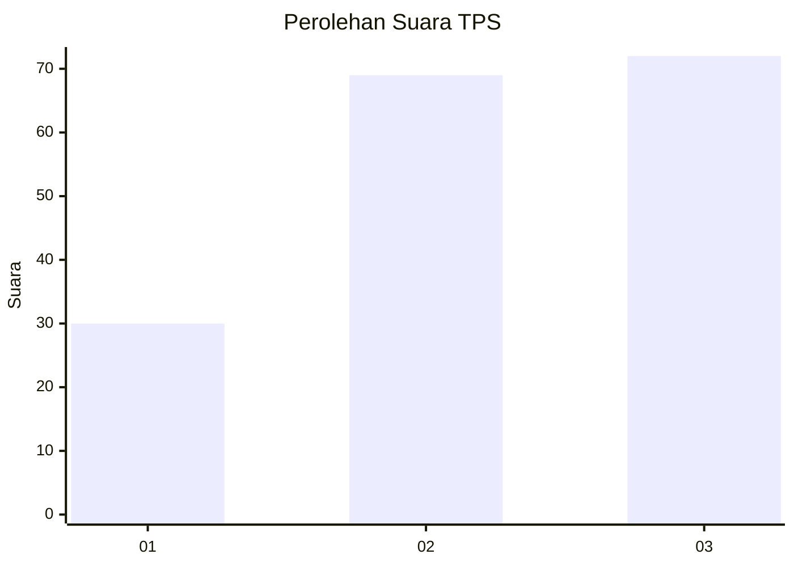
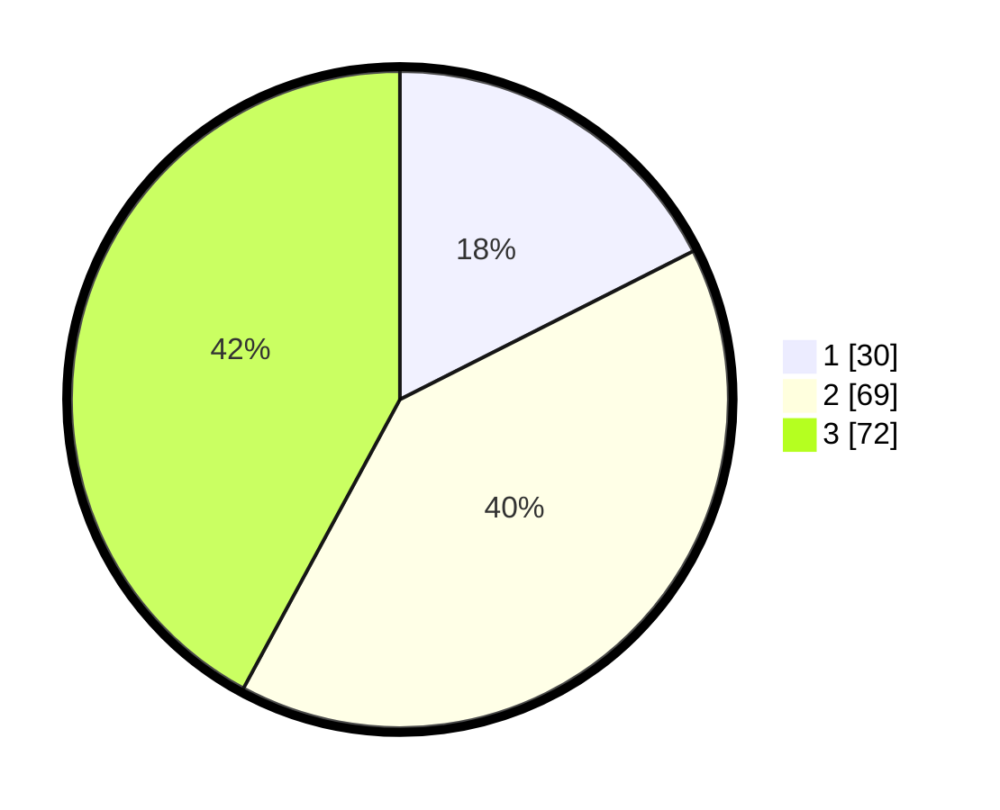

# Hasil

## Grafik

## Tabel

| No. | Nama Paslon    | Suara | Suara (raw) | Persentase |
|:--- |:-------------- | -----:| -----------:| ----------:|
| 1   | ANIES MUHAIMIN | 30    | [30][p-1]   | 17,54      |
| 2   | PRABOWO GIBRAN | 69    | [69][p-2]   | 40,35      |
| 3   | GANJAR MAHFUD  | 72    | [72][p-3]   | 42,11      |

[p-1]: https://github.com/gigit-pemilu/pemilu-2024-33-jawa-tengah/blob/main/pilpres/hitung-suara/sub/33-jawa-tengah/sub/05-kebumen/sub/14-sruweng/sub/2005-jabres/sub/004-tps/sub/paslon-1.txt
[p-2]: https://github.com/gigit-pemilu/pemilu-2024-33-jawa-tengah/blob/main/pilpres/hitung-suara/sub/33-jawa-tengah/sub/05-kebumen/sub/14-sruweng/sub/2005-jabres/sub/004-tps/sub/paslon-2.txt
[p-3]: https://github.com/gigit-pemilu/pemilu-2024-33-jawa-tengah/blob/main/pilpres/hitung-suara/sub/33-jawa-tengah/sub/05-kebumen/sub/14-sruweng/sub/2005-jabres/sub/004-tps/sub/paslon-3.txt

## Foto C Plano

https://sirekap-obj-formc.kpu.go.id/7c2f/pemilu/ppwp/33/05/14/20/05/3305142005004-20240215-014933--5aa0f1b4-23bd-4ba4-96db-64b3a10fb428.jpg

https://sirekap-obj-formc.kpu.go.id/7c2f/pemilu/ppwp/33/05/14/20/05/3305142005004-20240215-015348--d384ca59-a906-42f6-aa0a-d3b0a295801f.jpg

https://sirekap-obj-formc.kpu.go.id/7c2f/pemilu/ppwp/33/05/14/20/05/3305142005004-20240215-015550--9756b2b1-13c5-4441-ad61-cb7265f33aca.jpg

## Metadata

| Key        | Value               |
| ---------- | ------------------- |
| Time Stamp | 2024-02-19 14:00:00 |

