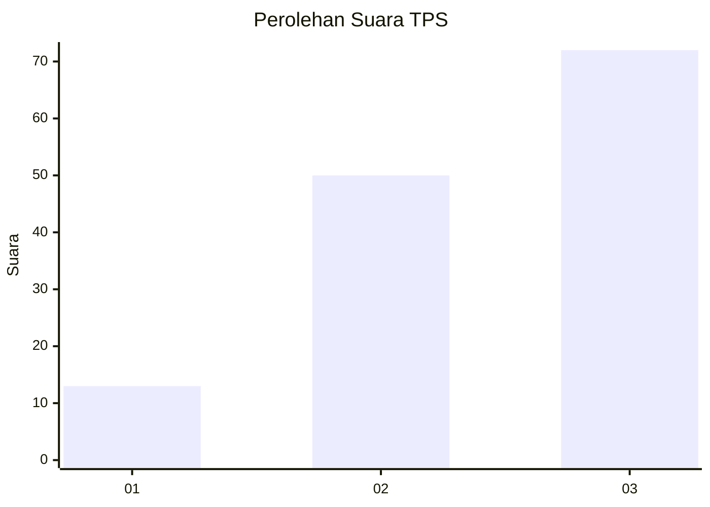
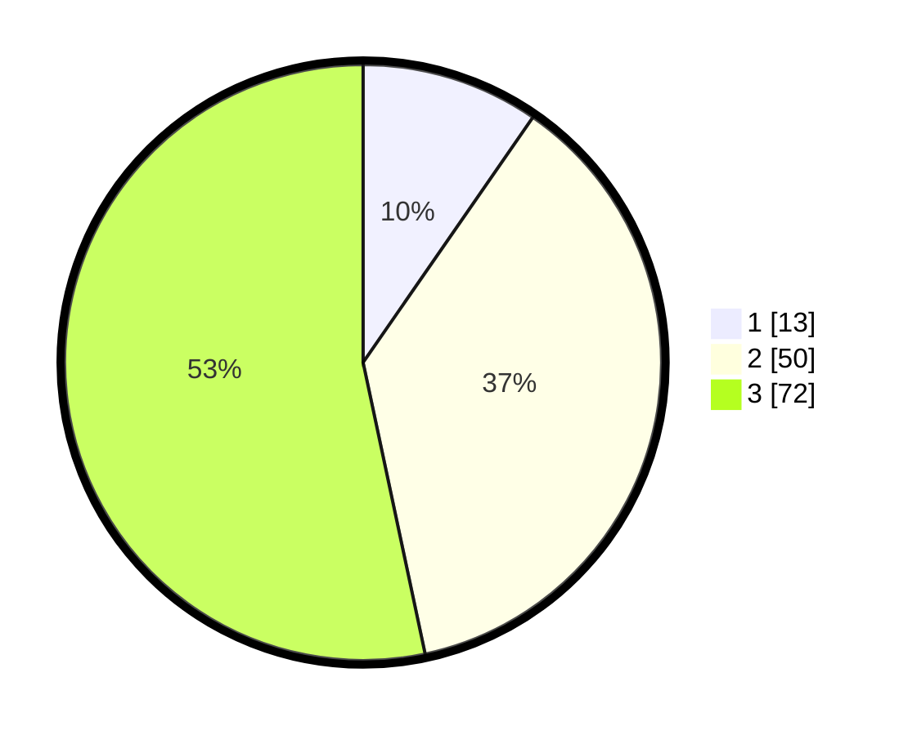

# Hasil

## Grafik

## Tabel

| No. | Nama Paslon    | Suara | Suara (raw) | Persentase |
|:--- |:-------------- | -----:| -----------:| ----------:|
| 1   | ANIES MUHAIMIN | 13    | [13][p-1]   | 9,63       |
| 2   | PRABOWO GIBRAN | 50    | [50][p-2]   | 37,04      |
| 3   | GANJAR MAHFUD  | 72    | [72][p-3]   | 53,33      |

[p-1]: https://github.com/gigit-pemilu/pemilu-2024/blob/main/pilpres/hitung-suara/sub/33-jawa-tengah/sub/05-kebumen/sub/14-sruweng/sub/2010-tanggeran/sub/009-tps/sub/paslon-1.txt
[p-2]: https://github.com/gigit-pemilu/pemilu-2024/blob/main/pilpres/hitung-suara/sub/33-jawa-tengah/sub/05-kebumen/sub/14-sruweng/sub/2010-tanggeran/sub/009-tps/sub/paslon-2.txt
[p-3]: https://github.com/gigit-pemilu/pemilu-2024/blob/main/pilpres/hitung-suara/sub/33-jawa-tengah/sub/05-kebumen/sub/14-sruweng/sub/2010-tanggeran/sub/009-tps/sub/paslon-3.txt

## Foto C Plano

https://sirekap-obj-formc.kpu.go.id/49e0/pemilu/ppwp/33/05/14/20/10/3305142010009-20240214-225747--7d524025-239f-4c08-96de-cc18ef58aecc.jpg

https://sirekap-obj-formc.kpu.go.id/49e0/pemilu/ppwp/33/05/14/20/10/3305142010009-20240214-230128--11ce9a11-da80-4802-85c9-ca0a77bf0517.jpg

https://sirekap-obj-formc.kpu.go.id/49e0/pemilu/ppwp/33/05/14/20/10/3305142010009-20240214-230533--b32d32d9-935c-4cd0-8080-705e99f15089.jpg

## Metadata

| Key        | Value               |
| ---------- | ------------------- |
| Time Stamp | 2024-02-19 14:00:00 |

