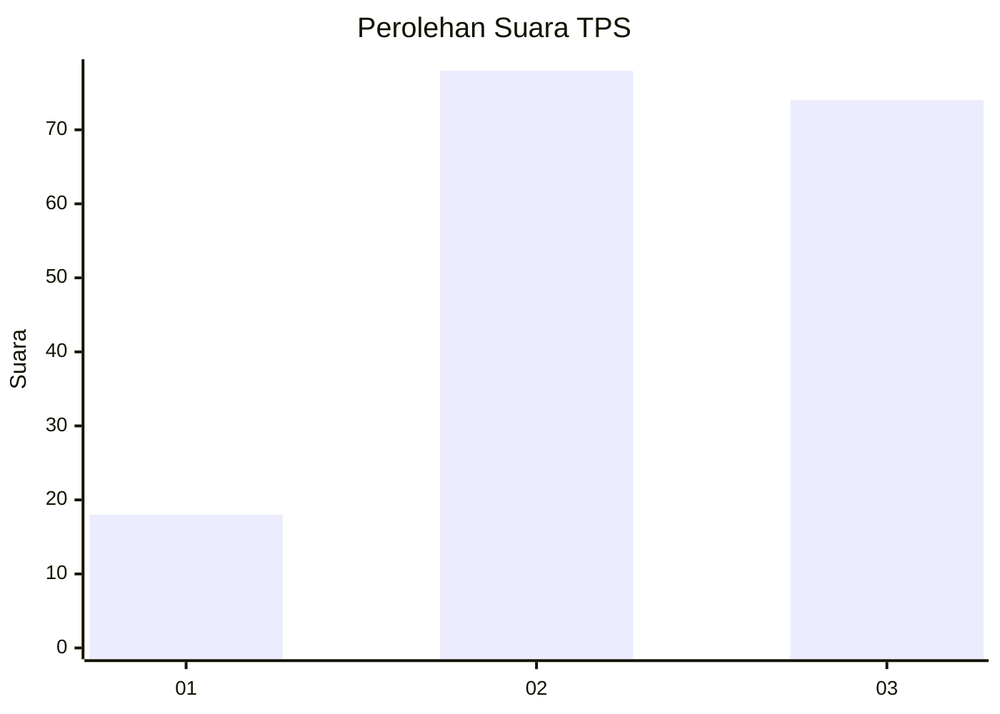
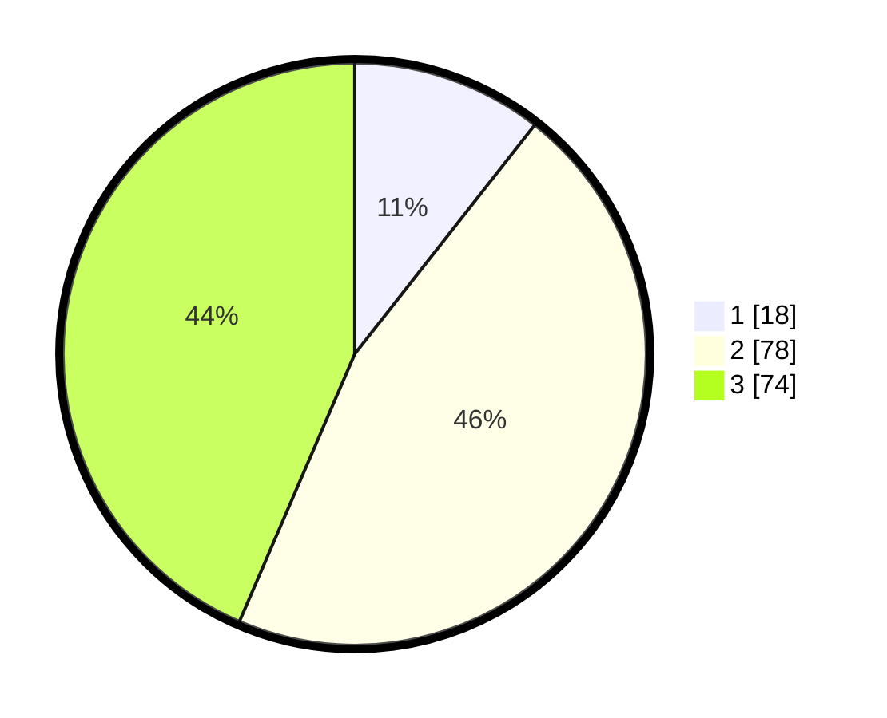

# Hasil

## Grafik

## Tabel

| No. | Nama Paslon    | Suara | Suara (raw) | Persentase |
|:--- |:-------------- | -----:| -----------:| ----------:|
| 1   | ANIES MUHAIMIN | 18    | [18][p-1]   | 10,59      |
| 2   | PRABOWO GIBRAN | 78    | [78][p-2]   | 45,88      |
| 3   | GANJAR MAHFUD  | 74    | [74][p-3]   | 43,53      |

[p-1]: https://github.com/gigit-pemilu/pemilu-2024/blob/main/pilpres/hitung-suara/sub/33-jawa-tengah/sub/05-kebumen/sub/14-sruweng/sub/2014-pengempon/sub/002-tps/sub/paslon-1.txt
[p-2]: https://github.com/gigit-pemilu/pemilu-2024/blob/main/pilpres/hitung-suara/sub/33-jawa-tengah/sub/05-kebumen/sub/14-sruweng/sub/2014-pengempon/sub/002-tps/sub/paslon-2.txt
[p-3]: https://github.com/gigit-pemilu/pemilu-2024/blob/main/pilpres/hitung-suara/sub/33-jawa-tengah/sub/05-kebumen/sub/14-sruweng/sub/2014-pengempon/sub/002-tps/sub/paslon-3.txt

## Foto C Plano

https://sirekap-obj-formc.kpu.go.id/9db2/pemilu/ppwp/33/05/14/20/14/3305142014002-20240215-054630--14501e8b-8e15-4926-8bf9-c230d31a96fa.jpg

https://sirekap-obj-formc.kpu.go.id/9db2/pemilu/ppwp/33/05/14/20/14/3305142014002-20240215-055321--9495906b-463a-4d6f-9dc3-ca47269d6979.jpg

https://sirekap-obj-formc.kpu.go.id/9db2/pemilu/ppwp/33/05/14/20/14/3305142014002-20240215-055513--9cd53c1a-c097-4530-92fe-26aea6e10956.jpg

## Metadata

| Key        | Value               |
| ---------- | ------------------- |
| Time Stamp | 2024-02-19 14:00:00 |

