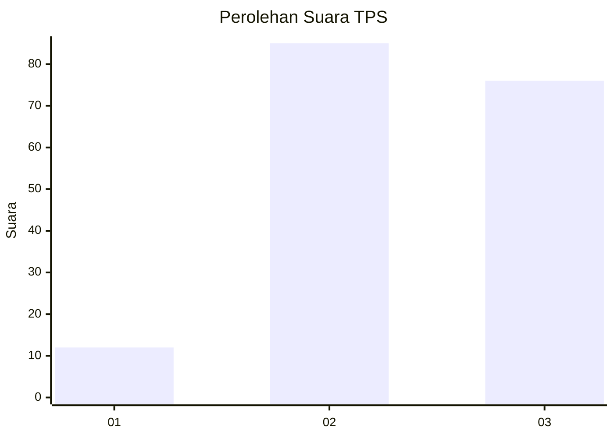
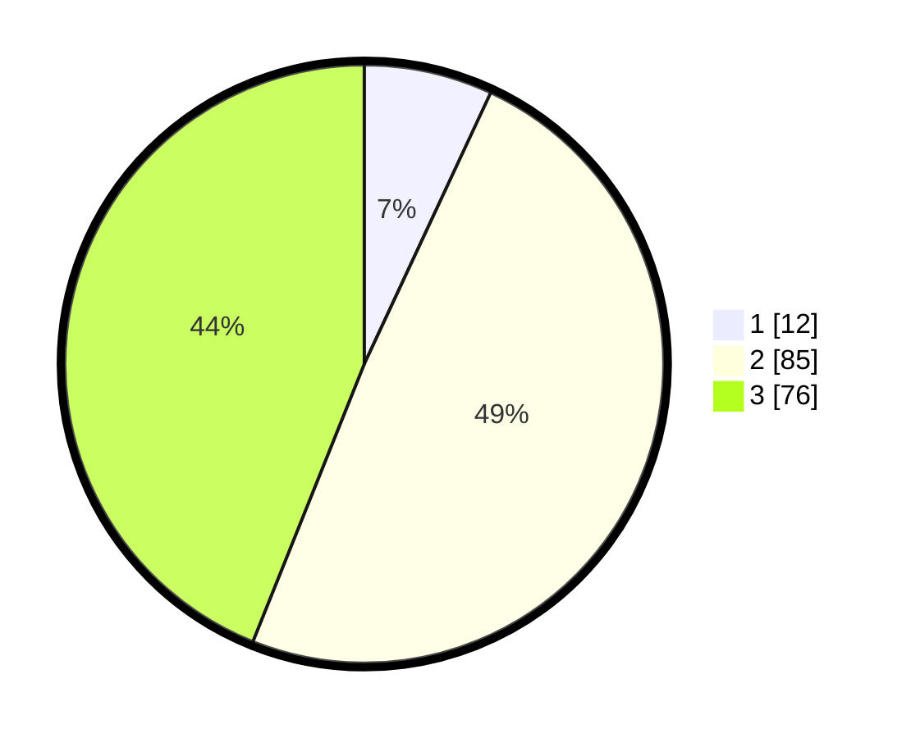

# Hasil

## Grafik

## Tabel

| No. | Nama Paslon    | Suara | Suara (raw) | Persentase |
|:--- |:-------------- | -----:| -----------:| ----------:|
| 1   | ANIES MUHAIMIN | 12    | [12][p-1]   | 6,94       |
| 2   | PRABOWO GIBRAN | 85    | [85][p-2]   | 49,13      |
| 3   | GANJAR MAHFUD  | 76    | [76][p-3]   | 43,93      |

[p-1]: https://github.com/gigit-pemilu/pemilu-2024-33-jawa-tengah/blob/main/pilpres/hitung-suara/sub/33-jawa-tengah/sub/05-kebumen/sub/14-sruweng/sub/2014-pengempon/sub/003-tps/sub/paslon-1.txt
[p-2]: https://github.com/gigit-pemilu/pemilu-2024-33-jawa-tengah/blob/main/pilpres/hitung-suara/sub/33-jawa-tengah/sub/05-kebumen/sub/14-sruweng/sub/2014-pengempon/sub/003-tps/sub/paslon-2.txt
[p-3]: https://github.com/gigit-pemilu/pemilu-2024-33-jawa-tengah/blob/main/pilpres/hitung-suara/sub/33-jawa-tengah/sub/05-kebumen/sub/14-sruweng/sub/2014-pengempon/sub/003-tps/sub/paslon-3.txt

## Foto C Plano

https://sirekap-obj-formc.kpu.go.id/9e49/pemilu/ppwp/33/05/14/20/14/3305142014003-20240215-023903--19e42017-f195-490a-a6f7-012e879afc90.jpg

https://sirekap-obj-formc.kpu.go.id/9e49/pemilu/ppwp/33/05/14/20/14/3305142014003-20240215-024404--5a3149cc-f6cd-4e6d-9c21-78b02ace3da4.jpg

https://sirekap-obj-formc.kpu.go.id/9e49/pemilu/ppwp/33/05/14/20/14/3305142014003-20240215-024034--c407f184-c5d4-4b20-af44-a4705f1e28da.jpg

## Metadata

| Key        | Value               |
| ---------- | ------------------- |
| Time Stamp | 2024-02-16 16:25:10 |

