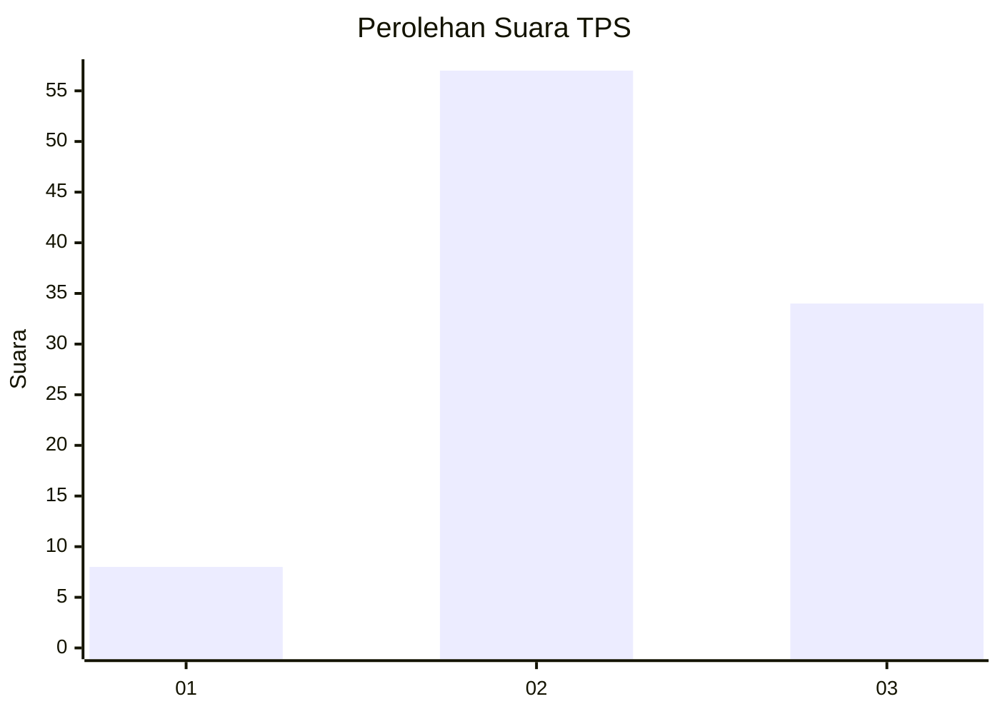
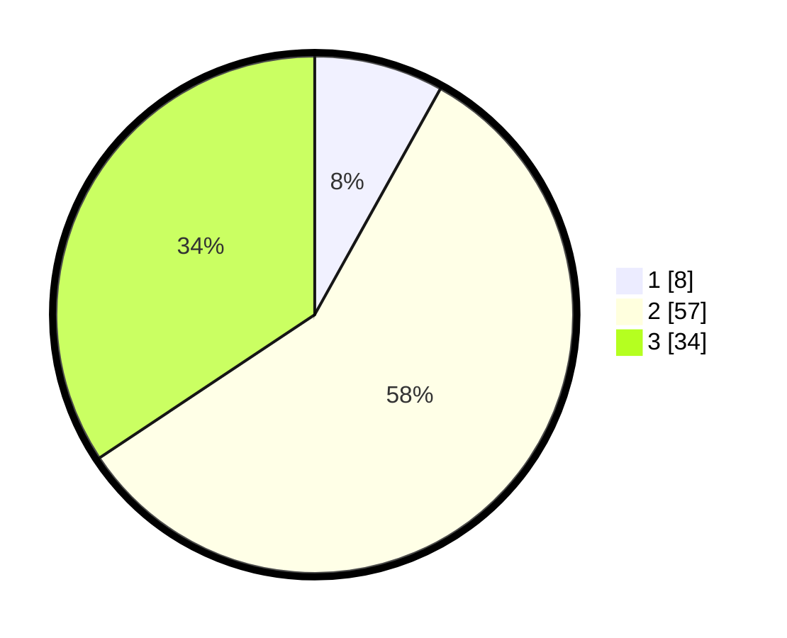

# Hasil

## Grafik

## Tabel

| No. | Nama Paslon    | Suara | Suara (raw) | Persentase |
|:--- |:-------------- | -----:| -----------:| ----------:|
| 1   | ANIES MUHAIMIN | 8     | [8][p-1]    | 8,08       |
| 2   | PRABOWO GIBRAN | 57    | [57][p-2]   | 57,58      |
| 3   | GANJAR MAHFUD  | 34    | [34][p-3]   | 34,34      |

[p-1]: https://github.com/gigit-pemilu/pemilu-2024/blob/main/pilpres/hitung-suara/sub/33-jawa-tengah/sub/05-kebumen/sub/14-sruweng/sub/2020-pandansari/sub/021-tps/sub/paslon-1.txt
[p-2]: https://github.com/gigit-pemilu/pemilu-2024/blob/main/pilpres/hitung-suara/sub/33-jawa-tengah/sub/05-kebumen/sub/14-sruweng/sub/2020-pandansari/sub/021-tps/sub/paslon-2.txt
[p-3]: https://github.com/gigit-pemilu/pemilu-2024/blob/main/pilpres/hitung-suara/sub/33-jawa-tengah/sub/05-kebumen/sub/14-sruweng/sub/2020-pandansari/sub/021-tps/sub/paslon-3.txt

## Foto C Plano

https://sirekap-obj-formc.kpu.go.id/aff2/pemilu/ppwp/33/05/14/20/20/3305142020021-20240218-102817--27b5abed-0f25-487d-b17d-5b91f6d3d894.jpg

https://sirekap-obj-formc.kpu.go.id/aff2/pemilu/ppwp/33/05/14/20/20/3305142020021-20240218-103110--f51f7f99-5bf2-49d6-8fe0-5d79a66331c8.jpg

https://sirekap-obj-formc.kpu.go.id/aff2/pemilu/ppwp/33/05/14/20/20/3305142020021-20240218-103220--c2001a30-6e8a-49c8-a0c5-4a3116a4c5fd.jpg

## Metadata

| Key        | Value               |
| ---------- | ------------------- |
| Time Stamp | 2024-02-19 14:00:00 |

