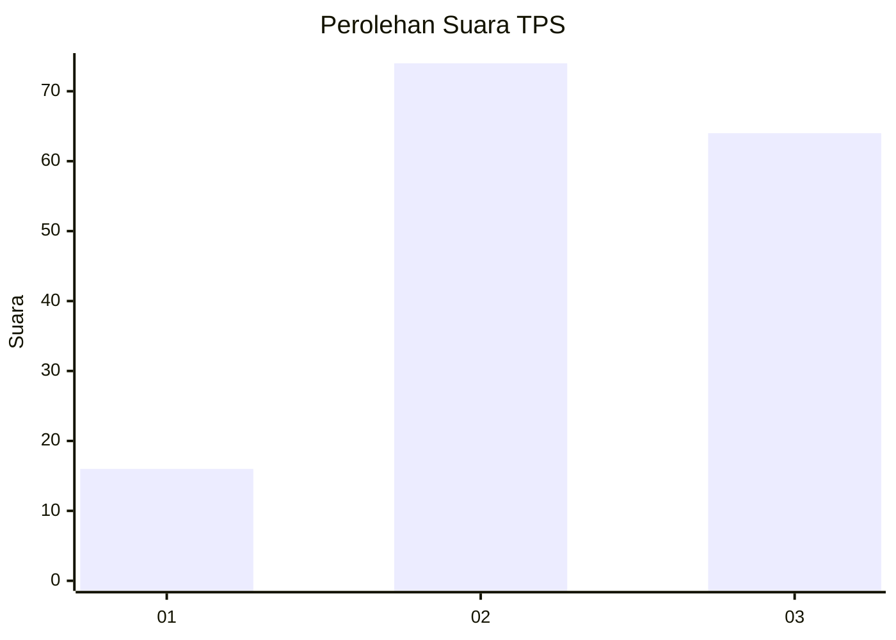
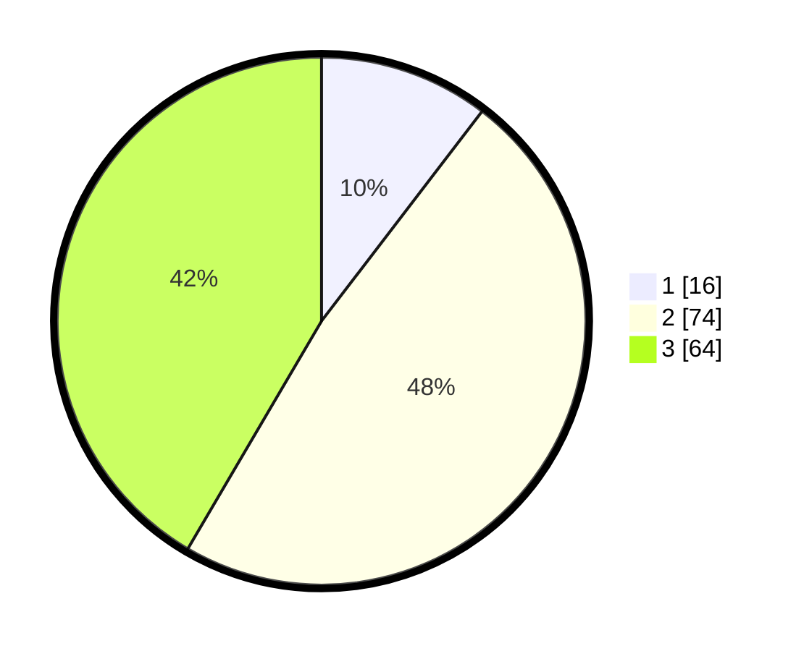

# Hasil

## Grafik

## Tabel

| No. | Nama Paslon    | Suara | Suara (raw) | Persentase |
|:--- |:-------------- | -----:| -----------:| ----------:|
| 1   | ANIES MUHAIMIN | 16    | [16][p-1]   | 10,39      |
| 2   | PRABOWO GIBRAN | 74    | [74][p-2]   | 48,05      |
| 3   | GANJAR MAHFUD  | 64    | [64][p-3]   | 41,56      |

[p-1]: https://github.com/gigit-pemilu/pemilu-2024/blob/main/pilpres/hitung-suara/sub/33-jawa-tengah/sub/05-kebumen/sub/15-adimulyo/sub/2020-arjomulyo/sub/002-tps/sub/paslon-1.txt
[p-2]: https://github.com/gigit-pemilu/pemilu-2024/blob/main/pilpres/hitung-suara/sub/33-jawa-tengah/sub/05-kebumen/sub/15-adimulyo/sub/2020-arjomulyo/sub/002-tps/sub/paslon-2.txt
[p-3]: https://github.com/gigit-pemilu/pemilu-2024/blob/main/pilpres/hitung-suara/sub/33-jawa-tengah/sub/05-kebumen/sub/15-adimulyo/sub/2020-arjomulyo/sub/002-tps/sub/paslon-3.txt

## Foto C Plano

https://sirekap-obj-formc.kpu.go.id/fbc4/pemilu/ppwp/33/05/15/20/20/3305152020002-20240215-023401--fd0e00cc-d319-40a5-99fa-82b377248663.jpg

https://sirekap-obj-formc.kpu.go.id/fbc4/pemilu/ppwp/33/05/15/20/20/3305152020002-20240215-003344--ebf667b8-8dce-4a42-a19a-ca17ebb12068.jpg

https://sirekap-obj-formc.kpu.go.id/fbc4/pemilu/ppwp/33/05/15/20/20/3305152020002-20240215-003001--58451e23-c1a3-4628-a366-cd106d719a12.jpg

## Metadata

| Key        | Value               |
| ---------- | ------------------- |
| Time Stamp | 2024-02-15 22:30:27 |

