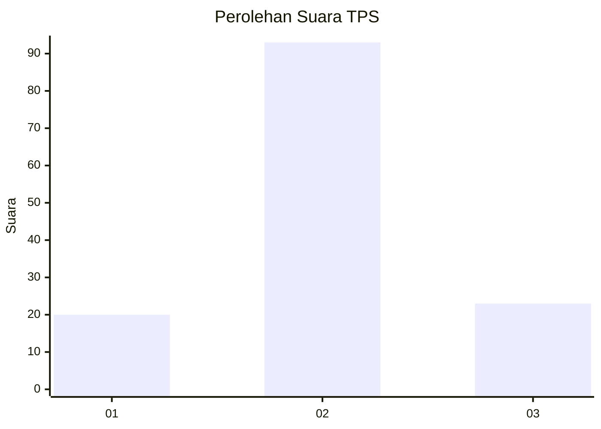
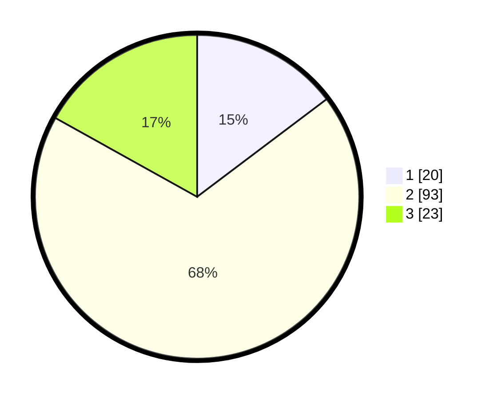

# Hasil

## Grafik

## Tabel

| No. | Nama Paslon    | Suara | Suara (raw) | Persentase |
|:--- |:-------------- | -----:| -----------:| ----------:|
| 1   | ANIES MUHAIMIN | 20    | [20][p-1]   | 14,71      |
| 2   | PRABOWO GIBRAN | 93    | [93][p-2]   | 68,38      |
| 3   | GANJAR MAHFUD  | 23    | [23][p-3]   | 16,91      |

[p-1]: https://github.com/gigit-pemilu/pemilu-2024-33-jawa-tengah/blob/main/pilpres/hitung-suara/sub/33-jawa-tengah/sub/05-kebumen/sub/16-kuwarasan/sub/2001-kamulyan/sub/001-tps/sub/paslon-1.txt
[p-2]: https://github.com/gigit-pemilu/pemilu-2024-33-jawa-tengah/blob/main/pilpres/hitung-suara/sub/33-jawa-tengah/sub/05-kebumen/sub/16-kuwarasan/sub/2001-kamulyan/sub/001-tps/sub/paslon-2.txt
[p-3]: https://github.com/gigit-pemilu/pemilu-2024-33-jawa-tengah/blob/main/pilpres/hitung-suara/sub/33-jawa-tengah/sub/05-kebumen/sub/16-kuwarasan/sub/2001-kamulyan/sub/001-tps/sub/paslon-3.txt

## Foto C Plano

https://sirekap-obj-formc.kpu.go.id/8414/pemilu/ppwp/33/05/16/20/01/3305162001001-20240214-141700--163a1855-8e49-4d95-aba2-1c59ab106889.jpg

https://sirekap-obj-formc.kpu.go.id/8414/pemilu/ppwp/33/05/16/20/01/3305162001001-20240214-141808--409e2088-ff54-4eb9-bf1d-e6a6f64ea53c.jpg

https://sirekap-obj-formc.kpu.go.id/8414/pemilu/ppwp/33/05/16/20/01/3305162001001-20240214-141902--ea3edb22-a765-4acb-bd5d-8b8c3ca21e6c.jpg

## Metadata

| Key        | Value               |
| ---------- | ------------------- |
| Time Stamp | 2024-02-16 10:30:29 |

