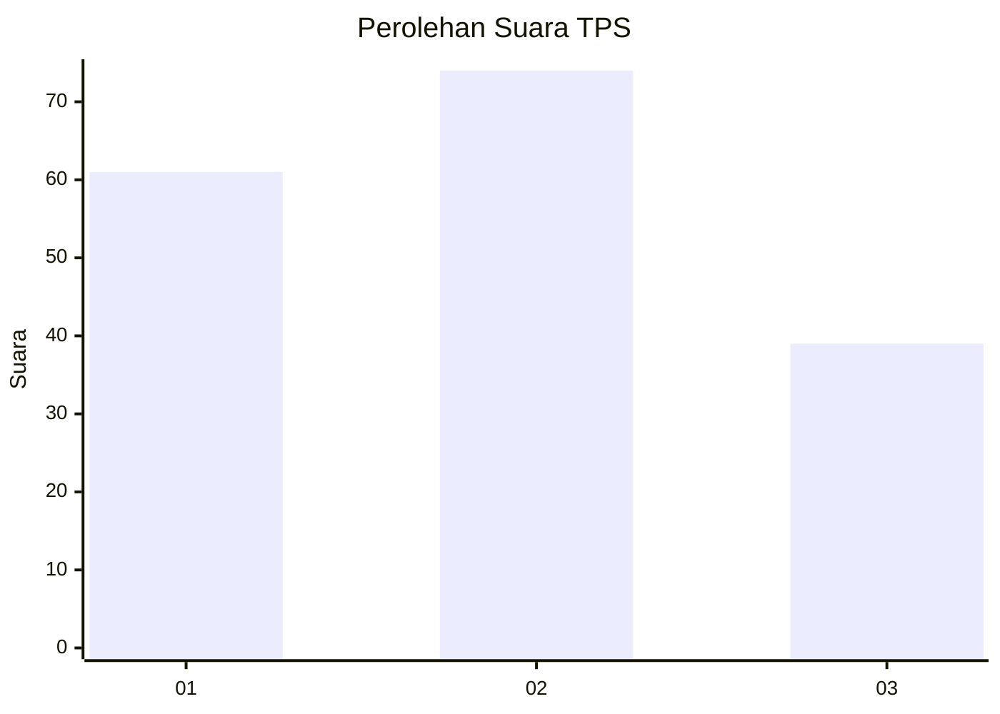
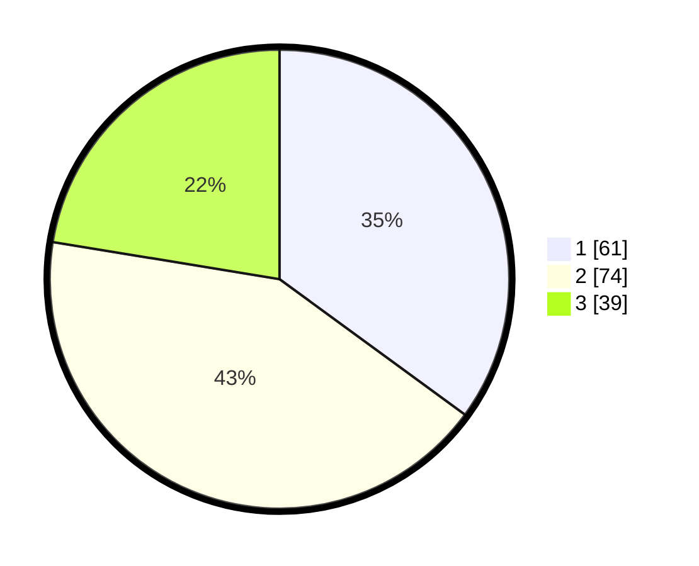

# Hasil

## Grafik

## Tabel

| No. | Nama Paslon    | Suara | Suara (raw) | Persentase |
|:--- |:-------------- | -----:| -----------:| ----------:|
| 1   | ANIES MUHAIMIN | 61    | [61][p-1]   | 35,06      |
| 2   | PRABOWO GIBRAN | 74    | [74][p-2]   | 42,53      |
| 3   | GANJAR MAHFUD  | 39    | [39][p-3]   | 22,41      |

[p-1]: https://github.com/gigit-pemilu/pemilu-2024-33-jawa-tengah/blob/main/pilpres/hitung-suara/sub/33-jawa-tengah/sub/05-kebumen/sub/16-kuwarasan/sub/2006-pondokgebangsari/sub/006-tps/sub/paslon-1.txt
[p-2]: https://github.com/gigit-pemilu/pemilu-2024-33-jawa-tengah/blob/main/pilpres/hitung-suara/sub/33-jawa-tengah/sub/05-kebumen/sub/16-kuwarasan/sub/2006-pondokgebangsari/sub/006-tps/sub/paslon-2.txt
[p-3]: https://github.com/gigit-pemilu/pemilu-2024-33-jawa-tengah/blob/main/pilpres/hitung-suara/sub/33-jawa-tengah/sub/05-kebumen/sub/16-kuwarasan/sub/2006-pondokgebangsari/sub/006-tps/sub/paslon-3.txt

## Foto C Plano

https://sirekap-obj-formc.kpu.go.id/2368/pemilu/ppwp/33/05/16/20/06/3305162006006-20240214-194107--0a6c93ae-1f4b-46fe-b543-ca7254016d50.jpg

https://sirekap-obj-formc.kpu.go.id/2368/pemilu/ppwp/33/05/16/20/06/3305162006006-20240214-194247--13235021-f791-4cc5-9311-6587967c2dce.jpg

https://sirekap-obj-formc.kpu.go.id/2368/pemilu/ppwp/33/05/16/20/06/3305162006006-20240214-194337--92504af5-9447-437a-9313-aca9940d725c.jpg

## Metadata

| Key        | Value               |
| ---------- | ------------------- |
| Time Stamp | 2024-02-14 21:46:01 |

