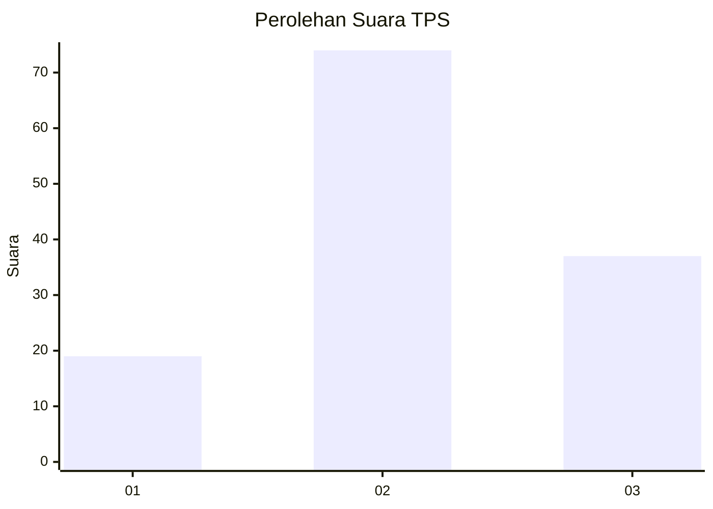
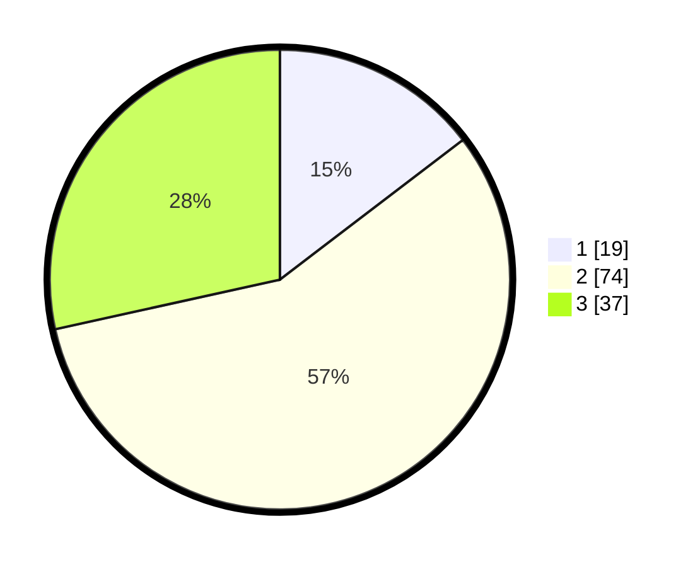

# Hasil

## Grafik

## Tabel

| No. | Nama Paslon    | Suara | Suara (raw) | Persentase |
|:--- |:-------------- | -----:| -----------:| ----------:|
| 1   | ANIES MUHAIMIN | 19    | [19][p-1]   | 14,62      |
| 2   | PRABOWO GIBRAN | 74    | [74][p-2]   | 56,92      |
| 3   | GANJAR MAHFUD  | 37    | [37][p-3]   | 28,46      |

[p-1]: https://github.com/gigit-pemilu/pemilu-2024-33-jawa-tengah/blob/main/pilpres/hitung-suara/sub/33-jawa-tengah/sub/05-kebumen/sub/16-kuwarasan/sub/2020-bendungan/sub/003-tps/sub/paslon-1.txt
[p-2]: https://github.com/gigit-pemilu/pemilu-2024-33-jawa-tengah/blob/main/pilpres/hitung-suara/sub/33-jawa-tengah/sub/05-kebumen/sub/16-kuwarasan/sub/2020-bendungan/sub/003-tps/sub/paslon-2.txt
[p-3]: https://github.com/gigit-pemilu/pemilu-2024-33-jawa-tengah/blob/main/pilpres/hitung-suara/sub/33-jawa-tengah/sub/05-kebumen/sub/16-kuwarasan/sub/2020-bendungan/sub/003-tps/sub/paslon-3.txt

## Foto C Plano

https://sirekap-obj-formc.kpu.go.id/c064/pemilu/ppwp/33/05/16/20/20/3305162020003-20240214-141549--b3360eb1-d509-480f-a6fe-8f9fc981903a.jpg

https://sirekap-obj-formc.kpu.go.id/c064/pemilu/ppwp/33/05/16/20/20/3305162020003-20240214-141226--48f750db-4e6c-4c73-bf17-560faed4a871.jpg

https://sirekap-obj-formc.kpu.go.id/c064/pemilu/ppwp/33/05/16/20/20/3305162020003-20240214-141353--37c18bde-71d4-4fce-bcc1-7a315e45ac21.jpg

## Metadata

| Key        | Value               |
| ---------- | ------------------- |
| Time Stamp | 2024-02-15 01:47:43 |

